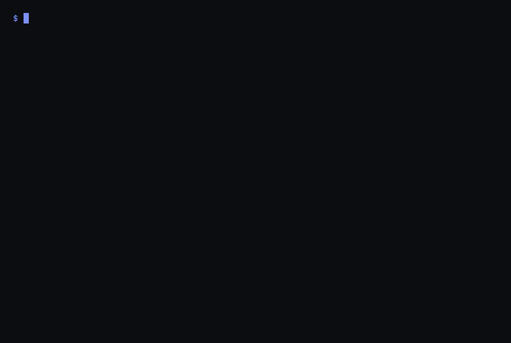
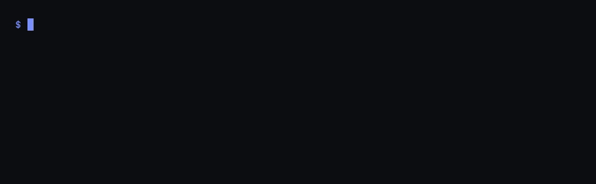
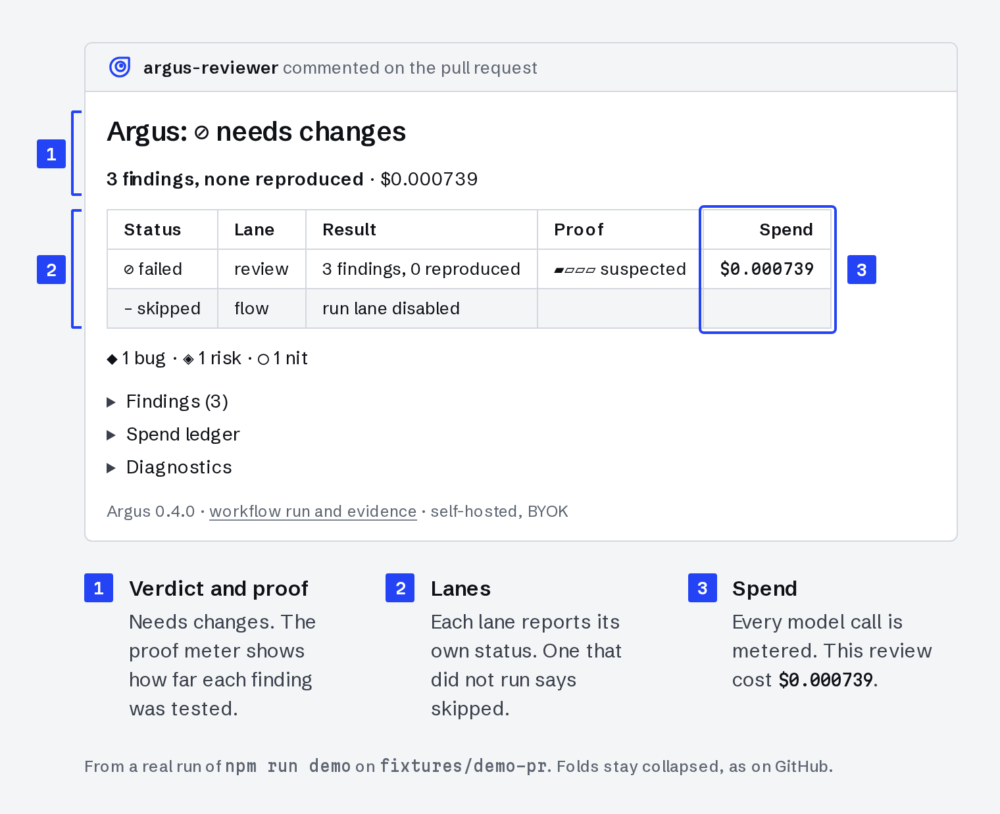

<p align="center">
  <picture>
    <source media="(prefers-color-scheme: dark)" srcset="assets/brand/export/lockup-dark.svg" />
    
  </picture>
</p>

<p align="center">
  <a href="https://www.npmjs.com/package/argus-reviewer-e2e"></a>
  <a href="https://github.com/duketopceo/Argus/actions/workflows/ci.yml"></a>
  <a href="LICENSE"></a>
  <a href="https://github.com/duketopceo/Argus/security/policy"></a>
</p>

**Argus reviews your pull request, runs your real app in a browser, and posts a verdict with its exact cost.**

It is a GitHub Action and a CLI. It runs on your infrastructure with your own OpenRouter key: no hosted service, no telemetry, no per-seat pricing. MIT licensed.

## Install in 60 seconds

```bash
npm i -D argus-reviewer-e2e      # the package; the command is argus-reviewer
npx argus-reviewer init          # config, a smoke test, and the PR workflow
```



`init` checks your environment and tells you what is missing. Add `OPENROUTER_API_KEY` to your shell and to the repository secrets, and every pull request gets a review.

Record a browser flow once, then replay it on every run:

```bash
npx argus-reviewer record "add an item and check out" --url http://localhost:3000
npx argus-reviewer run
```

A replay that matches the recorded page makes no model call and costs $0. This cast replays a recorded checkout flow with no API key set at all:



## What lands on your PR

<picture>
  <source media="(prefers-color-scheme: dark)" srcset="docs/assets/hero-dark.png" />
  
</picture>

One sticky comment that updates on every push:

- **Verdict:** approve or needs changes, with each finding linked to a source line.
- **Inline comments:** one batched review, sorted by severity. A finding can carry a `suggestion` block you apply in one click.
- **Proof level:** each finding says whether it is suspected or reproduced. Argus requests changes only for reproduced or adjudicated blockers; everything else stays advisory. `requestChanges: false` keeps it advisory always.
- **Lanes and cost:** what ran, what did not and why, and the dollar cost of the model calls.

The comment is not a GitHub review, so on its own it does not satisfy a required-approval rule. To have Argus submit a real review, supply `approval-token` (a GitHub App token, or a PAT from an account that is not the PR author). An approve also needs `approval-evidence` and a green `approval-check` on the head commit. Details: [`docs/approval-token.md`](docs/approval-token.md).

## Four lanes

`argus-reviewer verify` runs the lanes you select and writes one `run-manifest.json`, which the PR comment renders.

| Lane | Select with | What it does |
|---|---|---|
| review | default | Reviews the diff and posts findings and a verdict |
| flow | `--flow` (action input `run`) | Replays recorded browser flows, cache first |
| app | `--app --task "..."` plus `--expect-text`, `--expect-url` or `--expect-selector` | Runs one directed task against your live app and checks the expected state |
| a0 | `--a0` (action input `a0`) | Hands the task to your own Agent Zero host in a sandboxed child environment. A finished delegation reports inconclusive, never passed, because the agent's answer is self-reported |

A lane that cannot run says so. Here the review lane has no pull request to read, so it reports skipped with the reason, and the flow lane replays from the cache:


## Status legend

Every lane, in the comment and in the terminal, reports one of six statuses:

| Glyph | Status | Meaning |
|---|---|---|
| `●` | passed | The lane ran and its checks held |
| `⊘` | failed | The lane ran and found a problem |
| `◐` | inconclusive | The lane ran, but its evidence cannot settle the answer |
| `⊖` | blocked | A policy stopped the lane |
| `◌` | unavailable | The lane could not run: a missing key, tool or host |
| `–` | skipped | The lane was not selected, or had nothing to work on |

## Cost

Every OpenRouter call is metered from the provider's per-call price and totaled in the comment. The review in the image above cost **$0.000739**. A flow replay that matches its cache costs $0. `budgetUsd` caps each run (default $1.00), and you choose the model for each job (`model`, `code_model`, `escalation_model`).

The action tags every call with `ARGUS_REVIEWER_TRACE` (repository, PR, commit, run), so spend can be attributed per review. See [`docs/quickstart.md`](docs/quickstart.md) for the `openrouter` config block.

## Security

Argus treats pull request content as hostile. Untrusted checkouts never execute config code, fork PRs are gated behind the `argus-probe` label, secrets are filtered from model input and comment output, and the probe sandbox runs with no network and a read-only filesystem. Threat model: [`SECURITY.md`](SECURITY.md).

## Configuration

`argus-reviewer.config.ts` (or `argus-reviewer.config.json`):

```ts
import { defineConfig } from 'argus-reviewer-e2e'

export default defineConfig({
  model: 'google/gemini-2.5-flash-lite',          // vision: grounding and actions
  code_model: 'deepseek/deepseek-v4.1-flash',     // diff review
  escalation_model: 'anthropic/claude-sonnet-4',  // risky or complex findings
  budgetUsd: 1.0,
  target: { url: 'https://your-app.example.com' },
  testsDir: 'e2e',
  reportRetention: 20,                            // archived manifests to keep
})
```

Full shape: [`src/config.ts`](src/config.ts). Setup walkthrough: [`docs/quickstart.md`](docs/quickstart.md).

## Contributing

The repository also has a terminal view (`npm run watch`) and a desktop dashboard (`npm run app`). They are contributor tools: they run only from a clone of this repository, and the npm package does not ship them. The casts above are recorded by `npm run demo:record` (see `scripts/demo-record.mjs`). Guidelines: [`CONTRIBUTING.md`](CONTRIBUTING.md).

License: [MIT](LICENSE).
