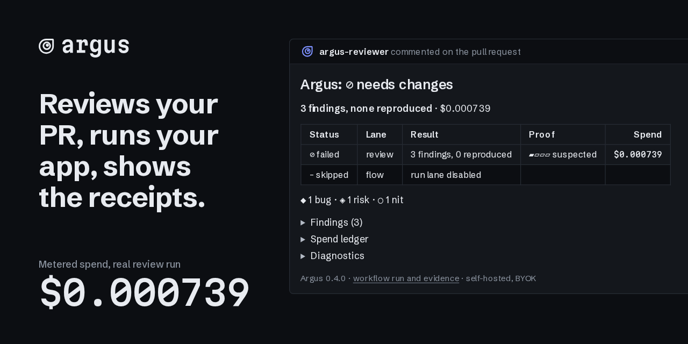
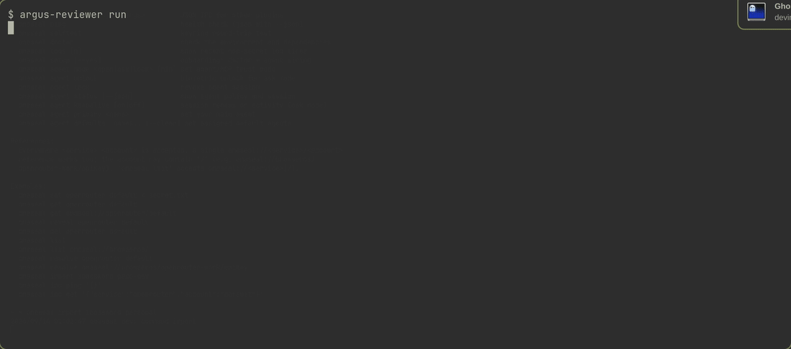

# Argus

<p align="center">
  
</p>

<p align="center">
  <a href="https://www.npmjs.com/package/argus-reviewer-e2e"></a>
  <a href="https://github.com/duketopceo/Argus/actions/workflows/ci.yml"></a>
  <a href="LICENSE"></a>
  <a href="https://github.com/duketopceo/Argus/security/policy"></a>
</p>

**The hundred-eyed watcher for your pull requests.** Argus reviews your diff, then goes further: it starts your real app, clicks through it like a user, and executes probes against suspected bugs — then posts a verdict on the PR with the exact dollar cost. Self-hosted, MIT-licensed, bring-your-own OpenRouter key. No SaaS middleman, no telemetry, no per-seat pricing.

## Get started in 60 seconds

```bash
npm i -D argus-reviewer-e2e      # the npm package; the command it installs is `argus-reviewer`
npx argus-reviewer init          # writes config + smoke test + GitHub workflow
```

Add `OPENROUTER_API_KEY` to your environment (and repo secrets for CI). Then:

```bash
npx argus-reviewer record "sign in and open the dashboard" --url http://localhost:3000
npx argus-reviewer run           # replays + asserts — free on cache hit
```

That's it. `init` drops a ready-to-run GitHub workflow; every PR from then on gets a review comment with findings, flow results, video evidence, and spend.

## `verify` — four lanes, one manifest

`argus-reviewer verify` runs the product lanes and writes one `run-manifest.json` — the shared evidence contract the sticky comment, the `npm run watch` TUI, and the Electron dashboard (`npm run app`) all render:

| Lane | Selected by | What it does |
|---|---|---|
| **review** | default | Diff review → inline findings + verdict |
| **flow** | `--flow` (action input `run`) | Cache-first replay of recorded journeys |
| **app** | `--app` + `--task` (action inputs `app`/`app-task`) | Directed task against your live app with an expected-state check (`--expect-text`/`--expect-url`/`--expect-selector`) |
| **a0** | `--a0` (action input `a0`) | Escalates the task to your Agent Zero host — sandboxed child env, bounded, and deliberately honest: it reports `inconclusive`/`unavailable`, never `passed`, while live verification is unproven ([#53](https://github.com/duketopceo/Argus/issues/53)) |

Every lane reports an honest status (`passed`/`failed`/`skipped`/`blocked`/`unavailable`/`inconclusive`) with usage, budget, and head binding in the manifest — a lane that couldn't run says so instead of silently no-opping. Completed manifests archive to `<reportDir>/manifests/` (bounded by `reportRetention`, default 20; `0` disables), and the dashboards keep the last valid run even if a write is interrupted.

## What lands on your PR

A sticky comment that updates on every push:

- **Verdict** — `APPROVE` / `NEEDS_CHANGES` with findings linked to concrete source lines
- **Inline comments on every severity** — one batched PR review, severity-sorted; each finding can carry a committable `suggestion` block you apply in one click
- **Blocks only on proof** — the review escalates to `REQUEST_CHANGES` only for reproduced or adjudicated blockers; everything else stays advisory. Stale request-changes reviews are dismissed automatically, and `requestChanges: false` keeps it advisory forever
- **Flow results** — which recorded user-journeys passed, healed, or broke
- **Reproduced, not suspected** — opt-in sandbox lane runs authored regression probes; a probe that fails on head and passes on base stamps the finding as *proven*
- **Cost** — every model call metered from OpenRouter's per-call pricing, totaled in dollars

That comment is **not a review**. `require_approving_reviews` reads reviews only, so on a protected branch the verdict alone leaves the gate unsatisfied. Supply `approval-token` — a GitHub App installation token, or a PAT from an account that is not the PR author — and Argus also submits a real review whose event follows the verdict. `github.token` cannot do this; GitHub refuses it outright. A token alone is **not** enough: an `APPROVE` also needs `approval-evidence` naming the test command, and `approval-check` naming a check run that has completed green on the pull request's head commit, produced by the App named in `approval-check-app` (`github-actions` by default). Details, the measured refusals, and the review-discipline rules: [`docs/approval-token.md`](docs/approval-token.md).

<p align="center">
  
</p>

## Why it's different

| | Argus |
|---|---|
| **Selectors** | None. A vision model looks at a screenshot and decides where to click. |
| **Maintenance** | Fingerprint cache replays at zero model cost; when the UI drifts, self-healing re-grounds and the heal shows up as a reviewable diff. |
| **Review depth** | Beyond the diff: full-source evidence linkage, CI evidence, executed probes, real browser runs. |
| **Spend** | You pick the models per lane (`model`, `grounding_model`, `code_model`, `escalation_model`) and set `budgetUsd`. Cache hits cost nothing. |
| **Data** | Yours. Keys, journals, videos, and reports stay on your infra. |

## Configuration

`argus-reviewer.config.ts`:

```ts
import { defineConfig } from 'argus-reviewer-e2e'

export default defineConfig({
  model: 'google/gemini-2.5-flash-lite',          // vision grounding + actions
  code_model: 'deepseek/deepseek-v4.1-flash',     // diff review
  escalation_model: 'anthropic/claude-sonnet-4',  // risky/complex findings
  budgetUsd: 1.0,
  target: { url: 'https://your-app.example.com' },
  testsDir: 'e2e',
  // How many verify manifests stay under <reportDir>/manifests/ for the
  // dashboard/TUI run history (default 20; 0 disables archival).
  reportRetention: 20,
})
```

Point `provider.order` at fast OpenRouter backends (`cerebras`, `groq`) for sub-second review calls — speed is a routing choice, not a pricing tier. Full shape: [`src/config.ts`](src/config.ts) (a legacy `vision-e2e.config.*` is still accepted). Setup walkthrough: [`docs/quickstart.md`](docs/quickstart.md).

## The execution ladder

Argus does more as you grant it more access — each rung is opt-in:

1. **API review** — GitHub token only. Reviews the PR diff and posts the verdict.
2. **Trusted checkout** — findings get verified against the full source tree.
3. **Browser flows** — Playwright drives your real app through recorded journeys (`verify --flow`).
4. **App task lane** — `verify --app --task "submit the signup form" --expect-url /welcome` runs a directed task against your live app and checks the expected state.
5. **Sandbox probes** — suspected findings get authored regression tests, executed in a hardened container (no network, no secrets, read-only FS). Fork PRs stay behind an `argus-probe` label gate.
6. **Agent Zero delegation** — `argus-reviewer delegate "find the checkout bug"` or the opt-in `verify --a0` lane hands work to your own A0 instance over a sanitized child environment. The lane reports `inconclusive`, not `passed`, until live round-trips are proven ([#53](https://github.com/duketopceo/Argus/issues/53)).

## Cost attribution

Every OpenRouter call carries a trace tag. The action auto-sets `ARGUS_REVIEWER_TRACE` (repo, PR, commit, run id) so spend is attributable per review — or set it yourself for custom fields. See [`docs/quickstart.md`](docs/quickstart.md) for the `openrouter` config block.

## Security model

Reviews run against hostile input by design: untrusted checkouts never execute config code, fork PRs are label-gated, secrets are filtered from model context and comment output, and the sandbox probe lane runs network-less with a read-only filesystem. Threat model: [`SECURITY.md`](SECURITY.md).

## File structure

```text
argus-reviewer/
├── action/                  # GitHub Actions composite action + sticky PR comment
├── runner/                  # Self-hosted runner registration docs + script
├── electron/                # Local observability dashboard (`npm run app`)
├── src/
│   ├── api.ts               # Test-facing `test`/`td` API + generated test renderer
│   ├── cli.ts               # verify · record · run · code-review · delegate · cache · index · init
│   ├── config.ts            # `argus-reviewer.config.*` loader
│   ├── cache/               # Per-step fingerprint + flow store
│   ├── driver/              # Playwright browser + dev-server target
│   ├── engine/              # Vision record/replay + healing loop
│   ├── evidence/            # PR/CI context, fork trust gate, finding linkage
│   ├── executor/            # Agent Zero delegation + hardened probe sandbox
│   ├── probe/               # Model-authored regression probes
│   ├── report/              # PR comment, JUnit XML, run.json, run-manifest.json
│   └── vision/              # OpenRouter client, cost parsing, budget ledger
└── tests/                   # Unit tests + Playwright fixture page
```

License: [MIT](LICENSE).
