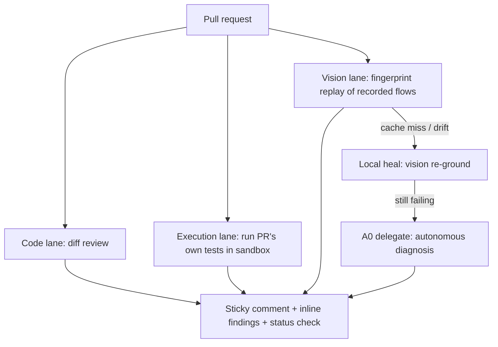

# feat: Post-launch roadmap — proof, execution-backed review, A0 depth, scale

## Summary

Re-plan of everything after `argus-reviewer-e2e@0.1.1`, replacing the
2026-09-10 roadmap (whose P0–P3 are now shipped). Four phases in priority
order: prove the launch, build the execution-backed review moat, deepen the
Agent Zero lane, then scale/ops. Each phase spawns its own detailed plan when
picked up — this document sequences the work and pins the decisions that are
already decidable.

---

## Problem Frame

0.1.1 is on npm and the launch post is ready to ship. What the product has —
record/replay/heal, code review, A0 delegation, observability — is real but
unproven to anyone outside this repo. The original product thesis (the catch
jump comes from running actual code, not just reading diffs) is still
unbuilt, and the three scale issues (#21–23) remain open. The risk ordering
is: adoption dies without visible proof; differentiation dies without the
execution lane; the rest is enterprise readiness that matters only if the
first two land.

---

## Requirements

**Proof & adoption**

- R1. A visitor to the repo or npm page sees the product working (demo
  assets, real output) without installing anything.
- R2. Releases publish from CI without manual passkey auth, using npm
  trusted publishing (OIDC) rather than a long-lived token.
- R3. A clean-install smoke test (fresh dir → install → `init` → config
  load, plus a `run` when a model key is available) runs in CI so
  consumer-facing breakage like the 0.1.0 CJS config bug is caught before
  publish, not by a user.

**Execution-backed review**

- R4. On a PR, argus can execute the diff's own test suite in an isolated
  environment and feed pass/fail evidence into the review verdict.
- R5. Review findings that claim a runtime defect carry execution evidence
  when the execution lane ran, so findings are verifiable rather than
  asserted.

**Agent Zero depth**

- R6. `delegate` and `heal: 'a0'` are verified end-to-end against a live A0
  instance, with the integration's real failure modes documented.
- R7. Delegated A0 work respects least-privilege scope and a hard
  time/cost ceiling configured by the user.

**Scale & ops**

- R8. Runner health is visible (builds on the Electron dashboard) — #21.
- R9. Org-level spend alerts and budget caps exist — #22.
- R10. GitHub Enterprise Server and GitLab are supported targets — #23.

**Housekeeping**

- R11. `STRATEGY.md` tracks reflect this roadmap; new GitHub issues exist
  for each phase's headline work.

---

## Key Technical Decisions

- **Phasing: proof → execution → A0 → scale.** Adoption and the
  differentiation moat come before enterprise readiness; A0 depth is gated
  on a live instance being reachable, so it can slide without blocking
  scale work.
- **Execution substrate: local Docker on the self-hosted runner first.**
  The action already assumes self-hosted runners; Docker-in-runner adds no
  new external dependency and keeps the self-hosted-first identity. Managed
  sandboxes (Cloudflare Sandbox, E2B) stay alternatives for users who want
  hosted isolation — decided per-phase, not here.
- **A0 is a headline track, not a vision sub-lane.** It serves both lanes
  (healing and autonomous exploration/review assistance), so it gets its
  own phase and its own issue.
- **npm trusted publishing over `NPM_TOKEN`.** OIDC trusted publishing
  removes the long-lived token entirely; a granular token with bypass-2FA
  is the documented fallback.
- **Each phase re-plans before execution.** This roadmap pins scope and
  decisions; per-phase `ce-plan` runs produce the implementation units for
  the work actually being picked up.

---

## High-Level Technical Design

The four phases build outward from this shape: Phase A proves what exists,
Phase B adds the execution lane, Phase C hardens the A0 escalation path,
Phase D scales the operational layer around all of it.

---

## Implementation Units

### Phase A — Proof & adoption

### U1. Strategy and tracker reconciliation

- **Goal:** Make the repo's stated direction match this roadmap.
- **Requirements:** R11
- **Dependencies:** none
- **Files:** `STRATEGY.md`; GitHub issues via `gh`
- **Approach:** Rewrite the Tracks section of `STRATEGY.md` to the four
  phases here; file one GitHub issue per headline unit below so the tracker
  and the plan stay linked.
- **Test scenarios:** none — documentation.
- **Verification:** `STRATEGY.md` shows the new tracks; issues exist and
  cross-link this plan.

### U2. Demo assets and proof surface

- **Goal:** A visitor sees the product working in under a minute.
- **Requirements:** R1
- **Dependencies:** U1
- **Files:** `README.md`; demo artifacts under `docs/` or the dashboard;
  optional sample consumer repo (separate repo decision deferred to phase
  plan)
- **Approach:** Record a `record`/`run` session with `ce-demo-reel` (GIF or
  terminal capture) plus a real PR screenshot showing the sticky comment,
  inline findings, and cost ledger. Lead the README with it.
- **Test scenarios:** none — content work; verified by viewing the rendered
  README.
- **Verification:** README shows the product end-to-end above the fold.

### U3. CI release pipeline with trusted publishing

- **Goal:** `npm publish` runs from a tag in CI with OIDC provenance.
- **Requirements:** R2
- **Dependencies:** none (repo-level)
- **Files:** `.github/workflows/release.yml` (new); `package.json`
- **Approach:** Tag-triggered workflow running typecheck/test/build then
  `npm publish --provenance`; configure the package's trusted publisher on
  npmjs.com (repo + workflow path). Manual passkey publishing becomes the
  emergency path only.
- **Test scenarios:** dry-run the workflow on a prerelease tag before the
  next real release; verify provenance badge appears on the npm page.
- **Verification:** a tagged release publishes without any local credential.

### U4. Clean-install consumer smoke test in CI

- **Goal:** The end-user install path is exercised on every release-candidate
  PR.
- **Requirements:** R3
- **Dependencies:** U3 (runs against the packed artifact before publish)
- **Files:** `.github/workflows/consumer-smoke.yml` or a job in the release
  workflow; a small smoke script under `scripts/`
- **Approach:** `npm pack` → fresh dir → `npm init -y` (deliberately
  CommonJS, matching the 0.1.0 failure) → install tarball → `init` → run a
  no-vision-path check (e.g. `--help`, config load) plus a mocked or
  cheap-model `run` when a key is available.
- **Test scenarios:** CommonJS consumer loads generated TS config; ESM
  consumer loads it; `init` succeeds with no optional tools detected.
- **Verification:** the 0.1.0 CJS failure mode fails this job if reintroduced.

### Phase B — Execution-backed review

### U5. Sandbox test-execution lane

- **Goal:** Argus executes the PR's own test suite in an isolated
  environment and captures results.
- **Requirements:** R4
- **Dependencies:** Phase A shipped (or parallel); phase-level plan required
  first — substrate choice, security boundary, and runner image design are
  non-trivial
- **Files:** new `src/executor/` sibling (e.g. `src/executor/sandbox.ts`);
  `action/action.yml` inputs; `src/config.ts` for enablement flags
- **Approach:** Checkout → detect project test command → run in Docker on
  the self-hosted runner with resource limits and no network except
  declared needs → parse results into the run report. Opt-in per repo.
- **Test scenarios:** passing suite yields positive evidence; failing suite
  yields negative evidence; timeout/kill-switch honored; sandbox cannot
  reach undeclared network endpoints.
- **Verification:** a dogfood PR shows execution evidence in the sticky
  comment.

### U6. Evidence-linked review findings

- **Goal:** Review verdict incorporates execution evidence; findings that
  predicted runtime breakage are cross-checked.
- **Requirements:** R5
- **Dependencies:** U5
- **Files:** `src/report/comment.ts`, `src/report/run.ts`, review prompt
  assembly in `src/engine/prompts.ts`
- **Approach:** Feed sandbox results into the review stage so the model can
  corroborate or withdraw findings; render an "evidence" line on verified
  findings.
- **Test scenarios:** finding corroborated by failing test renders with
  evidence; finding contradicted by passing suite is withdrawn or
  downgraded.
- **Verification:** dogfooded PR shows at least one evidence-linked finding.

### Phase C — Agent Zero depth

### U7. Live A0 verification and hardening

- **Goal:** `delegate` and `heal: 'a0'` work against a real instance; quirks
  are fixed and documented.
- **Requirements:** R6
- **Dependencies:** a reachable A0 instance (currently
  `agent0.bartlettdash.com` is down — external)
- **Files:** `src/executor/a0.ts`, `src/detect.ts`, `docs/quickstart.md`
- **Approach:** Run `delegate "say hello"` → a real browser task → a heal
  escalation on a deliberately broken flow; fix auth/output/timeouts as
  discovered.
- **Test scenarios:** delegate returns streamed output and exit 0;
  unreachable host fails cleanly without hanging the run; heal diagnosis
  lands in `run.json`.
- **Verification:** a real delegation round-trip succeeds on video or logs.

### U8. A0 scope and cost controls

- **Goal:** Users bound what delegated work can do and spend.
- **Requirements:** R7
- **Dependencies:** U7
- **Files:** `src/executor/a0.ts`, `src/config.ts`, `docs/quickstart.md`
- **Approach:** Surface per-task timeout and a delegated-spend ceiling;
  document the `a0 gateway` scope model (`browser` vs `computer_use`) so
  users can grant least privilege on the A0 side.
- **Test scenarios:** timeout kills a hung delegation; ceiling stops
  further A0 calls mid-run.
- **Verification:** config knobs demonstrably cap a live delegation.

### Phase D — Scale & ops

### U9. Runner health dashboard

- **Goal:** #21 — visibility into self-hosted runner state.
- **Requirements:** R8
- **Dependencies:** none
- **Files:** `electron/` dashboard extension; possibly `src/live.ts`
- **Approach:** Extend the Electron dashboard with runner status (queued/
  active runs, failures, spend per run) sourced from `live.ndjson` + `gh`
  runner APIs. Phase plan decides GitHub API surface vs. local-only.

### U10. Org spend alerts and budget caps

- **Goal:** #22 — budgets that bite at org level, not just per-run.
- **Requirements:** R9
- **Dependencies:** none (cost ledger already exists in `src/vision/`)
- **Files:** `src/vision/ledger.ts`, `src/config.ts`, report/alert surface
- **Approach:** Aggregate `budgetUsd` into per-org/per-period caps with an
  alert + hard-stop path. Reuse existing per-call cost attribution.

### U11. GHE and GitLab support

- **Goal:** #23 — the action works outside github.com.
- **Requirements:** R10
- **Dependencies:** none
- **Files:** `action/`, `src/report/comment.ts` (PR comment abstraction),
  `src/cli.ts` URL/host handling
- **Approach:** Abstract the PR-comment/status surface behind a host
  adapter; GitHub Enterprise first (same API), GitLab as a second adapter.

---

## Scope Boundaries

### Deferred to Follow-Up Work

- **Native A0 plugin** (`usr/plugins/argus` + index submission) — deferred
  until U7 proves the delegation path live; the plugin is distribution, not
  capability.
- **Managed cloud hosting** — remains outside the product's identity.
- **Selector-based authoring** — vision-first is the point.
- **Marketplace listing for the GH Action** — natural tail of Phase A but
  not required for launch proof.

### Open Questions

- Execution substrate beyond Docker-in-runner (hosted sandbox per-repo
  opt-in?) — decided in Phase B's plan.
- Whether the A0 lane ever merges into the review lane as a finding
  verifier — depends on what U7 reveals about reliability.

---

## Risks & Dependencies

| Risk / dependency | Mitigation |
| --- | --- |
| A0 host unreachable blocks Phase C entirely | Phase C is sequenced last-but-one and independently shippable; U7 starts whenever a host is reachable |
| Sandbox execution is the largest single build and a security boundary | Own phase plan; opt-in per repo; network-deny-by-default posture; Docker-first keeps it boring |
| npm trusted publishing misconfiguration blocks releases | Manual passkey publish remains the fallback path; validate on a prerelease tag |
| Demo assets age as the product moves | Regenerate on each phase boundary; `ce-demo-reel` keeps capture cheap |
| Scope creep into managed hosting | Explicitly out of identity; treat requests as signals for hosted-sandbox option only |

---

## Sources / Research

- Prior roadmap: `docs/plans/2026-09-10-002-roadmap-and-release-prep.md`
  (P0–P3 shipped; this plan replaces it)
- Strategy anchor: `STRATEGY.md` (tracks updated by U1)
- Open issues: #21, #22, #23 (Phase D)
- A0 surface: `a0` CLI v2.12 (`headless`, `acp`, `gateway` scope model);
  plugin layout researched earlier — deferred per scope boundaries
- Consumer failure modes that shaped Phase A: CJS config load, `/tmp`
  module resolution, `dist/api.js` export path (fixed in #44, shipped
  0.1.1)
