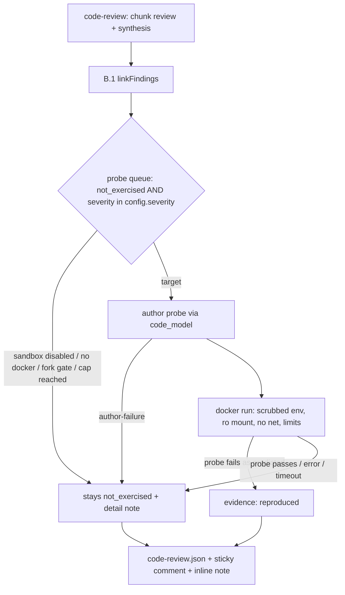

# feat: Execution-backed review — sandbox lane + authored probes (Phase B.2)

## Summary

Phase B.2 of the post-launch roadmap (U6): for high-severity findings that
B.1 tagged `not_exercised`, Argus authors a probe test, executes it inside a
hardened Docker container on the self-hosted runner, and upgrades the
finding's evidence to `reproduced` when the probe demonstrates the defect.
This is the differentiation half of the execution-backed-review thesis —
"found a defect *and reproduced it*" — versus review bots that only assert.

---

## Problem Frame

B.1 (shipped in PR #56) classifies every code-review finding against the
PR's own CI evidence: `exercised`, `corroborated`, `not_exercised`,
`inconclusive`. That made findings *verifiable in principle* but left the
`not_exercised` set — typically the highest-value findings, since existing
tests demonstrably don't reach them — as asserted-but-unproven. B.2 turns a
bounded subset of that queue into executed probes: the model writes a test
aimed at the suspected defect, the harness runs it in a scrubbed container,
and a reproduction is the only thing that upgrades the finding. Everything
else (clean probe, authoring failure, infra failure) leaves the finding at
`not_exercised` with severity intact — the sandbox can only add positive
evidence, never negative.

This is the largest security boundary in the product so far: it executes
PR-contributed code on the consumer's runner. The boundary design is
therefore the load-bearing part of the plan and every invariant is pinned
as a Key Technical Decision rather than left to implementation.

---

## Requirements

From the roadmap (R4, R5) and pinned invariants:

- **R1.** During `code-review`, findings with `evidence.status ===
  'not_exercised'` and severity in the blocking set become probe targets,
  up to a per-run cap.
- **R2.** For each target, Argus authors a test file in the consumer's
  detected test-runner idiom and executes it in the sandbox against the
  PR's checkout.
- **R3.** A probe that demonstrates the defect (test fails the way the
  finding predicts, or throws the predicted error) upgrades the finding's
  evidence to `reproduced`; the detail line names the probe outcome.
- **R4.** Sandbox invariants: no `GITHUB_TOKEN`, no `OPENROUTER_API_KEY`,
  no consumer secrets or ambient env; network `none`; read-only root
  filesystem; non-root user; all capabilities dropped;
  `no-new-privileges`; CPU/memory/PID limits; hard wall-clock timeout.
- **R5.** Fork/external-contributor PRs never run probes by default; a
  maintainer-applied `argus-probe` PR label (or an explicit config
  opt-in) is the approval signal.
- **R6.** Probe execution is opt-in per repo (`sandbox.enabled`), off by
  default; without Docker or a supported test harness the lane degrades
  to a detail note and findings stay `not_exercised`.
- **R7.** Probe output is attacker-controlled: capped and sanitized
  before it enters any model prompt or PR surface; never rendered
  verbatim.
- **R8.** Probe spend (authoring calls) and wall-clock are bounded and
  reported in `code-review.json`.

---

## Key Technical Decisions

- **KTD1 — Unit/harness-level probes only in v1.** The roadmap allows
  browser-level probes via the vision engine's record/replay loop; that
  requires a running app target, which PR CI does not reliably provide,
  and B.1 findings are file-level defects best proven by a focused test.
  Browser probes are deferred (see Scope Boundaries).
- **KTD2 — Docker-in-runner is the sandbox substrate** (roadmap-pinned):
  `docker run` with `--rm --network none --read-only --cap-drop=ALL
  --security-opt no-new-privileges --init --ulimit core=0 --user
  <non-root> --pids-limit --memory --cpus --tmpfs /tmp`, workspace
  bind-mounted read-only, and the image pinned/configurable
  (`sandbox.image`, default `node:22-slim` — digest-pinned recommended,
  matching the action's `node-version` default). Three boundary details
  research showed are load-bearing, not optional:
  - **Wall-clock kill must name the container.** `execFile`'s timeout
    SIGKILLs the `docker run` *client* — the daemon-managed container
    keeps running and `--rm` only fires on container exit. Every run
    uses `--name argus-probe-<runId>`; on timeout the executor issues a
    best-effort `docker rm -f argus-probe-<runId>`; on startup it sweeps
    any stale `argus-probe-*` containers. Never mount the docker socket
    and never DinD — the CLI stays host-resident.
  - **The checkout can carry secrets.** `actions/checkout` defaults to
    `persist-credentials: true`, which writes a live token into
    `.git/config`; a ro bind-mount of the workdir hands it to probe
    code. After the workspace mount, add `--tmpfs /work/.git` (and
    `--tmpfs /work/.env`) — later mounts win, masking credential files
    without copying the tree. Mounts are append-ordered, same mechanism
    as the nested rw report-dir mount.
  - **Env crosses only as a literal allowlist.** `docker run -e FOO`
    (bare name) copies the host's `FOO` — a silent secret leak. The argv
    builder emits only `-e KEY=value` literals from a fixed allowlist
    (`PATH`, `HOME=/tmp`, `CI=1`, `npm_config_cache=/tmp/.npm`); never
    the bare form, never `--env-file`.
  Dependencies are never installed inside the container: the action's
  existing `npm ci` already produced `node_modules` on the host, so
  `--network none` holds for every probe run. External hardening
  reference: OWASP/CI sandboxing practice and the SOTA container
  sandboxing rules (`sota-skills/03-containers-microvms`) — the flag set
  above is their untrusted-code profile verbatim.
- **KTD3 — Probes are authored in the consumer's own test-runner idiom.**
  Detection reads `package.json` (devDeps + `scripts.test`) for vitest,
  jest, or `node --test` (`node:test`); the generated file is written
  under `argus-reviewer-report/probes/` and run via the detected
  runner's non-interactive invocation. **Do not use `npx`/`npm` inside
  the container** — they write to the npm cache, which fails under
  `--read-only` + `nobody` + no real `HOME`. Invoke the runner binaries
  directly (`node node_modules/vitest/vitest.mjs run <file>`,
  `node node_modules/jest/bin/jest.js <file>`, `node --test <file>`)
  with the declared-env allowlist from KTD2 (`HOME=/tmp`,
  `npm_config_cache=/tmp/.npm`). No supported harness → the finding
  stays `not_exercised` with detail "no supported test harness".
- **KTD4 — One new evidence status: `reproduced`.** `EvidenceStatus`
  gains `'reproduced'`. A clean probe (test passes — defect did not
  reproduce) leaves the finding at `not_exercised` unchanged: a model-
  authored probe that fails to trigger is not evidence the defect is
  absent, only that this probe missed it. Probe-author failure, sandbox
  infra failure, and timeout likewise never downgrade — they are
  recorded on the probe record, not the finding.
- **KTD5 — Opt-in `sandbox` config block.** `sandbox: { enabled, image,
  maxProbes, timeoutMs, memory, cpus, allowForks }`, defaults:
  `enabled: false`, `image: 'node:22-slim'`, `maxProbes: 3`,
  `timeoutMs: 120_000`, `memory: '2g'`, `cpus: '2'`, `allowForks: false`.
  Fork gate evaluation order: `allowForks: true` runs everywhere;
  otherwise fork PRs require the `argus-probe` label or an
  author_association of MEMBER/OWNER/COLLABORATOR. Same-repo PRs run
  unconditionally once enabled.
- **KTD6 — Reproduction is the only upgrade, and only for an attributed
  test failure.** The probe outcome is classified by the harness result,
  not by asking the model to judge its own probe: `reproduced` requires
  the runner to report a *failed test* in the authored file — a plain
  nonzero exit is insufficient because collection errors, syntax errors,
  and "no tests found" also exit nonzero. Each runner maps this
  differently (vitest/jest summary counts; `node --test` TAP `not ok`);
  `harness.ts` owns per-runner classification of `failed-test` vs
  `load-error` vs `clean`. The raw (capped) output is stored on the
  probe record for audit. To keep the signal honest the authored probe
  is a single test file scoped to the finding — its pass/fail is the
  signal.
- **KTD7 — Probe authoring is one bounded model call per finding** on
  `code_model`, fed: the finding (file/line/message), the implicated
  file's contents, one exemplar test file (nearest test to the file per
  the repo index), and the detected harness. Structured output schema
  returns a single test file. Authoring cost records on the shared
  `codeReviewBudgetUsd` ledger — a capped review cannot spawn unbounded
  probes.

---

## High-Level Technical Design



Evidence pipeline position: linkage (B.1) produces the queue; the probe
stage (this plan) can only move `not_exercised` → `reproduced`. Every
other status is untouched.

---

## Output Structure

```text
src/
  executor/
    sandbox.ts        # docker availability + hardened run wrapper
  probe/
    harness.ts        # test-runner detection + invocation spec
    author.ts         # probe prompt, schema, parse
    queue.ts          # target selection, orchestration, outcome classify
tests/unit/
  sandbox.test.ts
  probe-author.test.ts
  probe-queue.test.ts
```

---

## Implementation Units

### U1. Evidence model + config surface + PR metadata

- **Goal:** The types and switches B.2 needs exist before any execution.
- **Requirements:** R5, R6
- **Dependencies:** none
- **Files:** `src/evidence/link.ts` (extend `EvidenceStatus`),
  `src/config.ts` (`Sandbox` interface + `sandbox` field + defaults +
  `resolveConfig` normalization), `src/evidence/ci.ts` (extend
  `fetchPrHeadSha` into `fetchPrMeta` returning `{ headSha, isFork,
  authorAssociation, labels }`), `src/cli.ts` (call-site update),
  `tests/unit/evidence.test.ts`, `tests/unit/config` coverage
- **Approach:** `EvidenceStatus` gains `'reproduced'` — additive only,
  `linkFindings` never emits it; only the probe stage does. `fetchPrMeta`
  reads the existing `/pulls/{pr}` payload fields (`head.repo.fork`,
  `author_association`, `labels[].name`) — one request, no new API
  surface. `sandbox.allowForks` + label/association gate is a pure
  function `mayProbePr(meta, sandboxConfig)` in `src/evidence/` or
  `src/probe/` so it is unit-testable without GitHub.
- **Test scenarios:**
  - `mayProbePr`: same-repo PR → allowed when enabled; fork PR + no label
    + OUTSIDE-collaborator association → denied; fork PR + `argus-probe`
    label → allowed; fork PR + MEMBER association → allowed;
    `allowForks: true` + fork + no label → allowed; `enabled: false` →
    denied regardless.
  - `resolveConfig`: absent `sandbox` → `enabled: false` defaults
    populated; partial `sandbox` → unspecified fields take defaults;
    non-finite `maxProbes`/`timeoutMs` → normalized to defaults.
  - `linkFindings` never produces `reproduced` (regression guard).
- **Verification:** types compile; gate matrix covered by unit tests.

### U2. Sandbox executor

- **Goal:** One audited function that runs a command inside the hardened
  container, with all subprocess calls behind the existing `ExecFn` seam.
- **Requirements:** R4, R7
- **Dependencies:** U1 (config type)
- **Files:** `src/executor/sandbox.ts`, `tests/unit/sandbox.test.ts`
- **Approach:** `dockerAvailable(exec)` runs `docker version` (short
  timeout). `runProbeInSandbox({ exec, image, workdir, reportDir, cmd,
  limits })` builds the `docker run` argv from KTD2: `--rm`,
  `--network none`, `--read-only`, `--cap-drop ALL`, `--security-opt
  no-new-privileges`, `--user 65534:65534` (nobody), `--pids-limit`,
  `--memory`, `--cpus`, `--tmpfs /tmp:rw,nosuid,nodev,noexec`, `--pull
  missing`, `-v <workdir>:/work:ro`, `-w /work`, plus `--env` only for a
  declared allowlist (PATH is set explicitly; no host env is inherited —
  `execFile` already does not pass ambient env to the container's
  process, but the `docker run` argv carries no `-e` flags that leak
  host values).
  **Probe-file placement:** the authored probe lives under the report
  dir (`<cwd>/argus-reviewer-report/probes/`), which sits inside the
  workspace so its relative imports into `src/`/`tests/` resolve
  naturally under `/work`. Files are written on the *host* before
  `docker run`; the container gets a nested writable bind-mount over
  just the report dir — `-v <reportDir>:/work/<rel-reportDir>:rw` after
  the ro workspace mount (later mounts win) — so the harness can write
  output while the repo and `node_modules` stay read-only. The rw
  target is pre-created on the host with permissive perms so the
  `nobody` container user can write into it.
  Result: `{ exitCode, stdout, stderr, durationMs, timedOut }` with
  stdout/stderr truncated to a fixed cap and sanitized before leaving
  the module. Use a dedicated `sanitizeProbeOutput` (strip ANSI/CSI
  escapes and invisible Unicode such as zero-width and tag characters,
  cap ~8 KiB) — `sanitizeForComment` is the 80-char comment-path filter
  and stays scoped to what is actually rendered on the PR. Set
  `execFile`'s `maxBuffer` deliberately rather than relying on the 1 MiB
  default.
- **Technical design (directional):** outcome classification is owned by
  the caller (U4, via the per-runner classifier in U3's `harness.ts`);
  this module reports exit code + timeout + output. A nonzero exit is
  never itself `reproduced`.
- **Patterns to follow:** `src/executor/a0.ts` — thin ExecFn wrapper,
  spawn-rejection degrades to a failed result, never throws past the
  caller's boundary.
- **Test scenarios:**
  - argv contains every hardened flag and no `-e`/secret-bearing env
    (assert against a stub `ExecFn` argv capture): `--name
    argus-probe-*`, `--init`, `--ulimit core=0`, tmpfs masks over
    `/work/.git` and `/work/.env`, and every `-e` flag is a literal
    `KEY=value` from the allowlist.
  - timeout → `timedOut: true`, outcome `error`, plus a `docker rm -f
    argus-probe-<id>` cleanup call (assert the second exec invocation).
  - docker missing (ENOENT on `docker version`) → `dockerAvailable`
    false, run never attempted.
  - stdout exceeding cap → truncated; `|`/`<`/newline sequences →
    sanitized.
  - spawn rejection → `error` outcome, message carried, no throw.
- **Verification:** flag-set assertions pass; no code path reaches
  `docker run` without the full flag set (single argv builder, no
  alternate path).

### U3. Harness detection + probe authoring

- **Goal:** Given a `not_exercised` finding, produce one runnable test
  file in the consumer's test-runner idiom — or a clean "cannot author".
- **Requirements:** R2, R7
- **Dependencies:** U1
- **Files:** `src/probe/harness.ts`, `src/probe/author.ts`,
  `tests/unit/probe-author.test.ts`
- **Approach:** `detectHarness(cwd)` reads `package.json`: vitest/jest in
  devDeps or `scripts.test` pattern, else `node:test` when
  `scripts.test` uses `node --test`; returns `{ kind, runCmd(file),
  classify(result) }` where `classify` maps the runner's output shape to
  `failed-test` | `load-error` | `clean` per KTD6 (vitest/jest summary
  counts; `node --test` TAP `not ok` lines).
  `buildProbeMessages(finding, fileContents, exemplarTest, harness)` —
  one system + one user message; instructs the model to emit a single
  self-contained test file importing only repo-internal modules +
  already-installed devDeps, targeting the defect described. Strict
  `JsonSchema` `{ filename, content, reasoning }`; `parseProbe` bounds
  `content` (size cap), rejects absolute imports of non-repo packages,
  and rejects content containing `process.env` reads of `*_KEY|*_SECRET|
  *TOKEN` patterns (defense-in-depth — the sandbox already strips env).
- **Patterns to follow:** `CODE_REVIEW_SCHEMA`/`parseCodeReview` in
  `src/cli.ts` — schema-first call, parse failure degrades to a clean
  no-probe result; `buildReviewContext` exemplar lookup uses the index
  when available.
- **Test scenarios:**
  - `detectHarness`: vitest devDep → vitest; `scripts.test: "node
    --test"` → node test; neither → `undefined` (caller marks
    not_exercised).
  - authored probe: schema parse happy path; oversized `content` →
    reject; content with `OPENROUTER_API_KEY` read → reject; parse
    failure → `{ ok: false }`, no file written.
  - prompt includes finding file/line/message and exemplar test text.
- **Verification:** generated probe for a fixture repo parses and would
  run under the detected harness's invocation shape.

### U4. Probe queue + orchestration inside `code-review`

- **Goal:** Wire the lane end-to-end: queue → author → sandbox →
  evidence upgrade → report.
- **Requirements:** R1, R2, R3, R6, R8
- **Dependencies:** U1, U2, U3
- **Files:** `src/probe/queue.ts`, `src/cli.ts` (`cmdCodeReview`,
  post-`linkFindings`), `tests/unit/probe-queue.test.ts`
- **Approach:** After `linkFindings`, when `config.sandbox.enabled` and
  `mayProbePr` passes and `dockerAvailable` and `detectHarness` succeed:
  take findings with `evidence.status === 'not_exercised'` and severity
  in `config.severity`, first `maxProbes`. Per target: author (U3, cost
  recorded on the shared ledger) → write probe file under
  `<reportDir>/probes/` → `runProbeInSandbox` → classify via the
  harness's `classify()` (KTD6): `failed-test` → `reproduced` with
  detail "reproduced by Argus probe `<name>`"; `clean`, `load-error`,
  or sandbox error → unchanged `not_exercised` (+ probe outcome
  recorded on the report).
  Every failure mode is a `debug()`/`err` note + report field, never an
  exit-code change: the lane is additive evidence, not a new failure
  surface.
- **Report:** `CodeReviewReport` gains `probes?: { file, findingFile,
  findingLine, outcome, durationMs, costUsd, detail }[]`; a `probes`
  summary line joins the completion log. The `code-review.json` write in
  `cmdCodeReview` switches to `writeAtomicJson` (`src/fsutil.ts`) —
  every other report write in the repo already uses it.
- **Execution note:** keep the orchestration a pure-ish function taking
  injected `exec`, `client`, `fs` paths — `probe-queue.test.ts` stubs
  all three and never touches Docker.
- **Test scenarios:**
  - seeded-defect fixture (a function with an obvious off-by-one +
    authored probe): `reproduced` upgrade lands on the finding, detail
    names the probe.
  - probe passes → finding stays `not_exercised`, probe record shows
    `clean`.
  - sandbox infra error (exec rejects) → `not_exercised` unchanged,
    outcome `error`.
  - `maxProbes: 2` with 4 eligible findings → exactly 2 probes.
  - `sandbox.enabled` unset → zero authoring calls made (ledger
    untouched).
  - harness-level failure (runner exits nonzero with "no tests") →
    `error`, not `reproduced`.
  - budget already exceeded before probes → queue skipped.
- **Verification:** unit suite covers the matrix above with stubs; the
  dogfood PR (below) exercises the real path.

### U5. Report/comment surface + action input + docs

- **Goal:** `reproduced` evidence is visible where reviewers look, and
  consumers can enable the lane.
- **Requirements:** R3, R6, R7
- **Dependencies:** U4
- **Files:** `action/sticky-comment.mjs` (icon + probes summary row +
  inline-comment note), `action/action.yml` (`sandbox` passthrough
  input → `ARGUS_SANDBOX` env or config note), `src/cli.ts`
  (`ARGUS_SANDBOX=1` env opt-in alongside config), `docs/quickstart.md`,
  `README.md`, `SECURITY.md` (threat-model paragraph)
- **Approach:** evidence icon map gains `reproduced: '🧪'`; a "Probes"
  line in the code-review detail (`N probes run, M reproduced`);
  inline comments on `reproduced` findings append "*Reproduced by an
  Argus probe — see workflow artifacts*". `ARGUS_SANDBOX` env overrides
  `sandbox.enabled` so the action input can enable the lane without
  touching consumer config. `SECURITY.md` documents the invariants and
  the fork gate **honestly**: the action's host `npm ci` already
  executes PR-controlled install scripts before any label gate is
  evaluated, so `argus-probe` bounds the *container* lane, not the first
  arbitrary-execution boundary — the doc states both plainly. While in
  `argus-reviewer.yml`, narrow `actions: write` to `actions: read` if
  check-run reads still pass (audit-only change, revert if a call needs
  write).
- **Test scenarios:** sticky comment renders `reproduced` row and
  probe-count line; inline comment carries the reproduction note only
  for `reproduced` findings (extend existing comment tests in
  `tests/unit/comment.test.ts` if present, else the sticky-comment
  module's behavior verified via the dogfood PR).
- **Verification:** dogfood PR shows a `🧪 reproduced` row in the
  sticky comment.

### U6. Dogfood verification

- **Goal:** Prove the lane on this repo with a seeded defect.
- **Requirements:** R3
- **Dependencies:** U4, U5
- **Files:** none permanent — a throwaway branch/PR seeded with a
  deliberately unexercised defect (e.g. an off-by-one in an untested
  helper)
- **Approach:** Open a draft PR with the seeded defect in a file
  outside `testReachableFiles`; confirm the review run produces a
  `reproduced` finding in `code-review.json` and the sticky comment.
  Close without merging.
- **Test expectation:** none — this is manual/CI verification.
- **Verification:** the draft PR's argus report shows `reproduced`.

---

## Scope Boundaries

### Deferred to Follow-Up Work

- **Browser-level probes** via record/replay (roadmap-allowed) — needs
  a running app target; revisit after unit probes prove the loop.
- **Managed sandbox providers** (Cloudflare Sandbox, E2B) — per-repo
  opt-in alternative, decided when Docker-first shows its limits.
- **Coverage-instrumented probe targeting** (running the probe under
  coverage to prove the implicated lines executed) — strengthens the
  `reproduced` claim; adds a coverage toolchain dependency.
- **Probe persistence** — today probes are ephemeral under the report
  dir; a follow-up could offer them back to the PR author as suggested
  tests.

### Outside this product's identity

- Executing arbitrary consumer commands or the full CI suite — probes
  are Argus-authored single test files only.
- Using probe results to dismiss findings — the sandbox only adds
  positive evidence.

---

## Assumptions

- The self-hosted runner has Docker available to the Actions runner
  user (the dogfood runner does). GitHub-hosted `ubuntu-latest` also
  ships Docker, so this is not self-hosted-only, but self-hosted is the
  primary target.
- `node_modules` is present at probe time — the action runs `npm ci`
  before `code-review`. Consumers running `code-review` outside the
  action without installed deps get "no supported test harness"-style
  degradation, not a failure.
- First `docker run` pulls `node:22-slim` on the host (daemon network,
  not container network). Documented as a one-time runner cost; the
  `--pull missing` default means later runs reuse it.

---

## Risks & Dependencies

| Risk / dependency | Mitigation |
| --- | --- |
| PR code escapes the container | KTD2 flag set + non-root + no env + no net + ro mount + named-container kill + `.git`/`.env` tmpfs masks; the boundary is the plan's core, not an afterthought |
| `loadConfig` transpiles and `import()`s the PR's `argus-reviewer.config.ts` in the trusted host process where `GITHUB_TOKEN`/`OPENROUTER_API_KEY` are in env — same vuln class as claude-code-action CVE-2026-47751; pre-existing on every fork PR run today, independent of the sandbox lane | Out of B.2 scope — file a separate issue: on fork PRs, accept `.json` config only or load the config from the base ref. Noted in SECURITY.md threat-model paragraph (U5) |
| Generated probe imports attacker-controlled or missing modules | U3 parse rejects non-repo imports; sandbox has no network to fetch anything |
| Probe output poisons a later prompt or comment | capped + `sanitizeForComment` at the module boundary (R7); probe output is never re-fed to the model in v1 |
| Model authors a probe that "fails" for unrelated reasons → false `reproduced` | KTD6: single-file probe scoped to the finding; harness-level errors classified `error`, not `reproduced`; report keeps raw outcome for audit |
| Docker absent on a consumer runner | `dockerAvailable` gate → clean degradation note |
| Authoring cost balloons on big PRs | `maxProbes` cap + shared `codeReviewBudgetUsd` ledger |
| Fork PR label-gate can be socially engineered | label application is a maintainer act; `allowForks` stays default-off |

---

## Sources / Research

- Roadmap: `docs/plans/2026-09-14-006-feat-post-launch-roadmap-plan.md`
  (U6, staged-moat decision, pinned sandbox invariants)
- B.1 implementation: `src/evidence/ci.ts`, `src/evidence/link.ts`
- Executor/ExecFn conventions: `src/executor/a0.ts`, `src/detect.ts`
- Container hardening: SOTA sandboxing container rules
  (github.com/martinholovsky/sota-skills, `03-containers-microvms`),
  Docker `run` reference (docs.docker.com), GitLab self-managed-runner
  security guidance — all converge on the KTD2 flag set
- Issue of record: duketopceo/Argus#52
