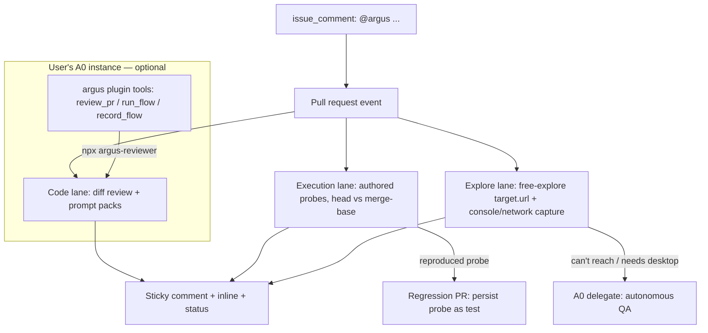

# feat: Full-feature reviewer roadmap — security hardening, review packs, exploratory QA, A0 plugin

## Summary

Continues the post-launch roadmap (plan 006) after Phase B.2 lands
(`feat/sandbox-probes`). The milestone: **a full-feature, npm-installable
GitHub PR reviewer** that stands comparison with testdriver.ai while staying
self-hosted, BYOK-OpenRouter, and free of per-seat SaaS.

What "full feature" means here (user-confirmed): super-easy onboarding with
an OpenRouter link and a tested-model list; standing review prompt packs
(debloat, secrets-leakage, optimization) applied to every PR; an exploratory
QA agent that walks the app, reads debug logs, and tries to break it;
and — as the +1 after the milestone — a v0.1 Agent Zero plugin shipped to
the community Plugin Index. GitLab is out (GHE stays, same API); A0 depth is
a parallel track that never gates the reviewer milestone.

---

## Problem Frame

B.1/B.2 give findings evidence: `not_exercised` → authored probe →
`reproduced`. Three gaps remain between that and the full-feature reviewer:

1. **Trust.** #58: `argus-reviewer.config.ts` executes PR-controlled code on
   the host with secrets in env — the one open hole in the "safe to install"
   story.
2. **Review depth.** The code lane runs one fixed prompt; users asked for
   domain lenses (secrets, perf, debloat) and a verified model menu so
   onboarding is pick-from-a-list, not guess-a-slug.
3. **Runtime reach.** Probes verify suspected defects at unit level, but
   nothing *explores* the running app — the testdriver-shaped claim ("our
   agent drives your real app") needs the exploratory lane, and the A0
   plugin opens the second distribution surface.

Phase D scale work (#21–23) stays sequenced behind adoption.

---

## Requirements

- R1. Host-side config execution can no longer be abused by a hostile PR —
  close #58 or shrink it to a documented safe surface.
- R2. Review prompt packs: user-selectable lenses (`security`, `perf`,
  `debloat`) layered onto the existing diff review, applied every run.
- R3. Onboarding is choose-from-verified: a tested-model table (cost tier,
  strengths) linked to OpenRouter, surfaced in docs and `init` output.
- R4. Reproduced probes can be persisted as regression tests — the finding
  becomes a committed test, not just a comment (testdriver parity: they
  commit generated tests back).
- R5. An exploratory lane walks `target.url` (or a PR preview URL), captures
  console/network failures, and reports findings — on PR when enabled, and
  as the escalation target for A0.
- R6. An `argus` A0 plugin (v0.1) ships to the community Plugin Index —
  standalone repo, `plugin.yaml` + tools at root, index submission PR.
- R7. `@argus` issue-comment triggers let a user ask for a flow/review in
  natural language on the PR itself (testdriver's `@testdriverai` parity).
- R8. Phase D stays headline-level: runner health (#21), org spend caps
  (#22), GHE (#23 — same-API target only; GitLab deferred).
- R9. A0 live-verify (#53) and scope/cost controls proceed when a host is
  reachable; never a gate on the milestone.

---

## Key Technical Decisions

- **Prompt packs are rubric injection, not multi-pass review.** Each
  enabled pack appends a domain rubric to the existing single-pass review
  prompt — same schema, same chunking, one model call per chunk. Multi-pass
  per-pack review multiplies cost for marginal signal; defer until evidence
  says otherwise.
- **Secrets-leakage findings are deterministically enforced.** A dedicated
  secrets pack gets a deterministic pre-scan (regex/gitleaks-style rules on
  the diff) merged with model findings — secrets detection is too
  recall-critical to leave to a model alone.
- **Exploration reuses the vision engine, not A0.** Free-explore is a new
  engine mode (no recorded flow): the action policy gains `explore`
  behaviors, the loop budget-caps steps, and console/network events become
  first-class evidence. A0 remains the escalation for desktop/complex work
  and is never required.
- **The A0 plugin is outbound tools, not inbound webhooks.** v0.1 gives A0
  Tool classes that invoke the argus CLI; Actions stays the PR trigger.
  Ephemeral-A0-as-service-container in Actions is documented as a future
  option, not built.
- **Persisted probes write via a generated branch + PR**, never a direct
  push — same review path as human code.
- **`@argus` mentions use `issue_comment` workflows** with a strict
  command whitelist and the same fork/association gate as probes.

---

## High-Level Technical Design

### A0 topology (answer to "how does A0 get PRs")

- **Actions → A0 (shipped):** the `pull_request` trigger IS the webhook.
  Argus calls `a0 headless -p <task>` into the user's instance with task +
  context; A0 never sees the PR object directly.
- **A0 → Argus (plugin):** the plugin adds tools the A0 agent invokes on
  chat request or a scheduled task (e.g., poll `gh pr list`, then
  `review_pr`). Requires the user's A0 to reach the repo checkout + a
  GitHub token scoped read (and comment) — onboarding doc covers the
  least-privilege token shape.
- **A0-in-Actions:** possible (A0 ships as a container) but heavy; BYO
  persistent instance is the supported shape for v0.1.

---

## Implementation Units

### Phase E1 — Trust + review depth (next tranche, detailed)

### U1. Close the host config-execution hole (#58)

- **Goal:** PR-controlled `argus-reviewer.config.ts` can no longer run
  arbitrary code beside secrets.
- **Requirements:** R1
- **Dependencies:** none
- **Files:** `src/config.ts`, `src/cli.ts`, `SECURITY.md`,
  `tests/unit/config.test.ts`
- **Approach:** Preferred: parse the config file as **data, not code** —
  support `.json` natively and evaluate `.ts` configs in a `node:vm`
  context with no `require`, no `process`, no imports (or a static
  allowlist: `defineConfig` only). On `pull_request` events for fork PRs,
  refuse `.ts` config entirely and require JSON. Document residual risk in
  SECURITY.md.
- **Test scenarios:** a `.ts` config containing `process.env`,
  `import`, `require`, or top-level side effects is rejected; JSON configs
  load; same-repo PRs keep TS config support; fork PR with `.ts` config
  fails closed with a clear message.
- **Verification:** #58 closed; a hostile config cannot read env or
  exfiltrate during load.

### U2. Review prompt packs + verified model menu

- **Goal:** Users pick review lenses and a model from a tested list.
- **Requirements:** R2, R3
- **Dependencies:** none
- **Files:** `src/engine/prompts.ts` (or new `src/review/packs.ts`),
  `src/cli.ts` (`buildCodeReviewMessages`), `src/config.ts`
  (`reviewProfiles`), `docs/models.md`, `docs/quickstart.md`,
  `tests/unit/review-packs.test.ts`
- **Approach:** `reviewProfiles: ('security'|'perf'|'debloat')[]` in config;
  each pack is a rubric block appended to the review prompt. The `security`
  pack additionally runs a deterministic diff scan for secret-shaped
  literals (private-key headers, `AKIA[0-9A-Z]{16}`, token patterns) merged
  into findings before the model call returns. `docs/models.md` lists
  verified OpenRouter slugs per lane (vision/code/probe) with cost tiers;
  `init` output prints the short list.
- **Test scenarios:** each pack's rubric appears in the built prompt;
  `security` pack catches a seeded AWS-key-shaped literal deterministically
  even if the model returns no finding; unknown profile names are rejected
  at config load; packs compose (security+perf both active in one prompt).
- **Verification:** dogfood PR with a seeded fake secret is flagged even
  under a cheap model.

### U3. Persist reproduced probes as regression tests

- **Goal:** A `reproduced` finding offers a one-step path to a committed
  regression test.
- **Requirements:** R4
- **Dependencies:** none (B.2 shipped)
- **Files:** `src/probe/persist.ts` (new), `src/probe/queue.ts`,
  `action/sticky-comment.mjs`, `src/cli.ts`,
  `tests/unit/probe-persist.test.ts`
- **Approach:** When a probe reproduces, the report records the probe
  content + suggested path. A new `persist` mode (config or a maintainer
  `@argus persist` mention — ties to U6) creates a branch
  `argus/regression-<pr>-<n>`, commits the probe at the suggested path, and
  opens a PR against the base branch. Never pushes to the PR branch.
- **Test scenarios:** reproduced probe → branch + PR created with the
  exact validated content; non-reproduced probes never persist; the
  suggested path still respects `isSafeRepoPath` + exclusive create;
  idempotent on re-run (existing branch/PR detected, not duplicated).
- **Verification:** a dogfood PR's reproduced probe produces a visible
  regression-test PR.

### Phase E2 — Exploratory QA lane (detailed)

### U4. Free-explore mode with console/network capture

- **Goal:** The "agent who walks the app and tries to break it" — without
  a recorded flow.
- **Requirements:** R5
- **Dependencies:** U1 (config trust), target boot machinery (existing)
- **Files:** `src/engine/explore.ts` (new), `src/engine/loop.ts` (explore
  actions), `src/driver/browser.ts` (console/network taps),
  `src/report/` evidence surfaces, `src/config.ts` (`explore` block:
  maxSteps, budgetUsd, enabled), `tests/unit/explore.test.ts`
- **Approach:** New engine mode: the model receives the screenshot + a
  compact affordance list and picks exploratory actions (nav, click,
  submit-bad-input, boundary cases) within a hard step + cost budget.
  Browser console errors, failed requests, and page errors are captured
  per step and become findings (`severity: risk|bug` with evidence
  `observed`). On PR: runs against `target.url` when configured or an
  env-provided preview URL; findings render in the sticky comment under an
  "Exploratory" section. Fails closed: unreachable target → no findings,
  not a failure.
- **Test scenarios:** a seeded console error on the target produces an
  `observed` finding; step and dollar budgets both halt exploration;
  unreachable URL degrades cleanly; a fork PR's explore run respects the
  same sandbox/gate posture as probes; explore findings never change
  verdict unless configured to.
- **Verification:** dogfood app with a seeded broken interaction shows an
  exploratory finding in the comment.

### Phase E3 — Onboarding surface (detailed)

### U5. `@argus` mention commands + polish

- **Goal:** Natural-language requests on the PR itself — parity with
  testdriver's `@testdriverai` UX — plus the last proof/onboarding items.
- **Requirements:** R3 (finish), R7
- **Dependencies:** U2
- **Files:** `.github/workflows` template + `action/` comment-dispatch
  step, `src/cli.ts` (`mention` command), `docs/quickstart.md`, README
  demo assets, `tests/unit/mention.test.ts`
- **Approach:** `issue_comment` trigger filtered to bodies starting with
  `@argus`; whitelist: `review`, `record "<flow>"`, `persist` (U3), `help`.
  Same fork gate as probes — untrusted-author mentions no-op. Also finish
  the Phase-A tail: README demo reel (ce-demo-reel) + npm Trusted
  Publisher re-add (#57 housekeeping).
- **Test scenarios:** `@argus review` on a PR re-runs review and upserts
  the sticky comment; untrusted-author mention is ignored; unknown
  commands reply with the help menu; mention runs never bypass the probe
  fork gate.
- **Verification:** a maintainer comment `@argus review` produces a fresh
  run on a dogfood PR.

### Phase C — Agent Zero (needs live host; parallel track)

### U6. `argus` A0 plugin v0.1 → Plugin Index

- **Goal:** Installable argus tools inside any A0 instance; submitted to
  the community index.
- **Requirements:** R6
- **Dependencies:** none for the build; index submission needs a manual PR
- **Files:** new repo `a0-plugin-argus` (plugin contents at root):
  `plugin.yaml`, `LICENSE` (MIT), `README.md`, `tools/argus_review.py`,
  `tools/argus_flow.py`; index submission: `plugins/argus/index.yaml` PR to
  `agent0ai/a0-plugins`
- **Approach:** Thin Tool subclasses invoking the argus CLI
  (`npx argus-reviewer code-review` / `run`) in a provided checkout dir;
  settings surface for repo path + GH token env name. Onboarding doc: user
  installs plugin in their A0, grants a repo-scoped read+comment token,
  asks A0 "review open PRs on X" or schedules it.
- **Test scenarios:** plugin loads in a local A0 (`usr/plugins/argus`);
  `review_pr` tool returns the argus verdict text; missing checkout/token
  fails with a clear message, not a stack trace.
- **Verification:** plugin visible in a local A0 Plugin list; index PR
  filed.

### U7. Live A0 verification + scope/cost controls (headline)

- **Goal:** #53 — `delegate`/`heal:'a0'` verified against a real instance;
  per-task timeout + delegated-spend ceiling (roadmap U7/U8).
- **Requirements:** R9
- **Dependencies:** reachable A0 host; **per-phase plan required** when picked up
- **Files:** `src/executor/a0.ts`, `src/config.ts`, `docs/quickstart.md`
- **Approach:** unchanged from roadmap — live round-trip, then bound scope
  (browser vs computer_use gateway) and cost.

### Phase D — Scale & ops (headline; per-phase plans when adopted)

### U8. Runner health dashboard (#21)

- **Requirements:** R8 — queued/active runs, failures, spend per run;
  extends the Electron dashboard + `live.ndjson`.

### U9. Org spend caps (#22)

- **Requirements:** R8 — per-org/per-period budget aggregation over the
  existing ledger, alert + hard-stop.

### U10. GitHub Enterprise Server (#23, GitHub-only)

- **Requirements:** R8 — host-configurable API base URL (`api.github.com`
  → `https://<ghe>/api/v3`) through `ghGet`, action inputs, and comment
  surfaces. **GitLab is deferred** — no demand signal; the adapter seam
  this unit creates keeps it cheap later.

---

## Scope Boundaries

### Deferred to Follow-Up Work

- GitLab adapter (user-confirmed out for the milestone)
- Managed cloud hosting — outside product identity
- Multi-pass per-pack review — only if single-pass rubric injection shows
  measurable recall gaps
- Ephemeral A0-in-Actions service container
- GitHub Marketplace listing for the action — natural tail of proof work

### Open Questions

- Whether explore-lane findings should ever block merge — start
  non-blocking, revisit with dogfood data.
- Whether the A0 plugin needs an argus HTTP surface (vs CLI shell-out) —
  decide during U6 implementation.

---

## Risks & Dependencies

| Risk / dependency | Mitigation |
| --- | --- |
| Explore lane is the biggest remaining build (new engine mode + evidence capture) | Phase-gated behind E1; vision engine already owns screenshots/actions/loop |
| A0 host availability gates U7 and plugin dogfooding | Plugin builds host-free (Tool classes are thin CLI wrappers); U7 slides without blocking E-phases |
| Prompt packs could inflate findings noise | Packs shape rubric only — same severity gate + dedup path; dogfood each pack before documenting it |
| Secrets pre-scan regex false positives | Entropy + shape checks; findings marked `risk` with deterministic-evidence note |
| `@argus` mentions on hostile repos | Same author-association gate as probes; whitelist-only commands |

---

## Sources / Research

- Roadmap continued from: `docs/plans/2026-09-14-006-feat-post-launch-roadmap-plan.md`
- Sandbox plan (B.2, shipping): `docs/plans/2026-09-15-007-feat-sandbox-probes-plan.md`
- Open issues: #21, #22, #23 (Phase D); #52 (B.2 → PR #59); #53 (A0 verify); #57 (republish/trusted publisher — done pending npm-side re-add); #58 (config exec)
- testdriver.ai: GitHub App + OIDC action + `@testdriverai` mention UX; $20/seat + hosted desktop sandbox; commits generated tests back via PR — our parity items are persist-probes (U3) and mentions (U5); our differentiation is self-hosted + BYOK + fingerprint-cache replay
- A0 plugin contract: `usr/plugins/<name>/plugin.yaml` + `tools/`; community distribution via standalone repo + index PR to `agent0ai/a0-plugins`
