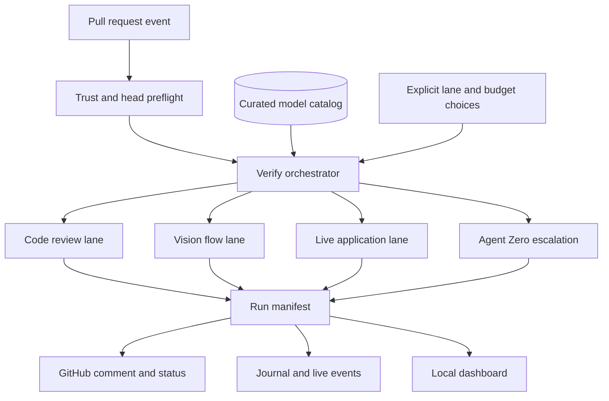
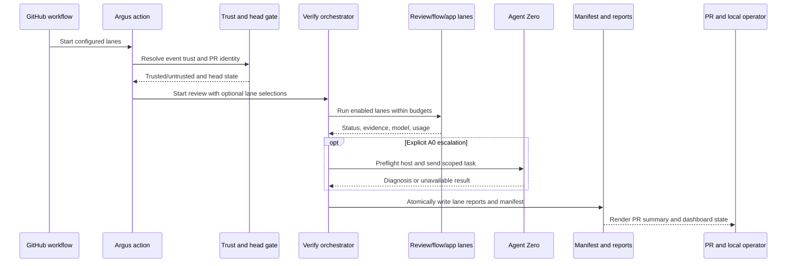
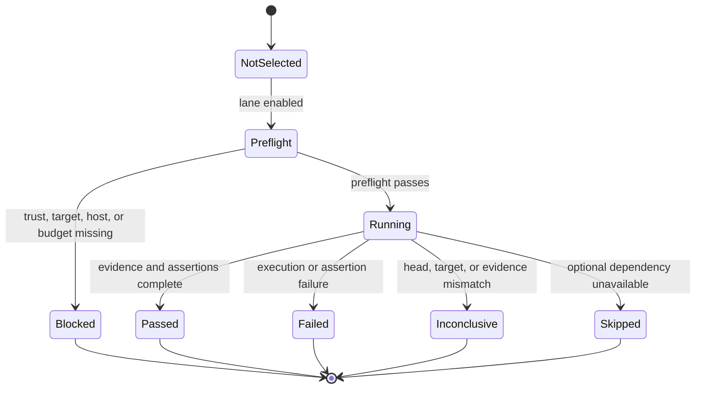
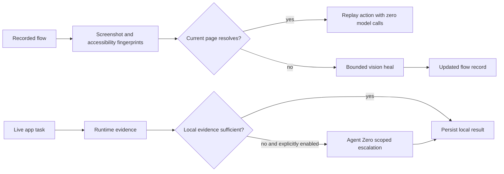

# Insight-first four-lane reviewer and local operator dashboard - Plan

## Summary

Turn Argus's existing code-review, vision-flow, target-process, and Agent Zero seams into one trustworthy product path: code review by default, cache-backed UI/UX replay, explicit live application execution, and budgeted Agent Zero escalation. Make the local Electron dashboard a first-class operator surface for lane status, evidence, model selection, cost, and live progress while closing the repository's trust and release gates.

## Problem Frame

Argus already contains most of the mechanisms needed for the product, but they are not yet one credible first-run experience. The code-review lane has Jev triage/adjudication, evidence linkage, secret scanning, sandbox probes, and a sticky PR comment. The vision lane can record and replay UI flows with screenshot/accessibility fingerprints and a cost ledger. The driver can boot a configured target and run Playwright tests. Agent Zero is reachable through a thin `a0 headless` adapter for direct delegation and failure healing. The local dashboard and TUI already read journals, live events, workflow runs, and code-review summaries.

The gaps are product and trust gaps, not a need for another isolated model integration:

- The public action currently attempts the browser lane by default, so a repository with no application target can fail before receiving the promised code review.
- Action inputs and local-action usage cross a shell and trust boundary; the workflow must not let PR-controlled code or lifecycle scripts run beside provider and GitHub secrets.
- Reports do not yet form one head-bound run contract shared by review, flow, app, and A0 lanes. A merge checkout, stale report, missing optional lane, or provider failure can be mistaken for a clean result.
- The vision cache is a fingerprint/replay cache, not a general model-response cache. Replay reliability, generated-test execution, and the current `file://` smoke failure need a release gate before “vision UI/UX testing” is a reliable promise.
- Application loading exists as a target adapter and test runner, but bounded live application exploration and explicit A0 escalation are not yet a coherent, budgeted product lane.
- The dashboard is useful but hard-codes default artifact locations and does not yet present the four lanes, evidence, budgets, and A0 state as one operator workflow.

The current baseline is mixed: type checking and linting are green, while the end-to-end smoke suite has one failing record/replay case because a `file://` fixture cannot reliably produce a screenshot in the current browser path. The plan treats that failure, the trust boundary, and head/evidence correctness as release prerequisites rather than separate maintenance work.

| Product lane               | Current repository reality                                                                                                                     | Target contract                                                                                                  |
| -------------------------- | ---------------------------------------------------------------------------------------------------------------------------------------------- | ---------------------------------------------------------------------------------------------------------------- |
| Code review                | Implemented through `code-review`, GitHub Action, Jev, evidence, and probes; correctness still depends on checkout/event context.              | Always available first, head-bound, provider- and cost-visible, with no application target required.             |
| Vision UI/UX flow          | `record` and `run` provide model-driven actions, fingerprint replay, healing, and generated tests; the smoke path is not yet release-reliable. | Record once, replay cache-first, re-ground only on drift, and show cache/heal/model/cost evidence.               |
| Real application execution | `TargetProcess`, Playwright, and test discovery can load a target; sandbox probes are test-level evidence rather than a full live app lane.    | Explicit bounded live app execution against a reachable target, with runtime artifacts and no silent escalation. |
| Agent Zero                 | `delegate` and `heal: 'a0'` invoke a remote `a0` headless task, but the seam lacks a complete budget, approval, and report contract.           | Explicit, scoped, preflighted second opinion or escalation with visible host, task, timeout, and usage status.   |

## Requirements

The following requirements carry forward the source contract in `docs/brainstorms/2026-09-23-insight-first-open-source-review-requirements.md` (see origin).

### Adoption and ownership

- R1. A public repository can reach its first code review through the GitHub-first path without hand-written model selection, an application target, or Docker setup.
- R2. A private or self-hosted team can use the same core review experience while retaining control over model choice, spend, trust boundaries, and retention of its own artifacts.
- R3. The first-run experience tells the user what will run, what data is sent to the model provider, what the default spend posture is, and how to change or stop it.
- R4. The product remains self-hosted and BYOK-first; managed Argus hosting is not required for the core promise.

### Review value and insight

- R5. Every actionable finding communicates its location, severity, rationale, evidence or confidence, reviewing model, and cost contribution.
- R6. The review summary separates actionable findings from low-confidence observations and gives a clear verdict rather than an undifferentiated stream of suggestions.
- R7. A developer can understand the review in GitHub without leaving the pull request; an operator can inspect run history, live progress, cost, and model selection in the local dashboard.
- R8. The local dashboard is a first-class local product surface, not a hidden diagnostic view, and answers what ran, why a finding exists, which model was used, and what it cost without requiring raw JSON.

### Models, cost, and escalation

- R9. New users can accept one curated default model and complete a review without choosing a provider or model slug.
- R10. Users who want control can override the default for review, vision, application execution, or escalation without losing the standard review experience.
- R11. The product shows actual provider cost for each review and keeps ordinary review spend separate from heavier agentic lanes.
- R12. Vision flow replay, browser testing, real application execution, exploratory work, and Agent Zero work are opt-in, clearly labeled as deeper or more expensive work, and cannot silently escalate spend.
- R13. A team can set a spend boundary or stop condition before enabling a deep lane, and the resulting behavior is visible in the review surface.

### Trust and quality

- R14. Public and private execution paths make their trust posture clear, and unsafe or unavailable setup fails visibly rather than producing a confident-looking empty review.
- R15. Findings and execution evidence are tied to the intended pull-request change; a merge checkout or unrelated branch state cannot be mistaken for proof about the PR head.
- R16. The default review path is reliable enough to dogfood on Argus's own pull requests; failures and degraded modes are visible rather than hidden behind a pass.
- R17. A team can inspect underlying evidence for a finding without exposing secrets or relying on an opaque vendor dashboard.
- R18. A team can run a real application flow against a configured target, then explicitly escalate unresolved runtime work to Agent Zero when a remote host is available.
- R19. Every invocation produces one durable run manifest that links lane status, repository and pull-request identity, checkout/head state, models, budgets, cost, evidence, and failure reasons.
- R20. A missing target, browser, provider, Agent Zero host, or optional lane produces an explicit skipped, unavailable, or failed state rather than a fabricated pass or silent omission.

## Actors and key flows

- A1. Public maintainer: wants a low-friction review for an open repository and accepts sensible defaults.
- A2. Private-team owner: wants self-hosting, provider choice, spend boundaries, and control over repository data and artifacts.
- A3. Reviewer or operator: uses PR output or the local dashboard to decide what to trust, rerun, or tune.
- A4. Deep-lane operator: deliberately enables vision flow, live application execution, exploratory work, or Agent Zero when the evidence justifies the extra cost.

- F1. Public first review: install, add the provider key, and receive a head-bound default review without a target or Docker setup.
- F2. Private team control: run the same review while selecting models, trust posture, retention, and budget policy.
- F3. Operator inspection: compare the PR decision with local lane status, evidence, model, cost, cache behavior, and live progress.
- F4. Deliberate deep QA: preview scope and limits, explicitly enable a lane, and keep its cost and result separate from ordinary review.
- F5. Application execution and remote escalation: load a reachable target, run a bounded local application task, persist runtime evidence, and optionally ask Agent Zero for a second opinion.

## Acceptance examples

- AE1. A public repository with no application URL and no Docker runner receives a code review on its first pull request after adding the provider key. The review names the default model, shows its cost, and links actionable findings. **Covers:** R1, R5, R9, R11.
- AE2. A public maintainer opens the review summary and understands each finding’s evidence, confidence, and suggested action without opening raw JSON or a provider dashboard. **Covers:** R6, R7, R17.
- AE3. A private-team owner changes the model and budget while keeping the GitHub-first review path, then sees the change reflected in the next run’s cost and report. **Covers:** R2, R10, R11.
- AE4. An operator enables an Agent Zero or application lane without a spend boundary. The product does not start unbounded work; it asks for an explicit decision or stops with a visible reason. **Covers:** R12, R13.
- AE5. A review is triggered from a pull request whose checkout differs from the intended PR head. The evidence is marked inconclusive or attached to the correct head rather than reported as proof about the wrong code. **Covers:** R14, R15, R16.
- AE6. A provider or configuration failure occurs. The review surface names the failure and next action; it does not present an empty or fabricated pass. **Covers:** R14, R16.
- AE7. A reachable application target is configured for a deep run. Local execution produces a durable result and cost record; if the operator selects Agent Zero, the remote connection is checked before delegation and unavailable or over-budget work stops visibly. **Covers:** R12, R13, R18.

## Key technical decisions

- KTD1. **Use a four-lane contract with a shared `verify` orchestrator.** Keep `record`, `run`, `code-review`, and `delegate` as compatible power-user commands, but make the primary action and local workflow use one orchestrator that can select review, vision flow, live application, and Agent Zero lanes. A single manifest prevents the PR comment, local dashboard, and exit code from inventing different truths. A new monolithic replacement for every existing command would break current users without improving the lane contract.

- KTD2. **Code review is the only default lane.** The public action starts with review enabled and all runtime lanes disabled unless the workflow explicitly opts in. A missing application target is therefore a normal review configuration, not a first-run failure. Optional lanes report `skipped` or `unavailable` without weakening the review result; an explicitly enabled lane that cannot meet its contract fails visibly.

- KTD3. **Separate read-only review from code-executing lanes at the trust boundary.** The default review path may fetch and analyze PR data without installing or executing consumer lifecycle scripts. Vision, application, and A0-related execution require an explicit trusted or self-hosted path. Fork PRs, unknown CI events, and `pull_request_target` fail closed for executable lanes. This extends the existing `resolveTrust` pattern rather than adding a second trust model.

- KTD4. **Bind evidence to an explicit source identity.** Every manifest and report records repository, pull request, intended head SHA, checkout SHA, diff base, run ID, and whether runtime evidence came from the head or merge checkout. A mismatch is `inconclusive`; it is never silently treated as proof. The PR poster and dashboard display the same identity fields.

- KTD5. **Treat the vision cache as a fingerprint/replay cache.** A cache hit means the stored screenshot-region hash and accessibility signature still resolve, so replay makes zero vision calls. A mismatch enters a bounded heal path and records the drift; it is not a generic LLM response cache and does not claim savings for code review or A0. The UI names this distinction plainly.

- KTD6. **Run local application execution before considering Agent Zero.** The live app lane boots or attaches to the configured target, drives a bounded task with the existing vision/action machinery, and captures screenshots, video, page errors, console failures, and network failures. A0 is an explicit escalation after insufficient or failed local evidence, not an automatic second opinion on every test.

- KTD7. **Use separate ledgers and explicit usage semantics.** Review, vision flow, live application, and A0 have independent preflight budgets and stop conditions. OpenRouter calls report actual USD and model attribution. A0 reports task count, timeout, host, and whether the host supplied usage data; when it does not, the manifest says `unmetered` rather than inventing a dollar amount. Cache hits report zero provider calls.

- KTD8. **Make the manifest the stable cross-surface contract.** The CLI, GitHub comment, commit-status decision, journal, TUI, and Electron dashboard consume the same versioned lane records. The action may retain a small renderer for GitHub Markdown, but contract tests keep its lane names, status meanings, cost fields, and head identity aligned with the manifest.

- KTD9. **Use a small verified model catalog, not a marketplace.** The catalog contains one sensible default per lane plus a small set of documented overrides, with modality, cost tier, rationale, and verification date. A scheduled or key-gated check queries the OpenRouter Models API for availability and pricing; a stale entry is marked or fails the catalog check rather than being silently presented as current. Users may still provide an explicit slug.

- KTD10. **Extend the existing technical operator visual language.** The dashboard keeps its dark canvas, cyan live/primary signal, green/red/amber semantic states, monospace utility typography, and compact interactive surfaces. It adds a run/lane workspace and evidence inspector rather than redesigning the product as a generic light SaaS dashboard. Focus-visible states, semantic controls, readable contrast, and keyboard selection are release requirements.

### Dashboard reference lock

- **Primary direction:** the existing `electron/index.html` operator surface: dark neutral canvas, compact mono utility type, cyan live signal, and semantic status colors.
- **Preserve:** the current information density, restrained surfaces, monospace data treatment, and cyan/green/red/amber role meanings.
- **Borrow only:** stronger run/lane hierarchy, explicit selected/empty/error states, and focus-visible keyboard treatment from the product-UI craft guidance.
- **Reject:** a generic light SaaS shell, decorative gradients, card-everywhere composition, and color used without status meaning.
- **Media strategy:** code-native status marks, run metadata, and evidence references; no decorative imagery is needed for this operator tool.

## High-level technical design

The following sketches are directional design guidance, not implementation specifications.

### Four-lane topology



### Invocation and evidence sequence



### Lane lifecycle



### Cache and escalation data flow



## Implementation units

### U1. Close the action and trust release gate

**Goal:** Make the default GitHub path safe to install and reliable before optional runtime work is added.

**Requirements:** R1, R2, R3, R14, R15, R16, R20. **Origin flows:** F1, F2. **Dependencies:** none.

**Files:** `action/action.yml`, `action/sticky-comment.mjs`, new `action/bootstrap.mjs`, `.github/workflows/ci.yml`, `.github/workflows/argus-reviewer.yml`, `src/trust.ts`, `src/config.ts`, `src/cli.ts`, `src/driver/target.ts`, `SECURITY.md`, `tests/unit/trust.test.ts`, `tests/unit/config.test.ts`, `tests/unit/cli.test.ts`, new `tests/unit/action-contract.test.ts`, and hostile configuration fixtures under `tests/fixtures/`.

**Approach:** Treat action inputs as untrusted data. Validate browser, path, budget, and lane values before use; pass secrets and user-controlled values through environment variables or quoted argument arrays rather than interpolating them into shell fragments. Replace dynamic code evaluation in the GitHub posting step with a checked-in module loaded from the action path. Pin the action and CLI distribution used by the default path to a reviewed release or commit rather than resolving an untrusted moving tag. Make the default action install and invoke a trusted Argus distribution without running consumer lifecycle scripts; consumer dependency installation belongs only to an explicitly enabled application or flow lane.

Change the repository’s self-hosted review workflow to use a pinned trusted action reference for normal operation. A local-action dogfood job may build the action but must not expose write credentials or provider secrets to PR-controlled code. Preserve the existing trust-before-config rule, reject unknown CI event names for executable lanes, disable runtime lanes on `pull_request_target`, and keep probe/flow/application execution behind explicit trust and fork policy. Ensure live logs, journal records, and action errors mask tokens and secret-like values.

**Patterns to follow:** `resolveTrust` in `src/trust.ts`; untrusted JSON allowlist behavior in `src/config.ts`; `persist-credentials: false` and least-privilege permissions in `.github/workflows/argus-reviewer.yml`; non-throwing environment detection in `src/detect.ts`.

**Test scenarios:**

- A browser input outside the supported set, a path escaping the working directory, a malformed budget, and shell metacharacters in an input are rejected before a subprocess starts.
- A hostile `.ts` config with environment reads, dynamic imports, or side effects cannot execute in an untrusted checkout; a committed JSON config can load only inert allowlisted fields.
- A fork PR, an unknown event name, and `pull_request_target` cannot enter flow, target-command, or A0 execution lanes.
- The default action contract does not run consumer `npm ci` or other lifecycle scripts beside secrets.
- A local action reference with write permissions fails the contract check or is restricted to a no-secret verification job.
- A provider key, GitHub token, or secret-like config value never appears in live output, journal JSON, or an error rendered by the action.

**Verification:** Hostile fixtures, action-contract checks, trust tests, type checking, linting, and the consumer smoke path pass without relying on a real provider key. A forked PR can receive a read-only review path but cannot execute optional runtime lanes.

### U2. Bind public review and evidence to the intended PR head

**Goal:** Make a public first review possible without an app target and prevent merge-checkout or stale-report state from becoming false evidence.

**Requirements:** R1, R5, R6, R14, R15, R16, R20. **Origin flows:** F1, F2, F3. **Origin examples:** AE1, AE5, AE6. **Dependencies:** U1.

**Files:** `action/action.yml`, `action/sticky-comment.mjs`, `src/cli.ts`, `src/evidence/ci.ts`, `src/evidence/link.ts`, `src/report/run.ts`, `src/report/comment.ts`, `src/journal/schema.ts`, `src/journal/build.ts`, `tests/unit/fixture.test.ts`, `tests/unit/evidence.test.ts`, `tests/unit/comment.test.ts`, `tests/unit/cli.test.ts`, new `tests/unit/head-binding.test.ts`, and `fixtures/demo-pr/`.

**Approach:** Capture the intended PR head, the actual checkout SHA, the diff base, repository, pull request, and run ID before model work begins. Review API changes and local index/context data against that identity. A runtime lane may run on a merge checkout only when its report labels that source; otherwise the result is `inconclusive`. Do not reuse a report from a previous invocation when the run identity or head differs.

Make the public action code-review-only by default. With no target, browser, or A0 configuration, the review lane still runs and the optional lanes are represented as explicit skipped states. A missing report from an enabled required lane remains a failure; a missing optional lane does not masquerade as a pass. The sticky comment and status renderer show lane status, head identity, model, cost, and the next action for provider/configuration failures. The existing `--fixture` path remains the deterministic local dogfood seam.

**Patterns to follow:** `ARGUS_REVIEWER_TRACE` and `fetchPrMeta` in `src/cli.ts`; merge-base materialization in `src/review/secrets.ts`; atomic report writes through `src/fsutil.ts`; sentinel-based sticky updates in `action/sticky-comment.mjs`.

**Test scenarios:**

- A public PR with no target, Docker, browser, or A0 produces a review manifest and a useful sticky comment with optional lanes marked skipped.
- A checkout SHA different from the intended PR head produces `inconclusive` runtime evidence and never a passing runtime claim.
- A stale `code-review.json` or `run.json` from a prior run is ignored when the run ID or head identity differs.
- Provider authentication, malformed model output, missing configuration, and missing GitHub identity produce named failure states and actionable messages rather than empty passes.
- A review with no blocking findings, a review with low-confidence observations, and a review with a blocking finding render distinct summaries and statuses.
- Inline findings and the sticky summary are bounded, sanitized, and attached to the same head as the manifest.

**Verification:** A fixture repository and a mocked GitHub event prove the public first-review path, head mismatch handling, and provider-failure rendering. The full suite no longer treats a missing optional app target as a default action failure.

### U3. Establish the shared four-lane orchestrator and budget contract

**Goal:** Give the CLI, GitHub Action, journal, and dashboard one explicit contract for lane selection, status, model roles, and spend.

**Requirements:** R3, R9, R10, R11, R12, R13, R19, R20. **Origin flows:** F1–F5. **Dependencies:** U1 and U2.

**Files:** new `src/pipeline/contracts.ts`, new `src/pipeline/budget.ts`, new `src/pipeline/verify.ts`, new `src/report/manifest.ts`, `src/cli.ts`, `src/config.ts`, `src/report/run.ts`, `src/journal/schema.ts`, `action/action.yml`, `tests/unit/pipeline.test.ts`, new `tests/unit/manifest.test.ts`, and `tests/unit/cli.test.ts`.

**Approach:** Add a primary `verify` orchestration surface while preserving the existing commands as compatible entry points. Define stable lane identities for review, vision flow, live application, and A0, and a small status vocabulary for passed, failed, skipped, blocked, unavailable, and inconclusive. Resolve lane choices and preflight requirements before spending. Review is selected by default; flow, app, and A0 require explicit selection and, where applicable, a target or host.

Represent model roles separately for review, vision, application, and escalation. A curated default can satisfy every ordinary lane, while explicit slugs remain valid overrides. Keep review, flow, app, and A0 ledgers separate. OpenRouter calls carry model, tokens, and USD; A0 carries host, task count, timeout, and `metered`/`unmetered` usage status. A cache hit contributes zero provider calls. The manifest is written atomically and may contain partial lane results when a later lane fails.

**Patterns to follow:** `Ledger` in `src/vision/ledger.ts`; `CallCost` and `CallKind` in `src/vision/cost.ts`; `writeAtomicJson` in `src/fsutil.ts`; existing `newRunId` and journal storage in `src/journal/store.ts`.

**Test scenarios:**

- The lane matrix selects review by default, preserves an explicitly selected flow/app/A0 lane, and does not infer A0 from a failed review.
- A missing target, browser, provider key, A0 host, or budget produces the correct preflight status without a subprocess or model call.
- Review and deep-lane budgets are independent; crossing one cap stops only its lane and marks the reason in the manifest.
- A0 without host usage data reports `unmetered`, while OpenRouter lanes report actual USD and model attribution.
- A partial lane failure still produces a complete manifest with the last successful evidence and explicit failure/skipped states.
- Existing `code-review`, `run`, and `delegate` invocations resolve to the same shared contracts without changing their basic output paths.

**Verification:** Contract tests cover every lane/status/budget combination and the manifest remains readable after an interrupted or partial run. The action and local commands can select the same lanes from the same configuration.

### U4. Make vision UI/UX recording and fingerprint replay release-reliable

**Goal:** Turn the existing record/replay/heal engine into a dependable cache-first UI/UX testing lane.

**Requirements:** R5, R7, R8, R11, R12, R16, R19. **Origin flows:** F3, F4. **Origin examples:** AE2, AE7. **Dependencies:** U2 and U3.

**Files:** `src/engine/loop.ts`, `src/engine/prompts.ts`, `src/cache/fingerprint.ts`, `src/cache/store.ts`, `src/index/invalidate.ts`, `src/api.ts`, `src/cli.ts`, `src/config.ts`, `tests/unit/loop.test.ts`, `tests/unit/fingerprint.test.ts`, `tests/unit/invalidate.test.ts`, `tests/unit/smoke.test.ts`, `tests/unit/cli.test.ts`, `tests/fixtures/serve.mjs`, and `tests/fixtures/index.html`.

**Approach:** Preserve the existing vision action model and add reliable flow history, bounded termination, and deterministic generated tests. The recorder must show prior actions to the model, stop with an explicit cap message, and persist a complete flow only after successful termination. Replay resolves each stored screenshot-region and accessibility fingerprint before taking action; a hit performs no vision call, while a mismatch enters a bounded heal and records the drift and spend. Diff-aware invalidation marks entries stale without deleting their evidence. Cache writes remain atomic and schema-versioned.

Replace the `file://` smoke dependency with the existing local HTTP fixture path so screenshots, accessibility capture, and target readiness exercise the same transport as a real app. Generated tests must be syntactically valid, execute through the normal runner, and report a zero-test or load error rather than success. The run report exposes cache hits, misses, heals, generated-test failures, model calls, and USD so the dashboard can explain “cheap” rather than merely print a total.

**Patterns to follow:** `Fingerprint.resolve`, `Engine.record/replay`, `Ledger.replayOnly`, `invalidateForDiff`, and the existing `TdSession` flow persistence in `src/api.ts`.

**Test scenarios:**

- A multi-step flow records several actions in order, sees its transcript, emits `done`, writes a cache, and generates a test that runs successfully.
- A flow requiring more than the default number of steps completes when the cap is raised; a capped run reports the cap and override hint.
- An unchanged replay produces zero vision calls and preserves the recorded action; a moved or text-changed element produces one bounded heal, a new fingerprint, and recorded cost.
- A diff-touched source file marks the flow stale, while an unrelated diff leaves it eligible for the normal fingerprint check.
- Corrupt, partial, or schema-incompatible cache data degrades to a named error or a fresh record, never a false pass.
- The HTTP fixture completes record, replay, generated-test, and assertion flows on the supported browser path; the current `file://` screenshot failure is covered by a regression test or removed from the fixture contract.
- A budget exhausted during heal records partial evidence and fails the flow explicitly.

**Verification:** The end-to-end smoke path is green, cache-hit tests prove zero provider calls, and drift tests prove only the necessary re-grounding spend occurs. The lane is visibly labeled as fingerprint replay rather than generic model caching.

### U5. Add an explicit live application execution lane

**Goal:** Let an operator load a real target, run a bounded application task, and inspect runtime evidence without enabling Agent Zero.

**Requirements:** R7, R8, R12, R13, R15, R18, R19. **Origin flow:** F5. **Origin example:** AE7. **Dependencies:** U1, U2, U3, and U4.

**Files:** new `src/pipeline/app.ts`, new `src/engine/explore.ts`, `src/driver/target.ts`, `src/driver/browser.ts`, `src/engine/actions.ts`, `src/cli.ts`, `src/config.ts`, `src/report/manifest.ts`, `action/action.yml`, `tests/unit/app-lane.test.ts`, `tests/unit/target.test.ts`, `tests/unit/driver.test.ts`, `tests/unit/manifest.test.ts`, `tests/fixtures/serve.mjs`, and new `tests/fixtures/app.html`.

**Approach:** Add a `verify --app` lane for a bounded natural-language task against a configured URL or locally booted target. Reuse the existing target readiness, browser driver, action primitives, vision client, video recording, and budget ledger. Add a task loop that stops at an explicit step/time/model budget and records the final page state, actions, screenshots/video, page errors, console failures, and network failures. The lane may optionally save a successful path as a replayable flow, but exploration does not silently rewrite committed tests.

Treat a local target command as executable input and apply the same trust policy as other code-executing lanes. A remote target URL does not require a local command, but it must be reachable from the runner. Missing readiness, browser installation, target access, or a failed task produces a visible lane failure or `inconclusive` result; a page that merely loads is not a pass unless the task’s expected state is verified.

**Patterns to follow:** `TargetProcess.start/stop`, `BrowserDriver.observe/close`, `Actions`, `Engine` budget checks, and the existing run report’s artifact and failure fields.

**Test scenarios:**

- A local HTTP fixture is booted, navigated, exercised through a multi-step task, and produces a durable app result with target URL, checkout/head identity, actions, artifacts, and cost.
- A remote URL is accepted without a boot command; an unreachable URL fails preflight without invoking a model.
- A task that reaches its expected state passes; a task that completes with the wrong marker, page error, console error, or network failure fails with bounded evidence.
- The step cap, timeout, and model budget each stop the app lane and preserve the partial result.
- A target command that exits early, a browser that is not installed, and a remote navigation timeout clean up processes and produce named failure states.
- Exploration does not call A0, write a generated test, or alter the PR branch unless those actions are separately requested.

**Verification:** The local fixture demonstrates a real Playwright application load and test with no A0 dependency. A screenshot/video/evidence inspection confirms the report points to the intended target and head.

### U6. Make Agent Zero escalation explicit, scoped, and budgeted

**Goal:** Turn the existing A0 seam into a safe optional escalation from failed or inconclusive runtime evidence.

**Requirements:** R3, R7, R8, R12, R13, R17, R18, R19. **Origin flows:** F4, F5. **Origin example:** AE4 and AE7. **Dependencies:** U1, U3, and U5.

**Files:** `src/executor/a0.ts`, `src/detect.ts`, `src/pipeline/verify.ts`, `src/report/manifest.ts`, `src/config.ts`, `src/cli.ts`, `action/action.yml`, `docs/quickstart.md`, `SECURITY.md`, `tests/unit/a0.test.ts`, new `tests/unit/a0-escalation.test.ts`, and `tests/unit/manifest.test.ts`.

**Approach:** Preserve `argus-reviewer delegate` and `heal: 'a0'` as compatibility surfaces, but make the primary orchestration path require an explicit A0 selection. Before spending, resolve the A0 CLI/host, check that the host is reachable, verify the target is reachable from the host’s environment, and show the task scope, maximum task count, wall-clock limit, and usage semantics. Pass a sanitized task containing the target, intended head, failure summary, and local evidence references; never pass provider keys, GitHub tokens, or arbitrary process environment.

Bound the remote task by count and time. A0 returns a diagnosis or runtime result into the manifest and PR evidence; it does not automatically commit fixes, rewrite tests, or silently start another lane. If the host is unavailable, disconnected, over limit, or unable to reach the target, record `unavailable`, `blocked`, or `inconclusive` with the next action. If the host supplies usage data, show it; otherwise show `unmetered` rather than fabricating a dollar amount.

Use an allowlisted child environment and the existing process-group/timeout discipline for the A0 process. Keep the least-privilege browser/desktop boundary on the A0 host and document that enabling a remote lane requires trusting that host. The standalone A0 plugin repository remains a separate distribution surface; this plan changes only the Argus-to-A0 connection.

**Patterns to follow:** `buildA0Args`, `a0TaskPrompt`, `runA0Task`, `detectEnvironment/resolveA0Host`, the 15-minute shared heal deadline, and the A0 diagnosis field in `src/report/run.ts`.

**Test scenarios:**

- A0 is not selected, the CLI is missing, the host is unreachable, or the target is not reachable from the host; each case stops before delegation and records a distinct reason.
- A selected A0 lane receives a sanitized prompt with the target and failure context, runs within its task/time budget, and writes a diagnosis to the manifest and report.
- A timeout, nonzero exit, cancellation, or process spawn failure kills the child and leaves no orphan process.
- Ambient `ARGUS_*`, GitHub, Node, and npm control variables are absent from the child environment; secrets never appear in prompts, progress, or errors.
- A host without usage data reports `unmetered`; a host with usage data is represented separately from OpenRouter USD.
- A local app failure does not trigger A0 unless the operator selected escalation and supplied the required boundary.

**Verification:** Stubbed A0 tests cover all preflight and failure paths. A separately gated live smoke against a reachable user-owned A0 host is required before claiming remote verification; until then the product truthfully reports the lane as unverified or unavailable.

### U7. Publish one evidence-rich report and make the local dashboard first-class

**Goal:** Let a developer and an operator understand the same run without opening raw artifacts, while preserving GitHub-native output and local-only operation.

**Requirements:** R5, R6, R7, R8, R11, R13, R16, R17, R19, R20. **Origin flows:** F3, F4, F5. **Origin examples:** AE2, AE4, AE7. **Dependencies:** U2, U3, U4, U5, and U6.

**Files:** new `src/report/manifest.ts`, `src/report/run.ts`, `src/report/comment.ts`, `src/journal/schema.ts`, `src/journal/build.ts`, `src/journal/store.ts`, `src/live.ts`, `action/sticky-comment.mjs`, `scripts/collect.mjs`, `scripts/watch.mjs`, `electron/main.mjs`, `electron/preload.mjs`, `electron/renderer.js`, `electron/index.html`, `tests/unit/manifest.test.ts`, `tests/unit/journal.test.ts`, `tests/unit/tail-live.test.ts`, `tests/unit/comment.test.ts`, new `tests/unit/collect.test.ts`, new `tests/unit/dashboard-view-model.test.ts`, and new `tests/e2e/dashboard-smoke.mjs`.

**Approach:** Define a versioned manifest that contains run identity, lane records, target and head state, model roles, provider calls, cache metrics, budgets, evidence references, status, and next actions. Keep `run.json` and `code-review.json` as lane-specific details for compatibility, but make the manifest the source for aggregate status. The journal and live event stream reference the same run ID. The GitHub renderer and dashboard must agree on lane names, status meanings, model/cost fields, and head identity; contract tests cover the parity.

Make artifact discovery configuration-aware. The collector must read the configured cache/report paths, tolerate missing or partial writes, and retain the last valid manifest rather than silently replacing it with an empty state. Local history is bounded by an explicit retention setting; no hosted analytics or remote dashboard is introduced. Evidence references are sanitized and secret-free.

For the Electron surface, preserve the current dark technical operator language rather than applying a generic light redesign. Use cyan for live/active state, green/red/amber for semantic outcomes, and monospace utility typography. Make the first view a run/lane workspace: a compact run list and status matrix, a selected-run inspector for findings/evidence, a cost and cache breakdown, and a live progress stream. Use dense bordered surfaces only where they contain a selectable run, lane, or expandable evidence item; use dividers and whitespace for non-interactive context. Provide semantic buttons, visible `:focus-visible` states, keyboard run selection, readable contrast, and useful empty/error states. The TUI should consume the same manifest and remain a compact fallback rather than a second product contract.

**Patterns to follow:** `scripts/collect.mjs` as the shared data boundary, the existing Electron IPC/preload split, the existing dark CSS variables in `electron/index.html`, `renderComment`/`conclusionFromReport`, atomic JSON writes, and `createLiveTailer`.

**Test scenarios:**

- A manifest with review, flow, app, and A0 records renders the correct lane matrix, model/cost totals, cache hits/heals, head identity, and next action.
- Missing `run.json`, a partial journal write, a rotated live log, and a custom cache/report directory produce a visible degraded state rather than a blank dashboard.
- Selecting a run updates the inspector and evidence details without exposing raw JSON as the primary interface.
- A provider failure, unavailable target, blocked A0 lane, and budget stop each receive distinct semantic status and readable copy.
- Secret-like values in model output, branch names, A0 output, and journal errors are escaped or masked before rendering.
- Keyboard focus reaches run selection, lane filters, refresh, and evidence disclosure; color is not the only status signal.
- The PR sticky comment and dashboard show the same aggregate status and cost for the same manifest.
- Local history retention removes only expired local records and leaves the current run intact.

**Verification:** Unit tests cover the collector and view model, a browser-driven dashboard smoke verifies the run workspace and keyboard path, and a screenshot review confirms the existing operator aesthetic remains coherent. A manual Electron smoke test runs the seeded manifest before release.

### U8. Ship curated defaults, onboarding, documentation, and dogfood evidence

**Goal:** Make the four-lane product understandable and installable without requiring users to understand model catalogs, cache terminology, target trust, or A0 setup.

**Requirements:** R1, R2, R3, R4, R9, R10, R11, R16, R17, R19, R20. **Origin flows:** F1, F2, F3. **Origin examples:** AE1, AE3, AE6. **Dependencies:** U1–U7.

**Files:** new `src/models/catalog.ts`, new `scripts/validate-models.mjs`, new `docs/models.md`, `src/config.ts`, `src/cli.ts`, `argus-reviewer.config.ts`, `README.md`, `docs/quickstart.md`, `SECURITY.md`, `.github/workflows/ci.yml`, new `.github/workflows/model-catalog.yml`, `tests/unit/model-catalog.test.ts`, `tests/unit/cli.test.ts`, `tests/unit/action-contract.test.ts`, `evals/`, and `fixtures/demo-pr/`.

**Approach:** Ship a short, role-oriented catalog with one default for review, vision, application execution, and escalation where a model is used. Each entry records why it is recommended, supported input modality, cost tier, provider/slug, and last verification date. A scheduled or key-gated validation job checks OpenRouter’s Models API and pricing metadata; the job is not a runtime dependency and does not expose a key to fork PRs. The docs and init output explain explicit overrides and the difference between a current default, a stale entry, and a provider failure.

Change `init` so the generated first-run path is GitHub-first and code-review-only. It may print optional snippets for a target, flow, app, or A0 lane, but it must not auto-enable A0 healing or runtime execution merely because an A0 host was detected. Explain what data is sent to the provider, the default budget posture, trust implications, cache behavior, and how to stop or rerun.

Update the README and quickstart with the four-lane contract, public/private examples, target readiness, fingerprint-cache semantics, live app evidence, A0 preflight/limits, dashboard startup, artifact retention, and the security model. Dogfood the complete default path on an Argus pull request and exercise a local app fixture plus the dashboard. Record known limitations honestly, including the absence of a live A0 host or hosted dashboard.

**Patterns to follow:** existing `cmdInit` scaffolding, `detectEnvironment`, the current model defaults in `src/config.ts`, OpenRouter model metadata from the official Models API, and the current local demo fixture.

**Test scenarios:**

- Catalog entries have valid slugs, lane roles, modality, cost metadata, and verification dates; stale or missing provider metadata is surfaced.
- `init` writes a code-review-first workflow/config without requiring a target, Docker, or model slug and does not silently enable A0.
- A detected A0 host produces an optional, clearly labeled suggestion rather than an active deep lane.
- The generated workflow passes the action contract and exposes only the permissions needed for its selected lanes.
- Documentation examples cover public no-target review, private overrides, vision replay, live app execution, A0 escalation, and local dashboard inspection.
- The dogfood manifest demonstrates a useful first review, actual cost, head binding, and explicit skipped optional lanes; the app fixture demonstrates runtime evidence without A0.
- A missing provider or invalid model produces a named setup failure rather than an empty report.

**Verification:** Catalog validation, init tests, action-contract tests, type checking, linting, unit/integration tests, the local demo, the browser smoke path, and a dashboard screenshot/review are release evidence. The plan and requirements documents are included in the implementation PR alongside code and tests.

## Sequencing

- Land U1 before any new runtime lane so the action, trust, permission, and secret boundaries are stable.
- Land U2 and U3 next so public review, head identity, lane status, and budgets share one contract.
- Land U4 and U5 after the contract exists; U4 establishes reliable flow replay while U5 adds live application execution.
- Land U6 after local application execution exists so A0 is a scoped escalation rather than a replacement for the local lane.
- Land U7 after all lane producers can emit manifest data; the PR renderer, TUI, and dashboard then consume the same contract.
- Land U8 last to calibrate the catalog, onboarding, docs, and dogfood evidence against the completed product surface.

## Output structure

```text
src/
├── pipeline/
│   ├── app.ts
│   ├── budget.ts
│   ├── contracts.ts
│   └── verify.ts
├── report/
│   └── manifest.ts
└── models/
    └── catalog.ts

action/
└── bootstrap.mjs

tests/
├── e2e/
│   └── dashboard-smoke.mjs
└── unit/
    ├── action-contract.test.ts
    ├── app-lane.test.ts
    ├── collect.test.ts
    ├── dashboard-view-model.test.ts
    ├── head-binding.test.ts
    ├── manifest.test.ts
    ├── model-catalog.test.ts
    └── pipeline.test.ts
```

## Requirements traceability

| Origin contract                                                                  | Plan coverage          |
| -------------------------------------------------------------------------------- | ---------------------- |
| Adoption, ownership, first-run defaults, and private controls: R1–R4, R9–R11     | U1, U2, U3, U8         |
| Review insight and dashboard visibility: R5–R8, R16–R17, R19                     | U2, U3, U4, U7, U8     |
| Budgets, model overrides, deep lanes, and explicit escalation: R10–R13, R18, R20 | U3, U5, U6, U7, U8     |
| Trust, PR-head correctness, and visible degraded modes: R14–R16, R20             | U1, U2, U5, U6, U7     |
| Public, private, inspection, deep-QA, and application flows: F1–F5               | U1–U8                  |
| Acceptance examples: AE1–AE7                                                     | U2, U4, U5, U6, U7, U8 |

## Scope boundaries

### Deferred to follow-up work

- A hosted team control plane with organization analytics, centralized policy management, and multi-repository administration.
- Full feature parity with CodeRabbit’s broader workflow actions or TestDriverAI’s hosted desktop and device coverage.
- An arbitrary model/provider marketplace as the primary onboarding experience.
- Automatic Agent Zero or exploratory execution on every pull request.
- Mobile and desktop testing parity as a default product promise.
- Team-wide hosted review history beyond the self-hosted local dashboard.
- Changes to the standalone `a0-plugin-argus` repository beyond documenting the Argus-to-A0 connection.
- General-purpose distributed or provider-native response caching; the planned cache remains a fingerprint/replay cache.

### Outside this product’s identity

- Managed cloud hosting as a requirement for ordinary use.
- Per-seat SaaS billing as the default business model.
- Selector-based test authoring as the primary testing experience.
- A hosted dashboard that becomes the only way to understand a review.
- Automatic code fixes or test commits based solely on model or Agent Zero output.

## System-wide impact

- **Security and permissions:** The action, trust resolver, consumer workflow, target process, generated tests, and A0 child process form one trust boundary. Unit and integration tests must cover the boundary, not only the model adapters.
- **Artifact compatibility:** Existing `run.json`, `code-review.json`, journal files, and live NDJSON remain readable where practical. New manifest fields are additive or versioned, and the PR/dashboard consumers must tolerate older artifacts.
- **Repository and CI topology:** Public review can run in a restricted environment; runtime lanes require explicit browser/host capabilities and, for fork code, a trusted runner or isolation boundary. The project’s own workflow must dogfood the same path it recommends.
- **External dependencies:** OpenRouter model availability/pricing, Playwright browser binaries, GitHub API permissions, and an optional A0 host can each fail independently. The product must show which dependency failed and keep unrelated lanes usable.
- **Data lifecycle:** Provider prompts, screenshots, accessibility snapshots, videos, network/console evidence, journals, and A0 output can contain sensitive data. Reports and dashboard views use bounded, sanitized evidence and local retention; raw artifacts are not silently published.
- **Operator experience:** The dashboard is local and read-mostly. It observes local/GitHub artifacts and does not become a second hosted control plane or an implicit remote execution console.

## Risks and dependencies

| Risk or dependency                                                                         | Mitigation and release evidence                                                                                                                            |
| ------------------------------------------------------------------------------------------ | ---------------------------------------------------------------------------------------------------------------------------------------------------------- |
| PR-controlled lifecycle scripts, local action code, or target commands run beside secrets. | Default to a trusted pinned action and no consumer install; enforce trust before config and runtime lanes; add hostile fixtures and action-contract tests. |
| Checkout is a merge ref or differs from the PR head.                                       | Record both identities, label runtime evidence by source, and fail closed or mark inconclusive; verify with head-binding fixtures.                         |
| Current browser smoke path uses an unreliable `file://` screenshot.                        | Move the smoke fixture to the existing HTTP server path and make the failure a release gate.                                                               |
| Model slugs, prices, or modalities drift.                                                  | Use a small catalog, key-gated scheduled validation, explicit stale/unavailable status, and allowlisted overrides.                                         |
| Fingerprint drift causes false replay or repeated healing.                                 | Match both screenshot-region and accessibility signatures, cap heals, record drift, and require a fresh record when the cache is corrupt.                  |
| Target or browser is unavailable in CI.                                                    | Preflight explicitly, preserve partial reports, and keep optional lanes from blocking a valid code review unless selected as required.                     |
| A0 is unavailable, remote, or able to reach a different environment than the runner.       | Preflight the CLI/host and target from the host perspective, allowlist child environment, cap tasks/time, and report `unavailable`/`unmetered` honestly.   |
| A0 or model output contains prompt-injected instructions or secrets.                       | Sanitize prompts, outputs, comments, journals, and dashboard cells; never treat remote diagnosis as an instruction to execute code.                        |
| Dashboard paths drift from custom config and artifacts are written concurrently.           | Resolve configured paths centrally, write atomically, tolerate partial files, and test rotation/custom-directory behavior.                                 |
| Evidence grows beyond comment, log, or local retention limits.                             | Bound tables, artifacts, live buffers, and history; expose overflow counts and next actions.                                                               |
| External API or host rate limits interrupt a lane.                                         | Use typed degradation, retry only bounded transient failures, and keep the lane status distinct from a clean pass.                                         |

## Verification and release gates

The implementation is not ready to claim the product promise until all of the following are observable:

1. A public, no-target PR receives a useful head-bound code review with a curated default model and actual cost.
2. A malicious config, action input, fork checkout, and unknown event cannot execute or exfiltrate secrets.
3. A multi-step vision flow records once, replays with zero provider calls on a cache hit, heals only on drift, and writes valid generated tests.
4. A reachable local application target is loaded and tested by Playwright with bounded runtime evidence and no A0 dependency.
5. A0 escalation requires explicit selection and preflight, respects task/time limits, and degrades visibly when unavailable.
6. The PR comment, manifest, journal, and local dashboard agree on lane status, head identity, model, cost, evidence, and next action.
7. The dashboard is visually reviewed in its existing dark technical direction, with keyboard focus and semantic status states verified.
8. The curated catalog, onboarding, README/quickstart, security notes, requirements document, and this plan are included in the implementation PR.

## Delivery contract

The implementation tranche is delivered as one PR for this repository containing source changes, tests, fixtures, dashboard changes, documentation, the requirements document, and this plan. The PR description records the four-lane contract, trust and spend boundaries, verification evidence, dashboard screenshot or local smoke result, and any unverified external dependency. The standalone Agent Zero plugin distribution remains a separate repository change and is not silently folded into this PR.

## Open questions

- Which exact shortlist and price bands should be published in the first catalog release? The catalog structure and validation path are fixed here; product calibration can tune the entries during implementation.
- Which user-owned A0 host and browser capability will serve as the first live verification target? The adapter and unavailable state are fixed here; live verification remains externally gated.
- What local history retention default should the dashboard use for active teams? The plan requires explicit, configurable retention; the default can be calibrated during dogfooding.
- Which private-team controls are essential in the first release versus documented advanced configuration? The plan preserves the core path and keeps the question at the configuration boundary.

## Sources and research

- `docs/brainstorms/2026-09-23-insight-first-open-source-review-requirements.md` — product contract, actors, flows, acceptance examples, and scope boundaries.
- `STRATEGY.md` — self-hosted/BYOK positioning, audience, cost posture, and non-goals.
- `docs/plans/2026-09-16-001-feat-full-reviewer-roadmap-plan.md` — prior review-depth, model-menu, exploratory-QA, and A0 seams.
- `docs/plans/2026-09-17-001-feat-trust-jev-demo-tranche-plan.md` — trust, Jev, evidence, live-run, and dogfood patterns already landed in the repository.
- `docs/plans/2026-09-12-005-feat-m2-vision-reliability-plan.md` — record termination, browser selection, and generated-test reliability precedent.
- `action/action.yml` and `action/sticky-comment.mjs` — current action inputs, lane execution, permissions, and GitHub output contract.
- `src/cli.ts`, `src/config.ts`, `src/trust.ts`, `src/engine/loop.ts`, `src/cache/fingerprint.ts`, `src/driver/target.ts`, and `src/executor/a0.ts` — current lane seams and trust/runtime behavior.
- `src/report/run.ts`, `src/report/comment.ts`, `src/journal/*`, `scripts/collect.mjs`, `scripts/watch.mjs`, and `electron/*` — current report, live-event, TUI, and dashboard patterns.
- `https://docs.coderabbit.ai/management/plans` and `https://docs.coderabbit.ai/` — current hosted-review positioning and feature boundaries used for comparison, not copied behavior.
- `https://docs.testdriver.ai/v7/generating-tests` and `https://docs.testdriver.ai/v7/copilot/running-tests` — current vision exploration, generated-test, runtime evidence, and GitHub workflow patterns used to define the application lane.
- `https://github.com/agent0ai/agent-zero/blob/main/docs/guides/a0-cli-connector.md` — A0 CLI host/remote connection and connector behavior used to define preflight and trust boundaries.
- `https://openrouter.ai/docs/api/api-reference/models/list-all-models-and-their-properties` — model availability, pricing, modality, and metadata fields used to define the curated catalog validation path.
- Existing Electron styling plus Refero craft guidance for product UI — dark technical canvas, restrained semantic color, compact utility typography, focus-visible states, and cards only for interactive surfaces inform the dashboard direction.
