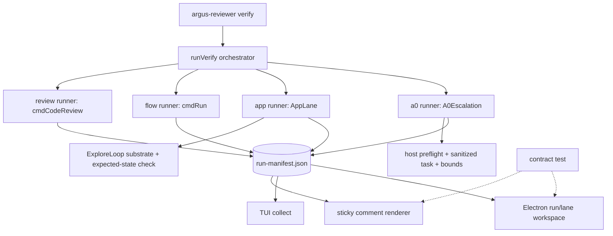
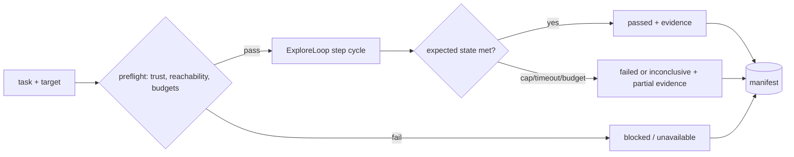

# Insight-first follow-through — app lane, A0 seam, manifest surfaces - Plan

## Goal Capsule

- **Objective.** Finish what the 09-23 insight-first program left unbuilt on
  `main`: wire the `app` and `a0` manifest lanes to real runners, make the
  run manifest the single evidence contract the PR comment, TUI, and Electron
  dashboard all consume, close the vision-lane release gates, and reconcile
  the stale parallel branch and onboarding surface.
- **Means.** Six units in three phases — repo hygiene + vision reliability
  tail, then the two missing lane runners (`verify --app` task lane on the
  U4b ExploreLoop substrate; explicit/scoped/budgeted A0 escalation), then
  manifest-first surfaces and truthful onboarding.
- **Authority.** `docs/brainstorms/2026-09-23-insight-first-open-source-review-requirements.md`
  owns product intent; `docs/plans/2026-09-23-001-feat-insight-first-four-lane-review-observability-plan.md`
  (the parent implementation plan, units U4–U8) owns unit intent; this plan's
  Requirements own behavior; KTDs own mechanism.
- **Stop conditions.** A0 live verification is blocked by an external
  dependency (`agent0.bartlettdash.com` down, issue #53) — no unit may claim
  it. Observe-only explore findings acquiring verdict power, or any lane
  running code an untrusted checkout supplied, invalidates the approach and
  stops the work.

## Product Contract

### Summary

#88/#89/#97 already landed the four-lane `verify` contract, the versioned
manifest, head-bound evidence, the action trust gate, the mention lane,
review packs, probe persistence, the verified model menu, and U4a captures.
The U4b act pass has since landed on `main` via #99 — `src/engine/explore.ts`
is the real substrate U3 builds against. What remains is the product's
promise made real end-to-end: the `app`
and `a0` lanes exist in the manifest but have no runners (they can only ever
report `unavailable`), the dashboard never reads the manifest, the
`file://` smoke path is still a release gate, and `init`/docs predate the
shipped contract.

### Problem Frame

The 09-23 plan's sequencing assumed its own branch line. In practice its
early units merged through other PRs while `feat/insight-first-four-lane-review`
fell ~5,300 lines behind `main` — merging it now would delete the mention
lane, probe persistence, review packs, and the approval-review action path.
Meanwhile the product surface advertises four lanes while two are empty
slots. This plan picks up the remainder on `main` directly and retires the
parallel line.

### Requirements

#### Baseline reconciliation

- R1. The stale `feat/insight-first-four-lane-review` branch is audited for
  unique deltas, anything still valuable is landed, and the remote branch is
  deleted; the two parked stashes are triaged to landed-or-dropped with a
  recorded reason.
- R2. No unit in this plan re-implements shipped work — `src/pipeline/`,
  `src/report/manifest.ts`, `src/mention.ts`, `src/probe/persist.ts`,
  `src/review/packs.ts`, `docs/models.md`, and `scripts/check-models.mjs`
  are treated as baseline.

#### Vision lane release gates

- R3. Record/replay smoke coverage runs against the local HTTP fixture
  (`tests/fixtures/serve.mjs`), not `file://`, so screenshots and
  accessibility capture exercise the same transport as a real target.
- R4. A record run shows prior actions to the model, stops with an explicit
  cap message, and persists a complete flow only after successful
  termination.
- R5. Generated tests are syntactically valid, execute through the normal
  runner, and report zero-test or load errors rather than success.
- R6. Replay reports cache hits, misses, heals, provider calls, and USD in
  `run.json` and the manifest so a cheap run is explainable, not just small.

#### Live application lane

- R7. `verify --app` executes a bounded natural-language task against a
  configured URL or locally booted target, reusing the ExploreLoop
  observe/act/capture machinery, and writes a manifest lane record with
  actions, final state, artifacts, and cost.
- R8. A task passes only when its expected state is verified — a page that
  merely loads is not a pass; page errors, console errors, and failed
  same-origin requests join the lane record as evidence.
- R9. A local target command is executable input under the existing trust
  policy (trusted checkouts only); a remote URL needs no command but must be
  reachable — unreachable targets fail preflight `blocked`/`unavailable`
  before any model call.
- R10. Step cap, wall-clock timeout, and USD budget each stop the lane and
  preserve partial evidence; the lane never writes tests, commits, or alters
  the PR branch.

#### Agent Zero escalation seam

- R11. `verify --a0` runs only on explicit selection; before spending it
  resolves the A0 host, checks reachability, verifies target reachability
  from the host's environment, and surfaces task scope, max tasks, wall-clock
  limit, and usage semantics.
- R12. Delegated prompts carry a sanitized task — target, intended head,
  failure summary, local evidence references — never provider keys, GitHub
  tokens, or ambient process environment.
- R13. Unavailable, disconnected, over-limit, and target-unreachable
  outcomes record `unavailable`, `blocked`, or `inconclusive` with a next
  action; a host without usage data reports `unmetered` rather than a
  fabricated dollar amount.
- R14. The lane reports itself unverified against a live host until issue
  #53's dependency resolves; all verification in this plan is stubbed.

#### Shared evidence surfaces

- R15. The PR comment renderer and dashboard consume the same versioned
  manifest; lane names, status meanings, model/cost fields, and head identity
  agree under contract test rather than by convention.
- R16. The collector reads the configured report/manifest paths, tolerates
  missing or partial artifacts, retains the last valid manifest, and bounds
  local history by an explicit retention setting.
- R17. The Electron dashboard's first view is a run/lane workspace — run
  list, lane status matrix, selected-run evidence inspector, cost and cache
  breakdown, live progress stream — in the existing dark operator visual
  language with visible focus and keyboard selection.
- R18. The TUI consumes the same manifest as a compact fallback, not a
  second product contract.

#### Onboarding and proof

- R19. `init` scaffolds a GitHub-first, code-review-only path; a detected A0
  host produces an optional labeled suggestion, never an enabled lane; init
  output names what is sent to the provider, the default budget posture, and
  how to stop.
- R20. README, `docs/quickstart.md`, and `STRATEGY.md` describe the shipped
  four-lane contract truthfully, including A0's unverified-live status and
  artifact retention.
- R21. A dogfood run on an Argus PR demonstrates the default path: useful
  review, actual cost, head binding, and explicit skipped optional lanes.

### Key Decisions

- **Explore is substrate, task is contract** (user-approved): `verify --app`
  composes the U4b ExploreLoop observe/act/capture machinery with an
  expected-state check — no second action loop. U4b's observe-only captures
  stay `observed` evidence inside `run`; the app lane's task verdict is a
  lane status inside `verify`. Rejected alternative: extend `run`'s explore
  pass into a pass/fail lane — conflates observation with verdict and
  bypasses the manifest contract.
- **Salvage, don't merge, the stale branch** (user-approved): audited for
  unique deltas, then deleted. Rejected alternative: merge/rebase — the
  branch is ~5,300 lines behind `main` and would delete shipped lanes.
- **A0 fails closed and honest** (user-approved): explicit selection,
  sanitized task, `unmetered` when the host supplies no usage, and a visible
  `unverified` posture until a live host exists. Rejected alternative: mark
  the lane ready on stubbed tests — fabricates proof the product does not
  have.
- **One manifest, three surfaces** (carried: origin KTD8): comment renderer,
  TUI, and dashboard all read `run-manifest.json`; parity is enforced by
  contract tests, not prose.
- **Dashboard stays dark-operator** (carried: origin KTD10): extend the
  existing Electron visual language — dark canvas, cyan live signal,
  semantic green/red/amber, mono utility type — no generic SaaS redesign.

### Scope Boundaries

#### Deferred to follow-up work

- Live A0 verification and hardening — blocked on issue #53 (host down);
  this plan ships the seam, not the round-trip.
- Org spend caps (#22), runner health dashboard (#21), GHE/GitLab (#23) —
  post-launch Phase D, separate plans.
- ARTEMIS mobile lane — researched
  (`docs/plans/2026-09-21-001-feat-artemis-mobile-lane-research.md`), not
  adopted.
- Issue #62 (OpenCodeReview pattern adoption) — orthogonal review-quality
  track.

#### Outside this product's identity

(carried from origin) Managed hosting for ordinary use, per-seat billing,
selector-based test authoring, a hosted dashboard as the only review surface.

### Acceptance Examples

- AE-A (covers R7, R8): `verify --app` against the HTTP fixture with task
  "submit the form and confirm the success banner" passes only when the
  banner exists; a fixture without it fails with captured evidence.
- AE-B (covers R11–R14): `verify --a0` with no reachable host records
  `unavailable` with the next action, spends nothing, and never claims
  metered cost.
- AE-C (covers R15–R17): a manifest with all four lanes renders the same
  aggregate status and cost in the sticky comment, TUI, and dashboard.
- AE-D (covers R19–R21): a fresh `init` in a test repo produces a
  review-only workflow; the dogfood PR shows cost, head binding, and skipped
  optional lanes.

---

## Planning Contract

### Key Technical Decisions

- KTD1. **App lane = ExploreLoop + expectation, not a new loop.** The U4b
  `ExploreLoop` (observe/propose/execute with clamps, stall detection,
  bounded keys) is the execution substrate. The app lane adds a task string,
  an expected-state assertion, and a manifest lane record around it —
  reusing `VisionClient`, `Actions`, `Ledger`, and the capture taps rather
  than duplicating them.
- KTD2. **Runners stay dumb, verify owns the contract.** `runVerify` already
  treats `app`/`a0` as `() => Promise<number>` slots that write their own
  lane detail; this plan fills the slots. `cli.ts` wires the runners and
  passes per-lane budgets; `verify.ts` keeps owning status semantics.
- KTD3. **Target commands are code.** A `target.command` boots only under a
  trusted checkout — the same gate probes use (`resolveTrust` +
  `mayProbePr`); remote URLs skip local execution entirely.
- KTD4. **A0 payload is a narrow record, not a transcript.** The delegated
  task is assembled from typed fields (target URL, intended head SHA,
  failure summary, evidence refs) through an allowlisted child env — the
  existing `buildA0Args`/`a0TaskPrompt`/`runA0Task` seam extended, never raw
  journal text or ambient env.
- KTD5. **Dashboard reads manifest, not artifacts.** `scripts/collect.mjs`
  gains a manifest path layer (config-aware `reportDir`, partial-write
  tolerance, last-valid retention) that feeds the Electron workspace; TUI
  uses the same collected shape. Raw `run.json`/`code-review.json` remain
  lane-detail, not the aggregate source.
- KTD6. **Isolated worktree for implementation.** All units implement on
  the dedicated branch in a separate `git worktree` off `main`; the shared
  checkout is not edited. (The U4b WIP that motivated this has since merged
  via #99; the isolation rule still holds — this plan's branch lives at
  `../argus-insight-follow`.)

### High-Level Technical Design

Lane wiring after this plan:

App lane decision flow:

### Assumptions

- The U4b `feat/explore-act-policy` work has landed on `main` (#99) —
  `src/engine/explore.ts` is real, so U3 builds against the actual
  `ExploreLoop`, not the planned interface. The implementation branch must
  rebase onto (or merge) current `main` before U3 so the lane composes the
  shipped substrate; it merges cleanly today.
- No reachable A0 host exists this cycle — every A0 behavior is verified by
  stubbed tests and reported honestly (R14).
- `docs/models.md` + `scripts/check-models.mjs` + `model-catalog.yml`
  already satisfy the origin's curated-catalog requirement; no
  `src/models/catalog.ts` rebuild.
- `dist/` is committed and rebuilt alongside `src/` changes per repo
  convention.

---

## Implementation Units

Three-phase ordering; units are sized for parallel owners where noted.

### Phase A — baseline + vision gates (no inter-dependencies)

### U1. Retire the parallel line

**Goal:** Resolve the stale branch and parked stashes so `main` is the only
live line. **Requirements:** R1, R2. **Dependencies:** none.

**Files:** git refs only — `feat/insight-first-four-lane-review` (remote +
local), `stash@{0}` (CacheStats telemetry on main), `stash@{1}` (a0-plugin
v0.1 plan note); optionally `docs/solutions/` or PR notes if a salvaged
delta lands.

**Approach:** Diff the branch's unique commits against `main` two-dot —
nearly everything is deletions (the branch predates #88/#89/#97), so audit
only the ~100 added lines (`action/` runtime deltas, `src/review/secrets.ts`,
`src/evidence/ci.ts`, `src/driver/browser.ts` hunks). Land any still-unique
fixes as a focused commit; record dropped deltas in the commit/PR body.
Delete local + remote branch afterward. Pop/inspect each stash: the
CacheStats getter may already be superseded by `Engine.cacheStats`
(`src/engine/loop.ts`); the a0-plugin stash belongs to the shipped
a0-plugin-argus repo — drop or relocate it to that repo's notes.

**State at resume (2026-09-30):** `feat/insight-first-four-lane-review` is
already absent from local and remote refs and `git stash list` is empty —
the retirement happened between the plan's write and this resume. Remaining
work is verification only: confirm the salvage decision was recorded (PR
body, commit message, or solutions doc) and reconstruct it in the PR body
here if it was not.

**Test scenarios:** none — git hygiene. Verification: `git branch -a` and
`git stash list` are clean of the retired refs (already true); the salvage
record exists in this PR's body or a prior one.

### U2. Vision lane release gates

**Goal:** Close the reliability gates the parent plan's U4 still owes.
**Requirements:** R3–R6. **Dependencies:** none.

**Files:** `tests/unit/smoke.test.ts`, `tests/unit/cli.test.ts`,
`tests/unit/driver.test.ts`, `tests/fixtures/index.html`,
`tests/fixtures/serve.mjs`, `src/engine/loop.ts`, `src/api.ts`,
`src/report/run.ts`, `tests/unit/loop.test.ts`,
`tests/unit/fingerprint.test.ts`, `tests/unit/fixture.test.ts`.

**Approach:** Migrate `file://` smoke/fixture usage onto the existing
`serve.mjs` HTTP server so screenshots, a11y capture, and readiness share
the real transport — keep the `file://` refusal test as a guard, not a
fixture source. Audit `Engine.record` against R4: prior actions are already
surfaced via `_fingerprints` → prompt context and the cap message exists —
verify both, then close whatever remains (persist flow only on successful
termination). Exercise the generated-test path end-to-end: the produced
spec must parse and run under the normal runner; zero-test and load-error
inputs report failure, not pass. Surface replay economics in `run.json`
(hits, misses, heals, calls, USD — `CacheStats` already exists) so the
manifest's flow lane can consume them.

**Test scenarios:**

- A record/replay round-trip against `serve.mjs` produces screenshot and
  a11y evidence identical in shape to the `file://` baseline.
- A capped record reports the cap message and writes no flow cache; a
  completed record persists it once.
- A generated test file parses and executes; an empty generation reports a
  named error.
- A cache-hit replay records zero provider calls in `run.json` and the
  manifest usage block; a healed step records drift + spend.
- The `file://` navigation-refusal guard still fails closed.

**Verification:** `npm test` green with no `file://` fixture dependency in
smoke paths; run.json exposes the cache economics fields.

### Phase B — fill the empty lanes

### U3. `verify --app` task lane

**Goal:** A real bounded application lane where the manifest slot is empty
today. **Requirements:** R7–R10. **Dependencies:** explore substrate is on
`main` (#99) — branch must include it first; U1 recommended first.

**Files:** new `src/pipeline/app.ts`, `src/engine/explore.ts` (consumer-side
options/hooks only — no rewrite), `src/pipeline/verify.ts`,
`src/cli.ts` (runner wiring + `--task`/config surface), `src/config.ts`
(`app:` block: task, expectedState or marker, budgets), `src/driver/target.ts`,
`src/report/manifest.ts` (app lane fields if absent),
`tests/unit/app-lane.test.ts`, `tests/unit/pipeline.test.ts`,
`tests/fixtures/app.html`.

**Approach:** `AppLane` resolves the target (`target.url`/`--url`, or boots
`target.command` under trust gate), runs a bounded task loop on the
ExploreLoop substrate with an explicit expected-state condition (selector,
text marker, or URL predicate), then writes a lane record: actions taken,
final URL/state, screenshots/video refs, captured page/console/network
anomalies, model calls, USD. Status mapping per the lane lifecycle: `passed`
only on verified expected state; page that merely loads → `failed` (or
`inconclusive` when evidence can't decide); unreachable target →
`blocked`/`unavailable` preflight before any model call. Budgets: step cap,
wall-clock, USD — each preserves partial evidence into the manifest.

**Test scenarios:**

- `verify --app` with a configured fixture task that reaches its marker →
  `passed` with actions, artifacts, and cost in the manifest.
- Task whose marker never appears → `failed` with partial evidence; page
  load alone never passes.
- Unreachable URL → preflight `unavailable`, zero provider calls recorded.
- `target.command` on an untrusted context → `blocked`; on trusted → boots,
  runs, cleans up the process.
- Step cap, timeout, and USD cap each halt the lane with partial evidence
  preserved.
- Covers AE-A.

**Verification:** unit suite covers every status path; a fixture-driven
lane run writes a complete manifest record.

### U4. A0 escalation seam

**Goal:** An explicit, scoped, budgeted A0 runner that fails closed and
honest — no live-host claims. **Requirements:** R11–R14. **Dependencies:**
U3 (escalation needs a real local lane to escalate from); can run parallel
on stub fixtures.

**Files:** `src/executor/a0.ts`, `src/detect.ts`, `src/pipeline/verify.ts`,
`src/report/manifest.ts`, `src/config.ts` (`a0:` block: maxTasks,
timeoutMs, host), `src/cli.ts`, `action/action.yml` (input surface),
`SECURITY.md`, `docs/quickstart.md`, `tests/unit/a0-escalation.test.ts`,
`tests/unit/a0.test.ts`, `tests/unit/manifest.test.ts`.

**Approach:** Wire `runners.a0` in `cli.ts` behind explicit selection only.
Preflight: resolve host (`detectEnvironment`/`resolveA0Host`), check
reachability, verify the host can reach the target; emit the scope summary
(tasks, wall-clock, usage semantics) before spending. Task payload built
from typed fields — target, intended head, failure summary, evidence refs —
through an allowlisted child environment; `ARGUS_*`, GitHub, npm, and
provider variables never propagate. Usage: metered fields when the host
returns them, `unmetered` otherwise. Outcome mapping: unreachable host →
`unavailable` + next action; selected-but-unpreflighted → `blocked`;
indeterminate result → `inconclusive`. Keep `delegate`/`heal: 'a0'` as
compat surfaces. Label the lane `unverified-live` in report copy until #53
resolves.

**Test scenarios:**

- No selection, missing CLI, unreachable host, host-can't-reach-target:
  each records a distinct status and spends nothing.
- A selected lane sends the sanitized payload — assert absence of
  `OPENROUTER_API_KEY`, `GITHUB_TOKEN`, `ARGUS_*`, `npm_*` in child env and
  prompt body.
- Timeout/nonzero-exit/spawn-failure kills the child, no orphan process,
  status + reason recorded.
- Host without usage data → `unmetered`; host with usage → fields rendered
  separately from OpenRouter USD.
- Covers AE-B.

**Verification:** stubbed tests cover every preflight/failure path; report
copy shows the unverified-live label.

### Phase C — one contract, three surfaces + proof

### U5. Manifest-first surfaces (collector, dashboard, comment parity)

**Goal:** Every surface reads the same run truth. **Requirements:** R15–R18.
**Dependencies:** U3, U4 for live lane records — can start on fixture
manifests in parallel.

**Files:** `scripts/collect.mjs`, `electron/main.mjs`,
`electron/preload.mjs`, `electron/renderer.js`, `electron/index.html`,
`src/report/comment.ts`, `scripts/watch.mjs` (TUI),
`tests/unit/collect.test.ts` (new),
`tests/unit/dashboard-view-model.test.ts` (new),
`tests/unit/comment.test.ts`, `tests/e2e/dashboard-smoke.mjs` (new),
`tests/fixtures/` (manifest fixtures).

**Approach:** `collect.mjs` gains a manifest layer: resolve `reportDir`
from config (not hardcoded), tolerate missing/partial `run-manifest.json`
(retain last valid), bound history by a retention setting, sanitize
evidence strings (extend `safe()`). New view-model module shapes manifest →
{run list, lane matrix, selected-run detail, cost/cache breakdown, live
tail}; Electron renderer renders it in the existing dark-operator language
with keyboard selection and focus-visible states; TUI consumes the same
view-model compactly. Comment renderer parity: a contract test renders one
manifest through both the sticky-comment path and the view-model and
asserts identical lane names, statuses, cost fields, head identity.
Dashboard smoke: `tests/e2e/dashboard-smoke.mjs` loads a seeded manifest and
asserts the workspace renders.

**Test scenarios:**

- A four-lane manifest renders identical aggregate status/cost in comment
  and view-model (contract test).
- Missing manifest, partial write, custom `reportDir` → visible degraded
  state, not blank dashboard.
- Selecting a run updates inspector/evidence without exposing raw JSON.
- Secret-shaped strings in evidence are masked/escaped before render.
- Keyboard focus reaches run list, lane filter, refresh, disclosure;
  status is not color-only.
- Covers AE-C.

**Verification:** collect/view-model unit tests, comment-parity contract
test, dashboard smoke on a seeded manifest, screenshot check that the
operator aesthetic holds.

### U6. Onboarding, docs, and dogfood proof

**Goal:** The shipped contract is what a new user meets. **Requirements:**
R19–R21. **Dependencies:** U2–U5 (docs must describe reality).

**Files:** `src/cli.ts` (`cmdInit`, `initConfig`, workflow templates),
`README.md`, `docs/quickstart.md`, `STRATEGY.md`, `ROADMAP.md`,
`SECURITY.md`, `tests/unit/cli.test.ts`,
`tests/unit/action-contract.test.ts`.

**Approach:** `init` emits a GitHub-first, code-review-only workflow +
config; a detected A0 host prints an optional labeled suggestion block
instead of writing an enabled lane. Init output names provider data flow,
default budget posture, trust implications, and how to stop/rerun. Update
README (four-lane contract, quickstart path), quickstart (lane-by-lane:
review default; flow, app, a0 opt-ins with budgets and failure modes),
STRATEGY tracks (post-launch → current truth), ROADMAP snapshot. Dogfood:
run `verify` on an Argus PR; attach the manifest + comment as PR evidence.

**Test scenarios:**

- `init` output contains no enabled app/a0 lanes; detected A0 host →
  suggestion comment only.
- Generated workflow passes action-contract tests and requests only the
  permissions its lanes need.
- Missing provider key → named setup failure, not an empty pass.
- Covers AE-D.

**Verification:** init + contract tests green; dogfood manifest shows cost,
head binding, and skipped optional lanes on a real Argus PR.

---

## Verification Contract

- `npm run typecheck`, `npm run lint`, `npm run build`, `npm test` — the
  four repo gates — green at each unit boundary.
- `tests/e2e/dashboard-smoke.mjs` runs the seeded manifest workspace.
- No `file://` fixture dependency remains in smoke paths.
- `verify --app` and `verify --a0` produce manifest records for every
  status in the lane lifecycle — none can silently no-op.
- A dogfood `verify` run on an Argus PR is attached as evidence (R21).

## Definition of Done

- All six units merged to `main` via PR(s) with the repo's four gates green.
- `feat/insight-first-four-lane-review` and both stashes are gone, with
  salvage recorded.
- `verify --app` passes/fails on verified expected state; `verify --a0`
  reports `unavailable`/`unmetered` truthfully.
- Comment, TUI, and dashboard render the same manifest under contract test.
- Docs describe the shipped contract — including that live A0 is
  unverified — and a dogfood run demonstrates the default path.

## Risks & Dependencies

- ~~**U4b landing order**~~ — resolved: `src/engine/explore.ts` shipped on
  `main` via #99; U3 composes the real ExploreLoop after rebasing the branch
  onto `main`.
- **A0 host** — external blocker (#53) caps U4 at stubbed verification; the
  plan forbids claiming otherwise (R14).
- **Electron on this machine** — dashboard smoke needs Playwright chromium;
  headless Electron is out of scope, smoke runs via the browser harness.
- **Shared checkout WIP** — another agent's uncommitted changes occupy the
  main checkout; implementation uses an isolated worktree (KTD6).
- **Cost** — dogfood `verify` runs spend real OpenRouter cents; keep to the
  cheap-tier defaults already in `docs/models.md`.

## Appendix — Research anchors

- Origin requirements: `docs/brainstorms/2026-09-23-insight-first-open-source-review-requirements.md`
  (R1–R21 here trace to its R1–R18, F1–F5, AE1–AE7).
- Parent plan: `docs/plans/2026-09-23-001-feat-insight-first-four-lane-review-observability-plan.md`
  units U4–U8 + KTD1–KTD10; its U1–U3 shipped via #88/#89.
- U4b substrate: `docs/plans/2026-09-29-001-feat-exploratory-act-policy-plan.md`,
  `src/engine/explore.ts` (in flight).
- Current seams: `src/pipeline/verify.ts` (`VerifyRunners.app`/`.a0`
  unfilled), `src/report/manifest.ts` (LANE_IDS, schema v1),
  `scripts/collect.mjs` (no manifest read), `src/engine/loop.ts`
  (`CacheStats`, record cap, fingerprint→prompt context),
  `tests/fixtures/serve.mjs` (HTTP fixture already exists),
  `docs/models.md` + `scripts/check-models.mjs` (catalog shipped).
- Blockers: issue #53 (A0 live verify — host down); open scale items #21–23.
