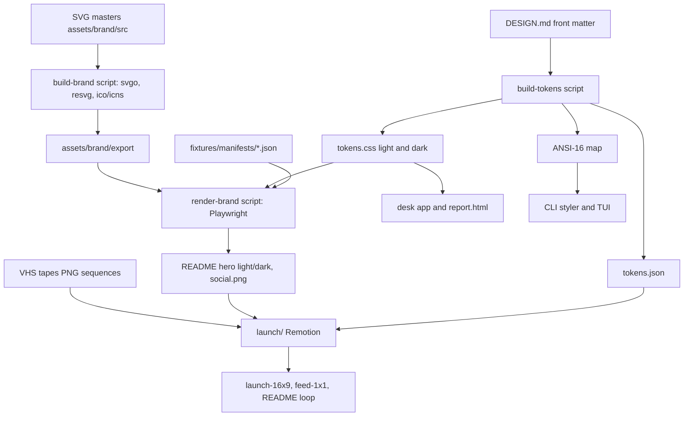
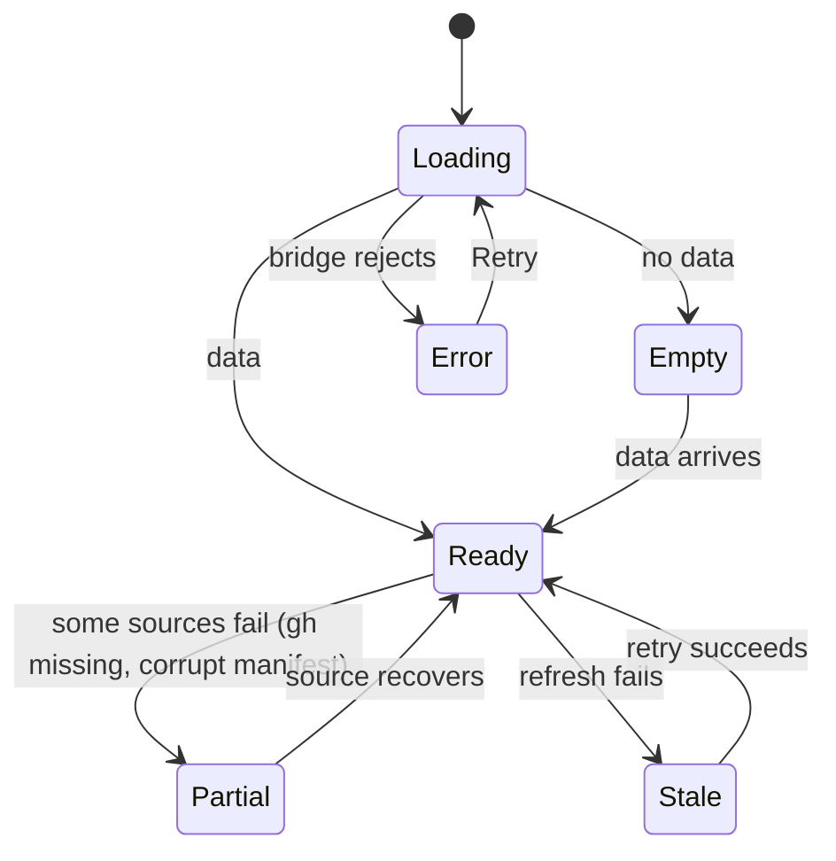
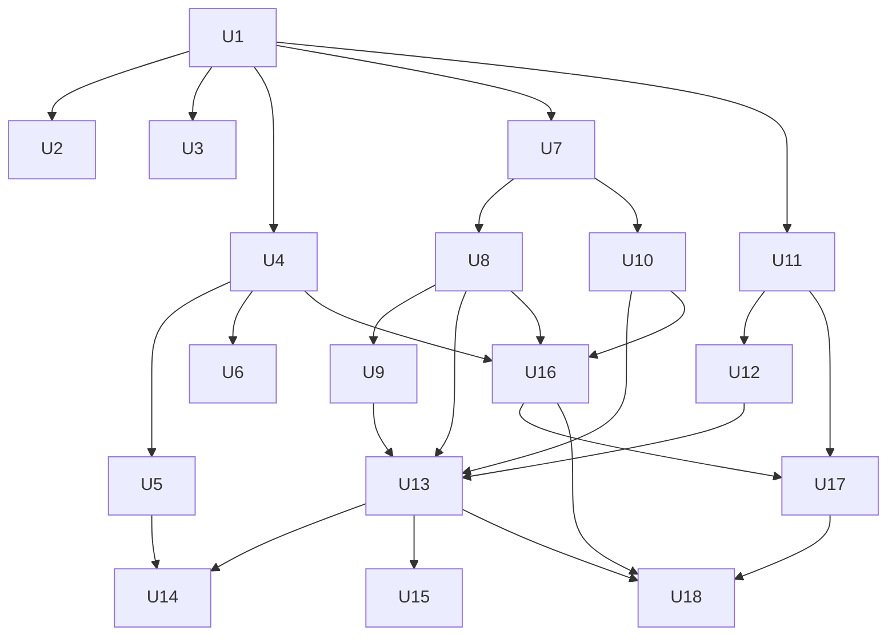

# Ocellus Redesign - Plan

## Goal Capsule

- **Objective:** A PR author, reviewer or adopter who meets Argus anywhere (PR comment, terminal, desk app, README, social unfurl, launch video) sees one consistent, honest, emoji-free visual language. They can read a verdict, how strong its proof is and what it cost in seconds, and every failure tells them what happened and what to do next.
- **Means:** Implement DESIGN.md "Ocellus" (origin) surface by surface on one token and glyph source (KTD1, KTD2), with hand-authored SVG assets (KTD6) and fixture-driven renders for all media (KTD7).
- **Authority hierarchy:** this plan's Requirements, then DESIGN.md (origin; §6 tokens and §6.7 glyph map are normative), then `AGENTS.md` / `SECURITY.md` / `CONTRIBUTING.md`, then the quality checklist (craft-and-launch research §A.3, bound by R31).
- **Execution profile:** 18 units in 6 phases, each unit sized as one PR against protected `main` (PR + 1 review). Phases 1 and 2 can run in parallel after Phase 0.
- **Stop conditions:** stop and ask if a unit would require a paid model call, AI image generation, a change to `src/trust.ts` or the fork/untrusted lane, a change to `tests/fixtures/*.html`, or widening `package.json` `files` before Q2 is answered.
- **Who finishes:** an implementing agent (`ce-work`) per unit; the user reviews and merges each PR. The agent captures and attaches its own verification evidence (R31).

---

## Product Contract

### Summary

Rebuild every Argus surface on the Ocellus system: a shared token and eye-state glyph vocabulary, one comment grammar, a styled CLI and TUI, a reskinned desk app with designed empty, loading and error states, a hand-drawn brand asset set, fixture-rendered README and social media, VHS terminal demos, and a 40-second Remotion launch video. Emoji are removed from every surface.

### Problem Frame

DESIGN.md §2 audits the current state: three competing emoji vocabularies in the PR comment (F2), codenames and HTTP codes in user copy (F3), a redundant inline-comment preamble (F4), README claims about surfaces consumers can't run (F5), a dashboard wearing GitHub Primer tokens (F7), no evidence viewer (F9, F13), a flickering fixed-width TUI (F10), an unstyled CLI (F11), and name sprawl (F12). PR #111 already fixed F1 (demo GIF pulled), F6 (spend confirm) and part of F3.

The spec-flow pass found that errors are the weakest part. Sticky comment and status posts have no error handling (`action/sticky-comment.cjs:1131-1171`). The sticky lookup reads only the first 100 comments (`:1132`), so busy PRs can get duplicate stickies. A corrupt manifest is silently dropped (`:1083`). The dashboard's `refresh()` rejection is unhandled (`electron/renderer.js:316-332`). A missing `gh` looks like an empty state. Provider 402/429/5xx are not distinguished in the vision client (`src/vision/openrouter.ts:199`). Argus's brand promise is honesty, so a silent or misleading failure is a brand defect, not only a bug.

### Requirements

**Shared vocabulary and tokens**

- R1. One token source (DESIGN.md front matter) feeds CSS, terminal and render pipelines; no surface hard-codes a color, radius or shadow outside it.
- R2. Status is always eye-state glyph plus lowercase word, using the §6.7 map (`● ⊘ ◐ ⊖ ◌ –`) in text surfaces and the A3 SVG glyphs in rendered surfaces; color is the third cue.
- R3. Proof strength (A4 `▱▰` ladder), severity (A5 `◆ ◈ ○ □`) and verdict reuse the same vocabulary everywhere; verdict uses status glyphs, never a third set.
- R4. No emoji in any user-facing output (comment, inline review, review body, status, CLI, TUI, desk, report, docs media). Parsing emoji out of model output stays allowed.
- R5. User-visible copy carries no internal codenames ("Jev"), no bare HTTP codes outside a Diagnostics fold, no em-dashes in changed strings, and status words stay lowercase.

**PR surfaces**

- R6. Every sticky comment body (missing key, no report, manifest, full report, review-only) follows one grammar: header, verdict line, lane table, findings summary, folds, ledger footer. The first screen is at most 12 lines before the first fold.
- R7. Inline review comments start with severity glyph, severity word and proof meter, then the finding sentence, then an optional suggestion and at most one evidence line. The tool name and line number are not repeated.
- R8. The commit status description mirrors the comment verdict line within GitHub's 140-character limit.
- R9. Comment posting never fails silently. A failed post writes the reason to the job summary and still attempts the commit status. One sticky per PR holds across PRs with more than 100 comments.
- R10. A comment that would exceed the length budget collapses folds in a fixed order and points to the workflow run's evidence rather than failing the post.
- R11. Missing, unreadable and stale manifests are told apart in the comment, each with a fix. A stale manifest shows both SHAs.

**Terminal surfaces**

- R12. CLI output is TTY-aware: styled in a TTY, plain when piped, with `NO_COLOR`, `FORCE_COLOR` and `--no-color` honored.
- R13. `run` and `verify` end with a summary block in the comment's grammar (verdict, lanes, total spend against budget, report path).
- R14. Every CLI error prints a one-line summary with the failed glyph, the cause, and a copyable fix command on its own line. `--json` emits a machine-readable error with a stable `code`.
- R15. Provider failures name their class: key missing, key out of credit (402), rate limited (429, with reset time), provider down (5xx), or an Argus bug.
- R16. `--help` groups commands by job (Review / Test / Operate / Setup) with the default command first.
- R17. The TUI uses the alternate screen, redraws only changed lines, adapts to terminal width with a 72-column minimum, shows a persistent key footer, and degrades to a single snapshot when stdout is not a TTY.

**Desk app (dashboard)**

- R18. The desk app uses Ocellus tokens, fonts, glyphs and app icon, in light and dark themes following system preference.
- R19. Runs is the home view (runs, lane matrix with evidence, inspector); maintainer panels move to a secondary Repo view; evals render as tables.
- R20. Every panel has designed empty, loading, partial, error and degraded states. A missing or unauthenticated `gh` is its own state, never an empty list. A failed refresh shows when data was last good, with Retry.
- R21. Every action is keyboard reachable (`j/k`, `[`/`]`, `/`, `?`, Enter), focus survives polling, and `?` lists keys.

**Evidence report and packaging**

- R22. A run can produce a self-contained offline `report.html` (verdict, lanes, findings, flow timeline, heals, ledger) that honors color scheme and prints cleanly, and the comment footer tells the reader where to find it (run page, artifact name, path).
- R23. The README and docs never describe a surface a consumer cannot run.

**Brand assets**

- R24. A hand-drawn mark (A1), wordmark and lockup (A2), status, proof, severity and lane glyphs (A3-A6), chrome icons (A7), app icon (A8), favicons (A9), empty-state illustrations (A13), motion (A14) and subset fonts (A15) exist as SVG or font masters with reproducible exports.
- R25. `action/action.yml` declares Marketplace branding (`icon: eye`, `color: blue`).

**Marketing media**

- R26. The social card (A10) and README hero (A11, light and dark) are rendered from real Argus output on fixture manifests, never mock-ups, and regenerate with one command.
- R27. README demos are scripted VHS casts (A12) with no personal tooling, notifications or secrets in frame.
- R28. A 40-second launch video for X follows the "The witness" storyboard, uses only real UI and real fixture numbers, and passes the video QC checklist (craft-and-launch research §C.4).

**Cross-cutting quality**

- R29. All token pairs used for text meet WCAG 2.2 AA in both themes; control borders and focus meet 3:1; targets are at least 24x24 px.
- R30. Motion is limited to the A14 set and §6.5 tokens, never animates on poll refresh, and is removed under `prefers-reduced-motion` and in non-TTY output.
- R31. Each unit ships with self-captured evidence against the quality checklist (craft-and-launch research §A.3): screenshots at 1440 and 390 px in both themes for web surfaces, terminal captures at 80 and 120 columns for terminal surfaces, the error and empty states it touches, a keyboard pass, and a contrast report.
- R32. No paid model call, AI image generation, or the dedicated eval billing key spend happens in any test, capture, render or demo pipeline.

### Key Decisions

- **Brand is "Argus"; `argus-reviewer` is the command and `argus-reviewer-e2e` the npm name.** DESIGN.md Q1 recommendation, adopted as default pending confirmation. Governs R5, R24.
- **The desk app and TUI stay contributor tools in this program; shipping `argus-reviewer desk` is built only after Q2 is answered.** The redesign keeps the UI dist-servable so the later decision is cheap. Governs R18, R23.
- **The comment stays text-only by default.** SVG glyph images from `raw.githubusercontent.com` (A16) wait for Q3. Governs R2, R6.
- **Demo media use a pre-seeded cache hit only ($0).** DESIGN.md Q7 default and R32. Governs R27, R28.
- **`tests/fixtures/*.html` stay visually frozen.** They are vision-model eval targets (DESIGN.md Q8). Governs R18.

### Success Criteria

- A reviewer can name the verdict, proof strength, lines needing attention and cost of a sticky comment within its first 12 lines, in both GitHub themes.
- A grayscale screenshot of each surface still distinguishes all six statuses.
- A repo-wide emoji scan of output-producing code returns only the allow-listed input parsers.
- Every error and degraded state listed in the spec-flow gaps (Appendix) has a rendered capture with a next action.
- The launch video passes every §C.4 QC item and every README/social asset is regenerated from one command on a clean checkout with no API key.

### Scope Boundaries

- Not changing review, flow, app or a0 lane logic, verdicts, or the manifest schema; the redesign renders what the view-model already exposes.
- Not changing `src/trust.ts`, the fork/untrusted lane, or `ARGUS_TRUSTED` handling (see Open Questions Q10).
- Not restyling `tests/fixtures/*.html`.
- Not generating any imagery with AI models, and not buying music or stock media.
- Considered and not built: changing numeric CLI exit codes. Exit codes are a public CI contract; splitting infra failures from verdict failures would break consumer scripts. `--json` error `code` (R14) gives the distinction without breaking anyone. Revisit if consumers ask for it.
- Considered and not built: the Checks API for a check-run title and summary. It needs `checks: write`, which fork tokens lack; R8 rewrites DESIGN.md §7.9 for the commit status instead. Revisit if Argus moves to a GitHub App.
- Considered and not built: generating `action/sticky-comment.cjs` from TS. See KTD2.
- Considered and not built: an `ARGUS_ASCII` glyph fallback. Double-width glyphs in CJK-locale terminals only misalign columns, are visible at once, and a fallback map is cheap to add later. Revisit on a user report.

#### Deferred to Follow-Up Work

- Comment SVG glyph images (A16), pending Q3.
- Docs site, per-page OG images and favicon deployment (A9 assets are produced in U10, deployment waits for Q6).
- Desk command palette, heal accept/reject that writes the cache, evidence viewer click markers (DESIGN.md P2 ceiling items beyond the R22 report).
- Moving the Remotion composition into a shared `launch-kit` repo once that repo is approved.
- `init` framework detection and free dry-run (DESIGN.md §7.8 ceiling).
- TUI pane-focus model and log filter (DESIGN.md §7.5 ceiling).

### Open Questions

Blocking for one unit only (others proceed on the stated default):

- Q2 (blocks U15). Ship `argus-reviewer desk` (and `watch`) to consumers from `dist/`, or keep them contributor-only? Default: contributor-only; U15 does not start without a yes.

Deferred (proceed on default, user may override):

- Q1. Brand naming as in Key Decisions. Default: adopt.
- Q3. Tag-pinned SVG glyph images in the comment. Default: no.
- Q4. Chrome icons hand-drawn or Phosphor Regular as the one exception. Default: hand-drawn, per the brief that all assets are custom (U9 keeps the set small, about 20 icons).
- Q5. Desk default theme. Default: system preference.
- Q6. GitHub Pages docs site. Default: out of scope; README stays the only marketing page.
- Q9. Launch-kit location. Default: in-repo `launch/` with a layout that can be moved wholesale (KTD10).
- Q10. Fork or untrusted PRs currently `exit 1` before any comment (`action/action.yml:192-215`). Should they instead post a comment with executable lanes marked `⊖ blocked`? This touches the trust path, so the default is no change; U5 only improves the job summary text.
- Q11. Audio for the launch video: silent-first with CC0 Kenney UI foley only, or add a licensed music bed (Uppbeat/Epidemic, a paid subscription)? Default: CC0 foley only, no music.
- Q12. Glyph cell width: `● ◐ ◌ ⊘ ⊖` are East Asian Ambiguous width and render two cells in CJK-locale terminals. Default: accept the misalignment; no ASCII fallback is built (Scope Boundaries).
- Q13. Should the action itself upload the evidence report as a run-scoped artifact (`argus-reviewer-evidence-<run_id>-<attempt>`) before the sticky step, so the footer can deep-link it? That adds a new artifact to every consumer run. Default: no; the footer links the run page and names where `report.html` sits in the consumer's existing upload (U14).
- Q14. Marketing fixture provenance: U16-U18 use a scrubbed copy of a real run manifest from this repo's own past dogfooding runs (no new spend). If none fits the hero story, may the figures be labeled "example run" instead? Default: use a real scrubbed manifest; label as example only with the user's yes.

---

## Planning Contract

### Key Technical Decisions

- KTD1. **Tokens are generated from DESIGN.md front matter.** A build script reads the YAML `colors`, `spacing`, `rounded`, `motion` blocks and emits `assets/brand/tokens.css` (custom properties, light and dark), `assets/brand/tokens.json` (DTCG-shaped, for Remotion and render templates) and an ANSI-16 map for terminals. Hex stays canonical because the §6.1 contrast table was measured in hex; an OKLCH value is emitted alongside each for derived tints. A generated-file drift test keeps outputs in step with DESIGN.md.
- KTD2. **The glyph vocabulary lives in `src/report/viewmodel.ts`, and `action/sticky-comment.cjs` keeps its own copy guarded by parity tests.** This extends the existing pattern (`MANIFEST_STATUS_EMOJI` plus the "manifest comment parity" and "manifest validator parity" tests). Generating the CJS from TS was the close alternative. It was rejected because the action is loaded by `actions/github-script` `require` from `action/` with no build step, and `dist/` is ESM. A bundling step would change the release and `check:dist` contract for a vocabulary of about 20 symbols. A Bake-off was not warranted for the same reason: both options are concrete and judgment settles it.
- KTD3. **Golden-file tests replace scattered `toContain` emoji pins for comment output.** Committed fixture manifests in `fixtures/manifests/` (passed, failed, mixed four-lane, review-only, missing key, stale, corrupt, oversize) render through both the CJS and the TS reference into committed `.md` goldens. An update flag regenerates them, and review sees the rendered markdown diff.
- KTD4. **Inline-comment dedup keys on `path:line:severity:normalizedMessage:suggestionHash`, parsed from both the legacy and the new body format, and new bodies carry a hidden `<!-- argus-reviewer:inline -->` sentinel.** The new body's first line is the severity line, so the current first-line key would collide across findings. A shared parser recognizes `**argus-reviewer <sev>:** <msg>` and the new `<glyph> **<sev>** · <proof>` + message line. One message normalizer strips a leading `L<n>[-<m>]:`, severity emoji, a `<sev>:` keyword and the trailing category code span; it runs on both parsed formats and on the rendered message line, because the review prompt asks the model for `L<line>: 🔴 bug: …` messages. Before adding a posted comment to the deduplication set, `planInlineComments` must require `isSelfLogin(c.user?.login)` as well as either the legacy `**argus-reviewer` prefix or the new sentinel, while retaining the current-head SHA check. Neither body marker alone proves authorship; a matching human-authored comment must not suppress an inline finding.
- KTD5. **The CLI styler is a dependency-free module in `src/ui/` used through `Ctx.out` / `Ctx.err`.** Precedence: `--no-color` and `NO_COLOR` beat `FORCE_COLOR`, which beats TTY detection. GitHub Actions logs get color only through `FORCE_COLOR`. Tests drive it through the existing `CliDeps` injection.
- KTD6. **Brand assets are hand-authored SVG masters on a 24-unit grid under `assets/brand/src/`, exported by a script to `assets/brand/export/`.** The script uses npm dev dependencies (`svgo`, `@resvg/resvg-js`, an ICO/ICNS writer) so exports reproduce in CI without system packages. `oxipng` is optional when present. Exports are committed. Each master gets rendered preview PNGs that the agent inspects across iterations.
- KTD7. **README hero, social card and launch-video UI plates are Playwright renders of real HTML templates fed by fixture manifests.** Playwright 1.63 is already a dev dependency and the dashboard smoke test already proves the stubbed-bridge capture pattern. Satori was considered and rejected because it cannot render the real comment markdown or desk UI.
- KTD8. **Fonts are subset WOFF2 files committed under `assets/brand/fonts/` with OFL licenses and a recorded subsetting command.** Sources are the official Schibsted Grotesk and Martian Mono releases. Total stays at or under 110 KB with metric-matched fallbacks.
- KTD9. **The desk UI is split into a static web front end plus a data bridge.** Electron supplies the bridge through `preload.mjs` today. A later `desk` command (U15) can serve the same files over `127.0.0.1` with an HTTP bridge. No framework is added; the existing `el()` DOM helper and CSP stay.
- KTD10. **The launch video is a Remotion 4 project in `launch/` with its own `package.json`, laid out like the proposed launch-kit (`brands/argus`, `videos/argus/launch`, `capture/argus`).** Remotion and its deps stay out of the root package and the published tarball. VHS footage is captured as PNG sequences because this machine's VHS emits 25 fps MP4 regardless of `Set Framerate`.
- KTD11. **An emoji and em-dash lint runs as a vitest test over all of `src/` plus `action/`, `scripts/`, `electron/` and `assets/brand/templates/`.** The allow-list holds only the `deriveSeverity` input regex and the review prompt text in `src/cli.ts`. Narrower scopes miss real producers such as `src/review/secrets.ts` (emoji in finding messages) and `src/probe/persist.ts` (emoji and em-dash in the heal PR body).
- KTD12. **Comment length is measured after full render.** Folds collapse to a one-line pointer in the order Diagnostics, Spend ledger, Heals, Findings detail, and the footer links the workflow run page, naming the artifact and the `report.html` path inside it once U14 lands. The budget is the DESIGN.md §10 20 KB target, well below GitHub's 65,536-character limit.

### High-Level Technical Design

Asset and render pipeline:

Desk panel data states (each panel, R20):

Unit dependencies:

### Assumptions

- The implementing agent may install `vhs`, `gifski` and the npm dev dependencies named in KTD6/KTD10; system packages go through `omarchy pkg add` run by the user.
- A seeded flow cache that makes `run` a $0 cache hit can be produced once from existing fixtures without a paid call. If it cannot, U17 records the `init` and `verify --review --dry-run` casts and asks before any paid seeding (Q7 default).
- DESIGN.md token hexes pass the §6.1 contrast table as stated; U1's contrast script re-verifies and fails the build if not.
- The §6.7 glyphs render single-cell in Martian Mono, JetBrains Mono, SF Mono and Cascadia; U1 verifies (Q12 covers CJK locales).
- The launch storyboard copy from craft-and-launch research §B.5 is the starting script; the user reviews `script.md` before the render (U18).
- Codename cleanup keeps `JEV_DEFAULT_MODEL` and the `typesafe/jev-1.13-20260917` model slug, which are real identifiers, and the historical CHANGELOG entries are reworded rather than deleted.

### System-Wide Impact

- **Shared view-model:** `src/report/viewmodel.ts` feeds the comment reference renderer, `scripts/collect.mjs` (through `dist/report/viewmodel.js`) and the dashboard. Changing its glyph exports (U1) changes all three; `collect.mjs` has a stale-dist fallback that must keep working until `dist/` is rebuilt.
- **Posted-comment compatibility:** sticky comments are found by the `<!-- argus-reviewer -->` sentinel and inline comments by dedup key. U4 keeps the sentinel; U6 keeps old posted comments deduplicating (KTD4).
- **Public contracts:** CLI flags (`--json`, `--no-color` added), help text, `action/action.yml` inputs (unchanged) and branding, the npm `files` list (unchanged unless U15), and numeric exit codes (unchanged).
- **CI:** `check:dist` fails on any `src/` change without a committed rebuild; new dev dependencies (KTD6) land in `package-lock.json`; `launch/` is excluded from lint and the root install.
- **Security invariants:** `maskSecrets` / `cell` on every interpolated string in the comment, report and desk; the desk server (U15) binds loopback only; no unit touches `src/trust.ts`.

### Risks and Dependencies

| Risk | Decision |
|---|---|
| CJS and TS comment renderers drift | Mitigated: goldens render both from the same fixtures (KTD3) plus vocabulary parity (KTD2). |
| Inline-comment format change re-posts or collides | Mitigated: dual-format dedup parser (KTD4) with an explicit legacy-to-new test in U6. |
| `●◐◌⊘⊖` render double-width in CJK locales | Accepted (Q12); no fallback built. |
| Martian Mono lacks one of `⊘ ⊖ ◐ ◌ ▱ ▰` | U1 checks the official font's cmap before subsetting. Missing glyphs are served from a named fallback mono through `unicode-range` in `fonts.css`, chosen in U1 and pinned by a test, so rendered surfaces stay consistent. |
| A tampered stale manifest plants text in the stale-SHA banner | U5 validates both SHAs as 7-40 hex characters and passes them through `cell`; anything else renders as "unknown". |
| `@resvg/resvg-js` or ICNS tooling lacks an aarch64 prebuild | U7 checks first; fallback is the system `resvg` binary via `omarchy pkg add`, documented in `CONTRIBUTING.md`. |
| Hand-drawn mark misses the taste bar | Mitigated: U7 ends on a user visual sign-off before glyphs build on it. |
| Remotion license | Free for individuals and companies of three or fewer; recorded in `launch/LICENSES.md`. Revisit if the team grows. |
| VHS emits 25 fps MP4 on this machine | Mitigated: PNG-sequence capture into Remotion (KTD10); README casts accept 25 fps. |
| Golden churn makes reviews noisy | Accepted: goldens are markdown, reviewed as rendered diffs; that visibility is the point. |
| Large comment grammar change confuses existing users mid-PR | Accepted: the sticky is replaced on the next run; CHANGELOG entry explains the new legend. |

- **Phase 0 (foundations):** U1, U2, U3.
- **Phase 1 (PR surfaces, P0):** U4, U5, U6.
- **Phase 2 (brand assets):** U7, U8, U9, U10. Runs in parallel with Phase 1.
- **Phase 3 (terminal):** U11, U12.
- **Phase 4 (desk and report):** U13, U14, then U15 if Q2 is yes.
- **Phase 5 (marketing and launch):** U16, U17, U18.

---

## Implementation Units

| U-ID | Title | Key files | Depends on |
|---|---|---|---|
| U1 | Tokens, glyph vocabulary, lint gates | `scripts/build-tokens.mjs`, `assets/brand/tokens.*`, `src/report/viewmodel.ts` | none |
| U2 | Verification harness | `scripts/qa/`, `tests/e2e/visual-capture.mjs` | U1 |
| U3 | Copy hygiene, branding, README truth | `docs/quickstart.md`, `CHANGELOG.md`, `action/action.yml`, `README.md` | U1 |
| U4 | Comment grammar and goldens | `action/sticky-comment.cjs`, `src/report/comment.ts`, `fixtures/manifests/` | U1 |
| U5 | Comment error and degraded UX | `action/sticky-comment.cjs` | U4 |
| U6 | Inline comments, review body, status | `src/cli.ts`, `action/approval-review.mjs`, `action/sticky-comment.cjs` | U4 |
| U7 | Mark, wordmark, lockup | `assets/brand/src/mark*.svg`, `scripts/build-brand.mjs` | U1 |
| U8 | Status, proof, severity, lane glyph SVGs | `assets/brand/src/glyphs/` | U7 |
| U9 | Chrome icons, empty states, motion | `assets/brand/src/icons/`, `assets/brand/src/empty/`, `assets/brand/motion.css` | U8 |
| U10 | Fonts, app icon, favicons | `assets/brand/fonts/`, `assets/brand/src/app-icon.svg` | U7 |
| U11 | CLI styler, summary, help, errors | `src/ui/`, `src/log.ts`, `src/cli.ts`, `src/vision/openrouter.ts` | U1 |
| U12 | TUI rebuild | `scripts/watch.mjs`, `scripts/tui/` | U11 |
| U13 | Desk app reskin, IA and states | `electron/*` | U8, U9, U10, U12 |
| U14 | HTML evidence report | `src/report/html.ts` | U5, U13 |
| U15 | `argus-reviewer desk` packaging (gated on Q2) | `src/desk/`, `package.json` | U13 |
| U16 | Fixture-rendered hero and social card | `assets/brand/templates/`, `scripts/render-brand.mjs` | U4, U8, U10 |
| U17 | VHS demo casts and README rewrite | `assets/demo/*.tape`, `README.md` | U11, U16 |
| U18 | Launch video "The witness" | `launch/` | U13, U16, U17 |

### U1. Tokens, glyph vocabulary, lint gates

**Goal:** Establish the single token source and the Ocellus glyph vocabulary that every later unit consumes, plus the gates that keep them honest.

**Requirements:** R1, R2, R3, R4, R29

**Dependencies:** none

**Files:**
- Create: `scripts/build-tokens.mjs`, `assets/brand/tokens.css`, `assets/brand/tokens.json`, `assets/brand/ansi.json`, `scripts/check-contrast.mjs`
- Modify: `src/report/viewmodel.ts` (replace `LANE_STATUS_ICON` / `LANE_STATUS_EMOJI` (add Ocellus status, proof, severity and verdict maps alongside the existing `LANE_STATUS_ICON` / `LANE_STATUS_EMOJI` exports, which stay until U4 and U13 move their consumers; replacing them here would break the CJS/TS parity test and dashboard smoke in this PR), `package.json` (scripts), `eslint.config.js` (scope for `assets/`)
- Test: `tests/unit/tokens.test.ts`, `tests/unit/glyph-vocabulary.test.ts`, `tests/unit/no-emoji.test.ts`

**Approach:**
- Token generation per KTD1; contrast checking computes WCAG 2.x ratios for every text/background pair DESIGN.md §6.1 lists and fails on any below its threshold.
- Vocabulary per KTD2: status, proof (`suspected`, `corroborated`, `exercised`, `reproduced`), severity and verdict.
- Light and dark color sets in DESIGN.md have different keys today (`surface-sunk` is light-only, `raised` is dark-only). U1 adds the missing dark `surface-sunk` and light `raised` values to DESIGN.md, contrast-checked, and the build fails when the two key sets differ.
- The emoji and em-dash lint per KTD11 lands here with a temporary allow-list for files later units rewrite; each later unit removes its file from the allow-list.

**Patterns to follow:** existing status contract test in `tests/unit/dashboard-view-model.test.ts`; `formatUsd` / `maskSecrets` exports in `src/report/viewmodel.ts`.

**Test scenarios:**
- Generating tokens from DESIGN.md produces byte-identical committed outputs; editing a hex in DESIGN.md without regenerating fails the drift test.
- Every `LaneStatus` value maps to exactly one text glyph and one lowercase word; no two statuses share a glyph.
- Building tokens from a front matter whose light and dark color key sets differ fails with the missing keys named.
- Existing `LANE_STATUS_ICON` / `LANE_STATUS_EMOJI` exports still resolve, so current consumers and parity tests pass unchanged.
- Proof levels map to `▱▱▱▱` through `▰▰▰▰` in ladder order; an unknown level maps to the empty meter, never throws.
- The contrast script reports every §6.1 pair and fails when a fixture token set lowers `ink-3` below 4.5:1.
- The emoji lint flags an emoji added anywhere under `src/` (for example `src/review/secrets.ts`) and ignores only the `deriveSeverity` regex and the review prompt text.

**Verification:** `npm test` passes with the new tests; a contrast report and a glyph sheet (text glyphs rendered in Martian Mono, JetBrains Mono, and DejaVu Sans Mono via Playwright) are attached to the PR, confirming single-cell width.

### U2. Verification harness

**Goal:** Give every later unit one command that produces its R31 evidence without paid calls.

**Requirements:** R31, R32

**Dependencies:** U1

**Files:**
- Create: `scripts/qa/capture-web.mjs` (Playwright: URL or file, widths 1440 and 390, light and dark, optional grayscale and deuteranopia filter), `scripts/qa/capture-term.mjs` (runs a CLI or TUI command under a fixed width via VHS `Screenshot`, 80 and 120 columns)
- Modify: `tests/e2e/dashboard-smoke.mjs` (reuse its stubbed `window.argus` seeding), `CONTRIBUTING.md`, `.gitignore` (`argus-reviewer-report/qa/`)
- Test: `tests/unit/qa-capture.test.ts`

**Approach:**
- Captures write to `argus-reviewer-report/qa/<unit>/` and are attached to PRs, not committed.
- The harness refuses to run when `OPENROUTER_API_KEY` is set unless an explicit `--allow-key` flag is given, enforcing R32 by construction.
- Keyboard checks are scripted Playwright sequences (Tab order, focus-visible presence) reported as pass/fail text.

**Patterns to follow:** `tests/e2e/dashboard-smoke.mjs` (HTTP serving of `electron/`, `addInitScript` stub, seeded manifest).

**Test scenarios:**
- Argument parsing yields the four width/theme combinations by default and accepts a single width.
- With `OPENROUTER_API_KEY` present and no `--allow-key`, the harness exits non-zero with an explanation.
- The grayscale option applies a filter before capture (asserted on the generated page CSS, no browser needed).

**Verification:** running the harness against today's dashboard produces eight PNGs (two widths, two themes, filled and empty) and a keyboard report, attached to the PR.

### U3. Copy hygiene, branding, README truth

**Goal:** Land the cheap P0 text fixes so adopters stop seeing codenames and unrunnable surfaces.

**Requirements:** R5, R23, R25

**Dependencies:** U1

**Files:**
- Modify: `docs/quickstart.md`, `docs/models.md`, `CHANGELOG.md`, `fixtures/demo-pr/README.md`, `scripts/demo.mjs`, `scripts/check-models.mjs`, code comments in `action/sticky-comment.cjs`, `src/cli.ts`, `src/config.ts`, `src/review/*.ts`, `src/evidence/ci.ts`; `action/action.yml` (branding block); `README.md` (mark `watch`/`app` as contributor tools); `electron/main.mjs` (`app.setVersion` from `package.json`, window title "Argus")
- Test: `tests/unit/action-contract.test.ts` (branding present), `tests/unit/no-emoji.test.ts` (codename check added)

**Approach:**
- "Jev" becomes "confidence model" in prose and comments; identifiers and the model slug stay (Assumptions). `dist/` is rebuilt because `src/` comments change.
- README line 34 and line 119 claims are rewritten per R23 and the Q2 Key Decision.

**Test scenarios:**
- `action/action.yml` parses and contains `branding.icon: eye` and `branding.color: blue`.
- A codename scan over user-facing docs and output strings finds no "Jev" outside the allow-listed identifier and slug.
- The Electron version string equals `package.json` version (unit test on the exported helper).

**Verification:** `npm run typecheck`, `lint`, `build`, `check:dist` and `test` pass; README diff reviewed for R23.

### U4. Comment grammar and goldens

**Goal:** Rebuild every sticky comment body on the R6 grammar with the Ocellus vocabulary, pinned by golden files.

**Requirements:** R2, R3, R4, R5, R6

**Dependencies:** U1

**Files:**
- Create: `fixtures/manifests/{passed,failed,mixed-four-lane,review-only,missing-key,stale,corrupt,oversize}.json`, `tests/goldens/comment/*.md`
- Modify: `action/sticky-comment.cjs` (one layout function shared by `renderMissingKeyBody`, `renderNoReportBody`, `renderManifestBody`, `renderBody`, `renderReviewOnlyBody`; glyph map copy per KTD2), `src/report/comment.ts` (reference renderer on the same grammar), `tests/unit/action-contract.test.ts`, `tests/unit/comment.test.ts`
- Test: `tests/unit/comment-golden.test.ts`

**Approach:**
- Follow the DESIGN.md §7.1 target first screen; footer carries version, a link to the workflow run page (KTD12), and "self-hosted, BYOK".
- Fold summaries drop emoji and use sentence case: Findings, Heals (review before merging), Spend ledger, Diagnostics.
- Secret masking through `cell` stays on every interpolated value.
- The goldens approach per KTD3 replaces the emoji `toContain` pins; the existing parity tests switch to the new glyphs.

**Execution note:** Write the goldens from the DESIGN.md §7.1 target first, then change the renderers until both CJS and TS match them.

**Patterns to follow:** "manifest comment parity (U5)" test in `tests/unit/action-contract.test.ts` (l.937); hostile-string case there.

**Test scenarios:**
- Covers R6. Each fixture manifest renders a body whose first non-sentinel lines are header, verdict, lane table, findings summary, in that order, and whose first fold starts at or before line 12.
- The mixed four-lane fixture renders `⊘ needs changes`, lanes in canonical order with `app` dimmed as `– skipped`, and a total spend in 6-decimal tabular format.
- CJS and TS renderers produce identical lane tables for every fixture, including the hostile-string fixture (pipes, backticks, a fake secret that must be masked).
- A manifest whose a0 lane is `inconclusive` renders `◐ inconclusive` with the proof meter at one notch, never `passed`.
- The missing-key body renders a neutral status line with the skipped glyph and a copyable fix line.
- No body contains a character in the emoji ranges or an em-dash.

**Verification:** goldens committed and reviewed as rendered markdown; screenshots of three goldens rendered in GitHub light and dark (via a gist preview or the PR itself) attached; grayscale capture distinguishes all six statuses.

### U5. Comment error and degraded UX

**Goal:** Make the action's posting path fail loudly and honestly, never silently.

**Requirements:** R9, R10, R11

**Dependencies:** U4

**Files:**
- Modify: `action/sticky-comment.cjs` (`run` posting block near l.1131-1171, manifest read near l.1077-1083, length guard), `action/action.yml` (job summary text on the fork/untrusted exit, wording only)
- Test: `tests/unit/action-contract.test.ts`, `tests/unit/comment-golden.test.ts`

**Approach:**
- Sticky lookup uses the existing `listAll` pagination helper (l.776) instead of a single 100-item page.
- Each GitHub write is wrapped; on failure the reason (permission, validation, rate limit with reset) goes to `core.summary` and `core.warning`, and the commit status is still attempted.
- Manifest states per R11: missing, unreadable (parse or validation failure), stale (`manifest <sha> ≠ head <sha>`, "Re-run the workflow").
- Length guard per KTD12.

**Test scenarios:**
- A mocked `listComments` returning 150 comments with the sentinel on page 2 updates that comment and creates none.
- `updateComment` throwing a 403 results in a summary entry naming the permission problem, a warning, and a `createCommitStatus` call.
- `createComment` throwing a 422 does not throw out of `run`.
- A corrupt manifest file renders the "manifest unreadable" degraded banner with a fix line; a missing manifest renders the "no manifest" banner; neither falls through to an empty body.
- A stale manifest renders both short SHAs.
- A stale manifest whose head SHA field holds non-hex text (for example a markdown link) renders "unknown" instead of the planted text.
- Covers R10. The oversize fixture renders under 20 KB with Diagnostics and Spend ledger collapsed to pointers and a report link in the footer; Findings detail collapses only if still over budget.

**Verification:** goldens for each degraded state attached as rendered screenshots; a dry run against a throwaway PR on the user's fork is optional and only with the user's go-ahead.

### U6. Inline comments, review body, status

**Goal:** Ship the R7 inline format, the matching formal review body, and the R8 status description, without breaking dedup.

**Requirements:** R3, R4, R7, R8

**Dependencies:** U4

**Files:**
- Modify: `src/cli.ts` (`renderReviewComments` near l.1528-1570; "no repo index" note moves to the sticky Diagnostics fold), `action/sticky-comment.cjs` (`postedDedupKey` near l.769, `reviewBody` near l.908, `createCommitStatus` description), `action/approval-review.mjs` (review body vocabulary), `src/review/secrets.ts` (finding messages use severity words, not emoji), `src/probe/persist.ts` (heal PR body note without emoji or em-dash), `dist/` rebuild
- Test: `tests/unit/review-policy.test.ts`, `tests/unit/action-contract.test.ts`, `tests/unit/cli.test.ts`

**Approach:**
- Body shape per DESIGN.md §7.2. Evidence line only when evidence exists; "Reproduced by an Argus probe" keeps its meaning without the emoji.
- Dedup per KTD4, with one parser shared by the CLI key and `postedDedupKey`, duplicated into CJS under the KTD2 parity rule.
- Status description: `<glyph> <verdict> · <n> findings · $<total>` truncated to 140 characters with a test.

**Test scenarios:**
- A bug finding with reproduced evidence and a suggestion renders the severity line, the message line, the suggestion fence and no "argus-reviewer" prefix.
- Two findings on the same line with different messages produce different dedup keys.
- A comment posted in the legacy format with a real-shaped model message (`**argus-reviewer bug:** L42: 🔴 bug: \`user\` can be null. Add guard.`) and the same finding in the new format produce the same dedup key (no re-post after upgrade).
- A self-authored new-format comment already posted on the head SHA is recognized through the sentinel and suppresses a re-post. Human-authored comments with an identical dedup key and either the legacy prefix or the new sentinel do not suppress a finding; missing or non-self `c.user?.login` values are excluded.
- The rendered message line never starts with `L<n>:` or a severity emoji, even when the model message does.
- A changed suggestion on the same finding produces a different key (re-post), matching current behavior.
- The status description for a long verdict stays at or under 140 characters and ends cleanly (no split glyph).
- `deriveSeverity` still parses emoji from model output (allow-listed input path).
- A secret-scan finding from `src/review/secrets.ts`, now worded without emoji, still derives the same severity it did before.

**Verification:** `npm test`, `check:dist`; a rendered inline comment and review body screenshot from the goldens attached.

### U7. Mark, wordmark, lockup

**Goal:** Draw the Ocellus mark and the "argus" wordmark and set up the asset build.

**Requirements:** R24

**Dependencies:** U1

**Files:**
- Create: `assets/brand/src/mark.svg`, `assets/brand/src/mark-16.svg`, `assets/brand/src/mark-24.svg`, `assets/brand/src/wordmark.svg`, `assets/brand/src/lockup.svg`, `scripts/build-brand.mjs`, `assets/brand/export/` (generated), `assets/brand/LICENSE-ASSETS.md`
- Modify: `package.json` (dev deps per KTD6, `brand` script)
- Test: `tests/unit/brand-assets.test.ts`

**Approach:**
- Briefs are DESIGN.md A1 and A2 (bound, not restated). Optical variants for 16, 24 and 64+.
- The wordmark is outlined to paths so no font is needed at runtime.
- Iterate with rendered previews at 16, 24, 64 and 256 px on both canvases; check the "not a target, shutter, or Eye of Providence" brief by viewing at small sizes.

**Test scenarios:**
- Every master parses as SVG, uses a 24-unit viewBox (mark) and contains no `<text>`, raster `<image>` or external reference.
- Optimized exports stay under 2 KB each (DESIGN.md §10).
- Re-running the build on unchanged masters produces byte-identical exports.

**Verification:** a preview sheet (mark at 16/24/64/256, lockup, wordmark, light and dark, grayscale) attached to the PR for the user's taste review; this is the one unit where the user's visual sign-off is the gate before U8.

### U8. Status, proof, severity, lane glyph SVGs

**Goal:** Draw the signature eye-state glyph set and its companions.

**Requirements:** R2, R3, R24, R29

**Dependencies:** U7

**Files:**
- Create: `assets/brand/src/glyphs/status-{passed,failed,inconclusive,blocked,unavailable,skipped}.svg`, `proof-{0..4}.svg`, `severity-{bug,risk,nit,question}.svg`, `lane-{review,flow,app,a0}.svg`, `assets/brand/export/glyphs.svg` (sprite)
- Modify: `scripts/build-brand.mjs`
- Test: `tests/unit/brand-assets.test.ts`

**Approach:** briefs are DESIGN.md A3-A6 and §6.6 (16/20 px, 1.5 stroke, round caps, circles reserved for eye semantics).

**Test scenarios:**
- The sprite contains one symbol per status, proof level, severity and lane, with ids matching the U1 vocabulary keys.
- Each glyph stays under 2 KB and the sprite under 24 KB.
- Every status glyph uses `currentColor` so surfaces color it through tokens.

**Verification:** a glyph sheet at 16 and 20 px in light, dark, grayscale, deuteranopia and protanopia simulation attached, showing all six statuses distinct by shape alone.

### U9. Chrome icons, empty states, motion

**Goal:** Complete the in-product asset set: about 20 chrome icons, four empty-state illustrations, and the motion definitions.

**Requirements:** R24, R30

**Dependencies:** U8

**Files:**
- Create: `assets/brand/src/icons/*.svg` (refresh, search, filter, settings, external, copy, chevrons, close, play, keyboard and the rest DESIGN.md A7 lists), `assets/brand/src/empty/{no-runs,no-key,nothing-to-heal,manifest-unreadable}.svg`, `assets/brand/motion.css` (scan, blink-to-state, tally tick keyframes and reduced-motion overrides), `assets/brand/spinner.json` (terminal frames)
- Modify: `scripts/build-brand.mjs`
- Test: `tests/unit/brand-assets.test.ts`

**Approach:** chrome icons use rectangles and lines only (§6.6, Q4 default). Empty states follow A13 (max two tones). Motion follows A14 and §6.5 tokens; reduced motion sets durations to zero and swaps the scan loop for the static half-lid.

**Test scenarios:**
- No chrome icon contains a `<circle>` or full-circle arc (reserved for eye semantics).
- `motion.css` contains a `prefers-reduced-motion: reduce` block that neutralizes every animation it defines.
- Spinner frames are four single-cell glyphs.

**Verification:** icon sheet and empty-state sheet in both themes; a short screen capture of scan and blink-to-state at normal and reduced motion attached.

### U10. Fonts, app icon, favicons

**Goal:** Produce brand type, the desktop app icon and the favicon set.

**Requirements:** R24, R29

**Dependencies:** U7

**Files:**
- Create: `assets/brand/fonts/{schibsted-grotesk-var.woff2,schibsted-grotesk-italic.woff2,martian-mono-var.woff2,OFL-*.txt,SUBSET.md}`, `assets/brand/fonts.css`, `assets/brand/src/app-icon.svg`, exports `app-icon-{16..1024}.png`, `app-icon.icns`, `app-icon.ico`, `favicon.svg` (internal dark-mode swap), `favicon-32.png`, `apple-touch-icon.png`, `icon-512.png`, `icon-maskable-512.png`
- Modify: `scripts/build-brand.mjs`, `electron/main.mjs` (window icon)
- Test: `tests/unit/brand-assets.test.ts`

**Approach:** KTD8 for fonts; `fonts.css` declares `size-adjust` fallbacks. App icon per A8 (cobalt field, no gradient). Favicons per A9, produced now, deployed later (Deferred).

**Test scenarios:**
- Total WOFF2 bytes are at or under 110 KB.
- `.ico` contains 16, 32, 48 and 256 sizes; `.icns` contains the macOS size set.
- The maskable icon keeps the mark inside the 80% safe zone (bounding-box check on the master).

**Verification:** font specimen page (both faces, all roles from §6.2) and icon sheet captured via the U2 harness.

### U11. CLI styler, summary, help, errors

**Goal:** Give the CLI visual hierarchy and an error grammar that always ends in a next action.

**Requirements:** R4, R12, R13, R14, R15, R16, R30

**Dependencies:** U1

**Files:**
- Create: `src/ui/style.ts`, `src/ui/summary.ts`, `src/ui/errors.ts` (error codes, three-line rendering, JSON shape)
- Modify: `src/log.ts` (dim `warn`, bold `error` instead of `[level]`), `src/cli.ts` (`USAGE` grouping near l.128, `init` output near l.2880-2935, run/verify summary near l.2379, top-level error handler near l.2962, `--json` and `--no-color` flags), `src/vision/openrouter.ts` (classify 402/429/5xx into typed errors, near l.199), `src/vision/decisions.ts` (reuse classification near l.186-215), `dist/` rebuild
- Test: `tests/unit/cli-style.test.ts`, `tests/unit/cli-errors.test.ts`, `tests/unit/cli.test.ts`, `tests/unit/log.test.ts`

**Approach:**
- Styler per KTD5 with the U1 ANSI map.
- Summary block per DESIGN.md §7.7, including the budget-exceeded form `⊘ budget exceeded: spent $1.02 of $1.00` with the config key to raise it.
- Error codes are a closed set (for example `OPENROUTER_KEY_MISSING`, `OPENROUTER_OUT_OF_CREDIT`, `OPENROUTER_RATE_LIMITED`, `PROVIDER_UNAVAILABLE`, `CONFIG_INVALID`, `MANIFEST_UNREADABLE`, `A0_UNREACHABLE`, `INTERNAL`), documented in `docs/quickstart.md`. Numeric exit codes stay as today (Scope Boundaries).
- `init` keeps the "What runs and what it costs" block verbatim and becomes a three-step checklist with the next command on its own line.

**Execution note:** Add characterization tests for current `run`/`verify` stdout before restyling, so the plain (non-TTY) output only changes where intended.

**Patterns to follow:** `CliDeps` / `Ctx.out` injection in `src/cli.ts` (l.106-121) and `tests/unit/cli.test.ts`.

**Test scenarios:**
- With a TTY and no env flags, output contains ANSI codes; piped output contains none.
- `NO_COLOR=1` with `FORCE_COLOR=1` yields no color; `FORCE_COLOR=1` on a non-TTY yields color.
- A missing key prints the failed glyph summary, the cause, and `export OPENROUTER_API_KEY=…` on its own line; with `--json` it prints one JSON object with `code: OPENROUTER_KEY_MISSING` and a `fix` field.
- A mocked 429 with `Retry-After: 20` produces `OPENROUTER_RATE_LIMITED` naming the reset; a 402 produces `OPENROUTER_OUT_OF_CREDIT`; a 503 produces `PROVIDER_UNAVAILABLE`.
- An unexpected exception produces `INTERNAL` with an issue link, and the stack only under `--debug`.
- The verify summary for the mixed four-lane fixture matches the DESIGN.md §7.7 layout and shows spend against budget.
- `--help` lists groups in order Review, Test, Operate, Setup with the default command first.
- Exit codes for verdict failure, usage error and infra error are unchanged from today.

**Verification:** terminal captures at 80 and 120 columns (U2) of `--help`, `init`, a passing and a failing `verify` summary, and each error code, in a dark and a light terminal theme and with `NO_COLOR`.

### U12. TUI rebuild

**Goal:** Make `npm run watch` flicker-free, width-aware and consistent with the comment grammar.

**Requirements:** R2, R4, R17, R20, R21, R30

**Dependencies:** U11

**Files:**
- Create: `scripts/tui/render.mjs` (pure frame rendering), `scripts/tui/screen.mjs` (alt-screen, line diff, resize)
- Modify: `scripts/watch.mjs` (keeps the PR #111 spend confirm), `scripts/collect.mjs` (surface `gh` missing/unauthenticated as a typed source state)
- Test: `tests/unit/tui-render.test.ts`, `tests/unit/tui-screen.test.ts`, `tests/unit/collect.test.ts`

**Approach:**
- Pane order per DESIGN.md §7.5 (Verify first). Key footer always visible; `?` overlay lists keys.
- Below 72 columns, a single "widen to 72 columns" line; non-TTY prints one snapshot and exits (R17).
- Failed `collect()` keeps the last frame with "updated N min ago, retrying" and backs off; `gh` missing renders "GitHub CLI not found" with `gh auth login`.
- Eval failure shows exit code, last stderr line and spend so far; retry reopens the spend confirm.
- Rendering uses the U1 vocabulary and U11 styler; ages and durations use the §6.2 formats.

**Test scenarios:**
- Rendering the seeded four-lane state at 72, 100 and 140 columns never exceeds the width and keeps lanes in canonical order.
- Rendering at 60 columns returns the single widen message.
- The line differ emits writes only for changed lines between two frames that differ in one lane.
- A source state of `gh: missing` renders the specific message, not "none open".
- Ages of 90 s, 1366 min and 5 days render as `1m`, `22h`, `5d`.
- `NO_COLOR` frames contain no ANSI color codes.

**Verification:** terminal captures at 80 and 120 columns of filled, empty, `gh` missing, collect failing, spend confirm and help overlay states.

### U13. Desk app reskin, IA and states

**Goal:** Rebuild the Electron dashboard on Ocellus with the R19 information architecture and every R20 state.

**Requirements:** R2, R18, R19, R20, R21, R29, R30

**Dependencies:** U8, U9, U10, U12 (shares the typed source states U12 adds to `scripts/collect.mjs`)

**Files:**
- Create: `electron/ui/` (static front end: `index.html`, `app.js`, `views/{runs,heals,spend,repo}.js`, `states.js`), copies or build links of `assets/brand/{tokens.css,fonts.css,motion.css,export/glyphs.svg}`
- Modify: `electron/main.mjs` (load `ui/index.html`, app icon), `electron/preload.mjs`, `electron/index.html` and `electron/renderer.js` (replaced by `ui/`), `scripts/collect.mjs` (typed source states shared with U12), `tests/e2e/dashboard-smoke.mjs`, `eslint.config.js`
- Test: `tests/unit/dashboard-view-model.test.ts`, `tests/unit/desk-states.test.ts`, `tests/e2e/dashboard-smoke.mjs`

**Approach:**
- Front end and bridge split per KTD9; CSP unchanged.
- Layout per DESIGN.md §6.3 (3-pane grid, inspector becomes an overlay sheet at 1100 px or less, single column at 390 px).
- Every panel follows the state diagram in High-Level Technical Design; errors are inline banners, never toasts; refresh failures show last-good time and Retry.
- Keep `verifyKey` poll fingerprinting and listbox semantics; add `aria-live="polite"` for run completion and `aria-busy` while a lane runs.
- Spend confirm from PR #111 moves into the new dialog component unchanged in behavior; eval failure shows inline with Retry reopening the confirm.
- Evidence in the inspector (first pass): labeled rows with copyable paths, plus a static before/after screenshot thumbnail pair when a flow-lane screenshot exists (fixed aspect ratio, lazy-loaded). Step timelines and video stay in the U14 report.
- Narrow layouts: at 1100 px or less, Enter or click on a lane opens the inspector as a modal sheet that takes focus on its heading, traps Tab, and closes on Esc or Close, returning focus to the originating lane row. At 390 px the panes become a drill-down stack (runs, lanes, inspector) with a visible Back control, and focus moves to each new pane heading.
- Panel states follow this table; "degraded" in R20 means Partial (a source missing or corrupt) or Stale (refresh failed after success):

| Panel | Empty | Partial or error |
|---|---|---|
| Runs | no-runs art, "No verify runs yet", `argus-reviewer verify` | manifest-unreadable art, last valid run kept, `argus-reviewer verify` to regenerate |
| Lanes and inspector | "Select a run" (no art) | lane `◌ unavailable` row with its reason |
| Heals | nothing-to-heal art, "No heals waiting" | inline banner naming the unreadable journal |
| Spend | "No spend recorded yet" with budget shown | inline banner, last-good total with timestamp |
| Repo (PRs, workflow runs) | "No open PRs" / "No workflow runs" | "GitHub CLI not found" or "not logged in", `gh auth login` |
| Evals | "No eval results yet", run-eval button | inline error with exit code, last stderr line, Retry |
| Any panel, no key | no-key art, `export OPENROUTER_API_KEY=…` | n/a |
- Sparkline becomes DPR-aware and token-colored; evals render as tables.

**Test scenarios:**
- The state reducer maps (no data) to Empty, (bridge rejects) to Error, (gh missing plus runs present) to Partial, and (refresh fails after success) to Stale with the last-good timestamp.
- A corrupt newest manifest yields Partial with the last valid run selected; a missing key yields the no-key state on every panel that needs it.
- At 1000 px, opening a lane's inspector moves focus into the sheet, Tab stays inside it, and Esc returns focus to the lane row (smoke).
- A run with a flow screenshot shows the thumbnail pair; a run without one shows evidence rows only, with no empty image frame.
- A poll returning identical data leaves the DOM untouched and focus on the selected run (smoke).
- `j/k` moves run selection, `[`/`]` moves lanes, `/` focuses filter, `?` opens help, Esc closes overlays (smoke).
- The run-eval IPC still refuses without `{ confirmed: true }`.
- Status cells always contain glyph plus word (extends the existing smoke assertion).

**Verification:** U2 captures at 1440 and 390 in both themes for filled, empty, partial (gh missing), error, stale, spend confirm and help states; grayscale capture; keyboard report; reduced-motion capture; contrast report for every token pair used.

### U14. HTML evidence report

**Goal:** Give consumers an offline evidence viewer next to every run.

**Requirements:** R11, R20, R22, R29, R30

**Dependencies:** U5, U13

**Files:**
- Create: `src/report/html.ts` (self-contained template: inline CSS, inline glyph sprite, subset fonts as data URIs within the 400 KB budget)
- Modify: `src/pipeline/verify.ts` (write `report.html` beside `run-manifest.json`), `action/sticky-comment.cjs` (footer names the run page, the consumer's artifact and the `report.html` path, per KTD12 and Q13), `scripts/build-brand.mjs` (also emits `src/report/brand-assets.generated.ts` with base64 WOFF2 subsets and the glyph sprite, so the assets compile into `dist/` and `package.json` `files` stays unchanged), `README.md` (where `report.html` lands in the consumer's upload), `dist/` rebuild
- Test: `tests/unit/report-html.test.ts`

**Approach:** sections per DESIGN.md §7.6; a missing lane renders `◌ unavailable: evidence missing`; a corrupt manifest renders the unreadable state rather than throwing; all interpolated strings pass through `maskSecrets`.

**Test scenarios:**
- Each fixture manifest renders valid HTML with no external URL (no `http` in `src`/`href` except the repo link).
- A hostile string in a finding message is escaped and a fake secret is masked.
- A manifest missing the flow lane renders that section as unavailable.
- Output without screenshots stays under 400 KB.
- Rendering from a packed tarball install (no `assets/` directory present) still embeds the fonts and glyph sprite, proving the generated module carries them.
- The print stylesheet hides interactive controls.

**Verification:** U2 captures of the report at 1440 and 390 in both themes and a print-to-PDF capture, attached.

### U15. `argus-reviewer desk` packaging (gated on Q2)

**Goal:** If the user approves, ship the desk UI to consumers as a local web command.

**Requirements:** R18, R23

**Dependencies:** U13; does not start until Q2 is answered yes.

**Files:**
- Create: `src/desk/server.ts` (127.0.0.1-only static server plus HTTP bridge mirroring `preload.mjs`), `src/desk/collect.ts` (consumer-safe subset of `scripts/collect.mjs`: runs and manifests only, no maintainer panels)
- Modify: `src/cli.ts` (`desk` command), `package.json` (`files` adds the built UI), `README.md`, `dist/` rebuild
- Test: `tests/unit/desk-server.test.ts`, `scripts/consumer-smoke.mjs`

**Approach:** bind to loopback only with a random port and a per-session token in the URL; no eval spending from the web bridge (maintainer-only action stays in Electron).

**Test scenarios:**
- The server refuses non-loopback binding.
- A request without the session token is rejected.
- The bridge exposes no run-eval route.
- The packed tarball contains the UI files and `desk` starts from a clean install (consumer smoke).

**Verification:** consumer smoke passes; U2 captures of the served UI match U13's.

### U16. Fixture-rendered hero and social card

**Goal:** Produce the README hero and social card from real Argus output.

**Requirements:** R26, R29, R32

**Dependencies:** U4, U8, U10

**Files:**
- Create: `assets/brand/templates/{hero.html,social.html,comment-frame.html}`, `scripts/render-brand.mjs`, outputs `docs/assets/hero-light.png`, `docs/assets/hero-dark.png`, `docs/assets/social.png` (replaces the current card)
- Modify: `package.json` (`render:brand` script)
- Test: `tests/unit/render-brand.test.ts`

**Approach:** KTD7. The source manifest follows Q14: a scrubbed copy of a real run manifest from this repo's past runs, with its provenance recorded in `fixtures/manifests/README.md`. The comment is rendered from the U4 golden of that fixture through a GitHub-markdown-styled frame, at 2x, with three callouts (verdict and proof, lanes, spend) for the hero. Social card per A10, no grid texture or glow.

**Test scenarios:**
- The template data loader reads the fixture manifest and fails clearly if the golden is missing.
- Rendered PNG dimensions are 1280x640 (social) and the hero widths at 2x; file sizes stay within §10 budgets.
- The spend figure on the social card equals the fixture manifest total.

**Verification:** outputs reviewed by the user; both hero themes shown inside a README preview in GitHub light and dark.

### U17. VHS demo casts and README rewrite

**Goal:** Replace demo media with scripted casts and restructure the README.

**Requirements:** R23, R26, R27, R32

**Dependencies:** U11, U16

**Files:**
- Create: `assets/demo/{init,run-cache-hit,verify}.tape`, `assets/demo/theme.json` (terminal theme from U1 ANSI map), `assets/demo/shell-profile.sh` (clean prompt, no history, no notifications), seeded cache fixture under `fixtures/demo-cache/`
- Modify: `README.md` (order per DESIGN.md §7.3; `<picture>` hero, lockup, status legend with the six glyphs, cost figure from the Q14 manifest), `docs/quickstart.md`, `package.json` (`demo:record` script)
- Test: `tests/unit/demo-tapes.test.ts`

**Approach:** tapes run in a clean `HOME` with no API key; outputs are MP4/WebM uploaded through GitHub video upload plus a GIF fallback of 3 MB or less. If a $0 cache cannot be seeded, follow the Assumptions fallback.

**Test scenarios:**
- Each tape sets the theme, font (Martian Mono), width 1100 and the clean profile.
- No tape references `omaseal`, `OPENROUTER_API_KEY` values, or a path under the user's home.
- The README contains no claim about `watch` or `app` as consumer features (unless U15 shipped).

**Verification:** final frame and contact sheet of each cast reviewed for stray content; README previewed in both GitHub themes.

### U18. Launch video "The witness"

**Goal:** A 40-second X launch video in the Ocellus look, built from real UI and fixture numbers.

**Requirements:** R28, R30, R32

**Dependencies:** U13, U16, U17

**Files:**
- Create: `launch/package.json`, `launch/remotion.config.ts`, `launch/src/core/{KineticType,UIZoom,SynthCursor,TerminalScene,EndCard,Sfx}.tsx`, `launch/src/brands/argus/{tokens.ts,glyphs/,fonts/}`, `launch/src/videos/argus/launch/{script.md,storyboard.md,Scene01Hook.tsx,…,index.tsx}`, `launch/capture/argus/{tapes/,playwright/}`, `launch/scripts/{capture.sh,render.sh,finish.sh,qc.sh}`, `launch/LICENSES.md`, `launch/AGENTS.md`
- Modify: `.gitignore` (`launch/out/`, `launch/public/captures/`), `eslint.config.js` (ignore `launch/`), root `package.json` untouched apart from a convenience script
- Test: `launch/scripts/qc.sh` (ffprobe specs, loudness, black and freeze detection) run as the gate

**Approach:**
- KTD10 layout; brand tokens come from `assets/brand/tokens.json` (U1).
- Beats per the "The witness" storyboard (craft-and-launch research §B.5); `script.md` goes to the user before compose.
- Web scenes are Playwright captures of the U13 desk and U16 comment render with an `events.json` driving the synthetic cursor and camera; terminal scenes are U17 tapes as PNG sequences.
- Compositions: `argus-launch-16x9` (1920x1080@60), `argus-launch-1x1` (1080x1080@60), and a 6-8 s README loop.
- Audio per Q11 default.

**Execution note:** Prototype the hook (eye opens, headline) and one UI zoom scene first and get the user's taste sign-off before building the remaining beats.

**Test scenarios:**
- Test expectation: none for unit tests -- this is media; the QC script is the gate and must pass every §C.4 check. Use ffprobe duration to assert that both 16:9 and 1:1 launch exports fall within 39–41 s (R28’s 40 s target, inclusive); verify that durations outside this window fail the gate. Check the README loop separately against its 6–8 s window.

**Verification:** QC report passes (H.264 High, yuv420p, AAC 48 kHz, 60 fps, launch duration 39–41 s inclusive around R28’s 40 s target; under 140 s is a separate platform limit, -14 LUFS / -1 dBTP when audio exists, first frame meaningful, end card held 2 s); a phone-sized review of 16:9 and 1:1 outputs; frame contact sheet checked for secrets, notifications and personal tooling.

---

## Verification Contract

| Gate | Command or method | Applies to |
|---|---|---|
| Typecheck, lint, build, dist drift, tests | `npm run typecheck`, `npm run lint`, `npm run build`, `npm run check:dist`, `npm test` (CI order on Node 22 and 24) | every unit |
| Dashboard smoke | `npm run smoke:dashboard` | U2, U13, U15 |
| Consumer smoke | `npm pack` plus `scripts/consumer-smoke.mjs` | U6, U11, U14, U15 |
| Token drift and contrast | `scripts/build-tokens.mjs` drift test, `scripts/check-contrast.mjs` | U1, then any unit touching tokens |
| Emoji and codename lint | `tests/unit/no-emoji.test.ts` | every unit (allow-list shrinks per unit) |
| Comment goldens | `tests/unit/comment-golden.test.ts` | U4, U5, U6, U14 |
| Asset build reproducibility | `npm run brand` twice yields no diff | U7-U10 |
| Visual evidence (R31) | U2 harness: 1440 and 390 px, light and dark, grayscale; terminal at 80 and 120 columns; keyboard report | U4-U18 |
| Quality checklist | craft-and-launch research §A.3: all P0 items pass, 90% overall, recorded in the PR body | every surface unit |
| Video QC | `launch/scripts/qc.sh` and §C.4 | U18 |
| No spend | captures run with no `OPENROUTER_API_KEY`; harness refuses otherwise | every unit |
| DESIGN.md Appendix A pre-flight gates | checklist in PR body | every surface unit |

---

## Definition of Done

**Global:**
- All 17 non-gated units merged to `main` through reviewed PRs; U15 merged or explicitly declined via Q2.
- The emoji lint allow-list contains only the `deriveSeverity` input regex and the review prompt text.
- DESIGN.md `status` is updated from "Nothing in this file is implemented yet" and §7.9 describes the commit status (R8).
- Every open question either answered or still on its recorded default.
- No abandoned-attempt code, preview scratch files, or unused assets remain in the diff.

**Per unit:**
- Its Test scenarios exist and pass; its Verification evidence is attached to the PR; its quality checklist P0 items pass; `dist/` is rebuilt and committed when `src/` changed.

---

## Appendix

### Sources and research

- Origin spec: `DESIGN.md` (sections 0-12 and Appendix A). Its §8 priorities map to phases: P0 to Phases 0-1 plus U7, U8, U16, U17; P1 to U9-U13; P2 to U14, U15 and Deferred items. Its §9 accessibility rules are carried by R2, R21, R29, R30; its §10 budgets by U7-U10, U13, U14, U16, U17 tests.
- Cross-cutting research (maintainer-local tooling notes (`design-research.md`, not committed)): skill stack (refero-design method, ce-frontend-design Module B/C for app UI, design-taste-frontend for README/marketing only), SVG plus svgo/resvg pipeline (KTD6), OKLCH (KTD1), WCAG 2.2 AA (R29).
- Quality bar and launch research (`docs/design/research/craft-and-launch-research.md`): §A.3 checklist (R31), §B.4 pipeline and §B.5 "The witness" storyboard (U18, KTD10), §C.4 video QC, verified Remotion 4.0.532 on linux-arm64 and VHS 0.12.1 emitting 25 fps.
- Code anchors: `src/report/viewmodel.ts` (vocabulary), `action/sticky-comment.cjs` (live renderer, 1199 lines, five body renderers, `listAll` at l.776, `postedDedupKey` at l.769, status at l.1156-1173), `src/cli.ts:1528-1570` (inline comments), `tests/unit/action-contract.test.ts` (parity tests at l.937 and l.1421), `tests/e2e/dashboard-smoke.mjs` (stubbed capture pattern), `scripts/eval-plan.mjs` (PR #111 spend confirm).
- No `docs/solutions/` learnings exist in this repo.

### Spec-flow gaps carried into units

| Gap | Unit |
|---|---|
| Sticky and status posts unhandled; 100-comment page | U5 |
| Comment total length unbounded | U5 (KTD12) |
| Corrupt or missing manifest silent in comment; stale without SHAs | U5 |
| Commit status vs check run mismatch in DESIGN.md §7.9 | U6 (R8) |
| No error codes or `--json` errors in CLI | U11 |
| Provider 402/429/5xx not distinguished | U11 |
| Budget exceeded has no recovery copy | U11, U13 |
| TUI below 72 columns, non-TTY, NO_COLOR | U12 |
| Dashboard `refresh()` rejection and `gh` missing | U12, U13 |
| Eval child-process failure copy | U12, U13 |
| Report partial and corrupt states | U14 |
| Fork/untrusted PRs fail before commenting | Q10 (not built) |
