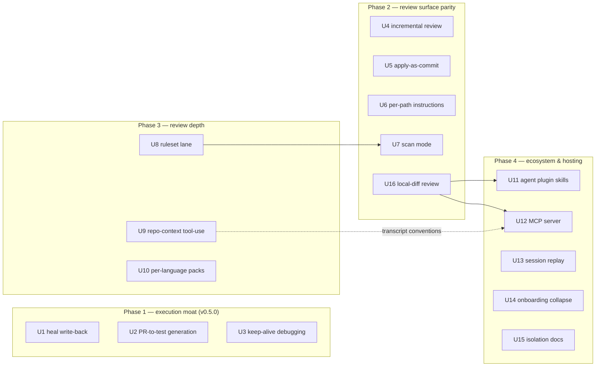

# feat: Competitive-gap roadmap — execution moat, review parity, ecosystem surface

## Summary

Sequenced plan for closing the gaps measured against CodeRabbit, Alibaba
`open-code-review`, and TestDriver, while staying inside the product
identity in STRATEGY.md (self-hosted-first, BYOK, no per-seat, vision-first).

The single structural finding from capability research: nearly every
"competitor feature" already has a partial Argus primitive — the roadmap is
mostly *extension and composition*, not new subsystems. Two shared
prerequisites stand out: the model layer (`src/vision/openrouter.ts`) is
strictly request→JSON-schema with no tool-call loop, and there is no
local-diff review entry point (`code-review` today only runs against a live
PR via env or a materialized fixture) — the canonical agent ask "review my
current diff" is inexpressible and must land before the ecosystem surface.

Release framing: Phase 1's first two units are the v0.5.0 headline
("self-healing flows that write back; generated regression coverage").
Onboarding is a stated constraint, not a phase: every unit must keep the
≤3-step path intact and push configuration into `resolveConfig` defaults.
Every `src/` unit also rebuilds committed `dist/` and, where it touches the
scaffold or comment grammar, regenerates `tests/fixtures/onboarding/` goldens
and keeps the `action/sticky-comment.cjs` parity copies in lockstep.

---

## Problem Frame

- TestDriver now runs every PR in hosted desktop sandboxes and generates
  tests from the diff — "nobody else runs code" is no longer a true claim.
  Argus's defensible difference is *verdict-bound execution on your own
  infra with an exact dollar cost*, not execution alone.
- CodeRabbit's moat is surface polish (chat, learnings, autofix, SAST
  aggregation) on a per-seat subscription. Argus already ships suggestion
  blocks, `@argus` dispatch, and head-bound dedup — the remaining gap is
  conversational breadth and incremental review, not the review itself.
- Alibaba OCR's moat is a deterministic ruleset corpus plus agentic repo
  context. Argus's secrets lane proves the deterministic pattern; what is
  missing is a named ruleset surface and a tool-use loop for the model.
- Onboarding parity vs "install app, done": the app worker already turns
  org-wide install into per-repo onboarding PRs; the residual friction is
  worker deployment and per-repo secrets, documented but not collapsed.

---

## Requirements

- **R1.** Every shipped capability stays self-hosted BYOK: user's runner,
  user's OpenRouter key, no hosted compute, no telemetry, no per-seat
  anything.
- **R2.** New `@argus` commands inherit the existing mention gate verbatim:
  association whitelist, no PR-head checkout, fork heads require the
  `argus-probe` label, write commands (`fix`, `generate`) join
  `record`/`persist` in the fork-disabled set. Applied suggestion text is
  bound to Argus's *posted* inline comments — never to a report artifact.
- **R3.** Deterministic findings union with model findings *after*
  synthesis and can never be erased by it; the lane degrades open. The dead
  OCR plan's additive-union design is the template.
- **R4.** Self-healed recordings, applied fixes, and generated tests reach
  main only as reviewable PRs that render *legible* old-vs-new content (a
  step card, a hunk diff) — never opaque JSON blobs, never silent
  write-back.
- **R5.** Every new model call honors `budgetUsd` per-lane caps and lands
  in the spend ledger. Agent/MCP invocations carry an explicit `budgetUsd`
  or the configured default cap — never silently uncapped (the review
  lane's uncapped default must not propagate to agent surfaces).
- **R6.** Onboarding to first review stays ≤3 steps on the per-repo path;
  the org-wide path collapses to: install app → merge onboarding PRs →
  one org-level `OPENROUTER_API_KEY` secret.
- **R7.** New user-facing config follows the established pipeline:
  `Config` field → `resolveConfig` default/validation → `ConfigInput` →
  action input → scaffold comment → docs.
- **R8.** Gate signals stay single-sourced: `verdict`/`ok`/`reviewEvent`
  derive from one blocking-severity set; execution evidence joins via the
  existing `provenBlockers`/`approval-evidence` path, never by trusting
  the model's verdict.
- **R9.** Model-facing reads are index-gated: tool-call file reads are
  confined to repo-index membership (which excludes dotfiles, VCS
  internals, lockfiles, and binaries by construction), symlink-escape is
  refused, and tool transcripts land in reports under the secrets-lane
  masking contract. `.git/config` (persisted `x-access-token`) and
  credential-shaped files are never readable by a tool.
- **R10.** The MCP surface is stdio-only (never a socket), every path arg
  is realpath-confined to the launch workspace, and the tool whitelist is
  frozen to read/run lanes — no write tools (`fix`, `persist`, `generate`,
  `init --pr`), no `delegate`. A path arg naming a foreign checkout never
  executes that checkout's config (the a0 plugin's archive-to-scratch
  pattern is the precedent).

## Key Technical Decisions

- **Heal write-back persists relocation fields only.** A heal replaces the
  whole `ActionPayload` (`type`/`text`/`keys`/`ms`) — a poisoned heal could
  retarget a step or inject keystrokes. Write-back admits only bbox,
  clickPoint, regionHash, a11ySnippet; any action/text/keys/ms change heals
  in-run and reports `write-back suppressed`, never a PR.
- **A shared write-PR helper is extracted** (`src/github/write-pr.ts`:
  `createFilesPr({branch, files, title, body})`). `persistProbes` hard-
  rejects non-`argus-probe-*` basenames and is probe-shaped; U1, U2, and
  U5 need the same refs/contents/pulls calls with different contracts.
- **Flow recordings move into the repo** at `tests/argus/flows/*.json` —
  they currently live in gitignored `.argus-reviewer-cache/` (artifact-
  uploaded per KTD6 of the evidence plan). Write-back requires a committed
  destination; this is an explicit revisit of `persistCache: 'artifact'`
  for the *recording*, not the cache.
- **Incremental baseline is verified, not trusted.** `lastReviewedSha`
  rides in the sticky comment AND the report/manifest (local and agent
  re-reviews get the same savings), but it is only honored when it (a) is
  a strict ancestor of head and (b) names a commit an Argus review is
  API-verifiably bound to. Forged or equal-to-head → full diff, warning
  line.
- **Tool-call loop lands once in `src/vision/openrouter.ts`** behind a
  per-call opt-in; first consumer is repo-context tools (U9). MCP (U12)
  is the opposite direction — Argus *exposing* tools — and shares only the
  transcript/ledger conventions, not the loop.
- **MCP wraps the CLI binary** (subprocess `dist/cli.js`, the proven
  a0-plugin pattern) rather than extracting cli.ts lane orchestration —
  zero refactor, same artifact contract: fresh `--report-dir` per call,
  parse files not stdout, exit code ≠ verdict.
- **`code-review --base <ref>` is the agent-review primitive** — a
  local-diff mode (`materializeMergeBaseDiff` already produces the diff)
  so agents, MCP, and local users can review without a live PR.
- **Deterministic rules are pure functions emitting findings**, merged
  post-synthesis by the secrets lane's path; nothing deterministic emits
  `bug` without adjudication.
- **Per-language packs auto-select from diff file extensions** and stack
  under configured global profiles — zero new config for the common case.
- **`scan` composes `scanRepo` + rules lane + a new standalone audit
  report** — not `CodeReviewReport` (which is PR/headBinding-shaped) and
  not `renderReportHtml` (manifest-shaped); the audit report is its own
  small assembly.
- **Hosting is documented, never provided.** U15 documents where the
  runner executes PR-controlled code honestly: the Docker sandbox covers
  *probes only*; `run`/`record`/`app`/`delegate` run consumer/PR code on
  the runner host.

## High-Level Technical Design

U16 (local-diff mode) is the prerequisite that makes agent review
meaningful; U9 (tool-call loop) informs U12's transcript shape;
everything else is independently landable within its phase.

---

## Implementation Units

### Phase 1 — execution moat (v0.5.0 headline)

### U1. Heal write-back: healed relocations persist as a fix PR

**Goal:** when a fingerprint miss triggers a model heal and the healed
step verifies, persist the *relocation* back to the recording — as a PR
proposing the updated flow file, never silently, never the full action
payload.

**Requirements:** R1, R4, R5

**Dependencies:** none (extends the heal ladder; shares the new writer
with U2/U5 — extract `createFilesPr` here)

**Files:**
- `src/engine/loop.ts` — emit a `healed-step` outcome carrying the
  re-resolved relocation fields (bbox/clickPoint/regionHash/a11ySnippet)
- `src/cache/store.ts`, `src/cache/fingerprint.ts` — committed-recording
  materialization; constrain `flowName` (`isSafeRepoPath` + forced `.json`
  basename — `--name` bypasses `slugify` today)
- `src/github/write-pr.ts` (new) — extracted `createFilesPr` from
  `persistProbes`' refs/contents/pulls calls
- `src/config.ts` — `flow.healWriteback` (default `off` → `'pr'`)
- `action/action.yml`, `src/onboarding/scaffold.ts` — `contents: write`
  on the mention workflow + comment; regenerate onboarding goldens
- `src/probe/persist.ts` — migrate to the shared writer
- `tests/unit/heal-writeback.test.ts` (new)

**Approach:** the ladder (fingerprint → coordinate → model-heal) produces
a re-resolved step in-run. On heal success, diff the old record vs the
healed record: if anything beyond relocation fields changed (action kind,
text, keys, ms), heal stays in-run and the report says
`healed, write-back suppressed: action payload changed`. Otherwise open a
`argus/flow-heal-<n>` PR against `tests/argus/flows/<flow>.json` whose body
renders a **legible step card** — instruction text, action kind, resolved
element label, before/after location — not the raw record diff. Heal
resolving to `done` is already a hard failure; it writes nothing.

**Patterns to follow:** `persistProbes` (write path, exclusive-create,
model-authored warning banner); `heal:'a0'` wiring for config plumbing.

**Test scenarios:**
- Happy: moved element → heal → PR with step-card body + relocation-only
  record diff
- Edge: healed action changes `text`/`keys` → suppressed report line,
  no PR; heal→`done` → no PR, run fails as today
- Error: contents-API write fails → heal still reported, write-back
  marked `unavailable`, lane never fails
- Integration: fork PR without `argus-probe` → write-back suppressed;
  `--name ../../x` → path refused before any API call

**Verification:** a recorded flow with a deliberately moved element opens
a PR whose rendered step card a reviewer can judge at a glance; raw
payload diffs never appear in the PR body.

### U2. PR→test generation: persisted specs from the diff

**Goal:** `argus-reviewer code-review --generate-tests` (and `@argus
generate`) turns the PR's diff into authored Vitest specs deposited as a
PR into `tests/argus/` — the general form of today's finding-scoped
probes.

**Requirements:** R1, R2, R4, R5

**Dependencies:** U1 (shared `createFilesPr`)

**Files:**
- `src/probe/author.ts` — generalize `buildProbeMessages` from
  finding-scoped to diff-scoped
- `src/probe/queue.ts`, `src/executor/sandbox.ts` — reuse verbatim
- `src/github/write-pr.ts` — corpus-rooted write contract
- `src/mention.ts` — `generate` in the whitelist + fork-disabled set +
  `MENTION_USAGE`/`MENTION_HELP` text
- `src/onboarding/scaffold.ts` — mention-workflow command comment
- `src/config.ts` — `review.generateTests` bounds (max specs, budget share)
- `tests/unit/probe-generate.test.ts` (new)

**Approach:** the probe lane authors repro tests for unexercised findings
inside the Docker sandbox; U2 widens the prompt input to "cover the
behavior this diff changes." The write contract stays narrow:
`tests/argus/**/*.test.*` leaf files only — no `*.config.*`, no
`setup`/`conftest`, no `.github/**`, exclusive-create. Generated specs
are model-authored code that will run **host-side in consumer CI
post-merge** — sandbox pre-validation proves green-in-container, not
safety; the PR gate is the boundary, and the PR body says so.

**Test scenarios:**
- Happy: diff touching one function → one valid spec in the PR, green in
  sandbox
- Edge: docs-only diff → `skipped` reason, near-zero spend
- Error: spec fails sandbox → excluded from PR, listed as draft in the
  review comment; spec path escapes corpus root or names a config file →
  excluded
- Integration: `generate` on a fork PR → refused (write-command gate)

**Verification:** a real PR produces a second PR whose specs pass sandbox
validation and carry `reproduced`-adjacent provenance in the manifest.

### U3. Keep-alive debugging on failed runs

**Goal:** on a local flow/app failure, hold the run's browser/target
reachable briefly and print how to inspect it — the local answer to
TestDriver's keep-alive sandbox.

**Requirements:** R1

**Dependencies:** none

**Files:**
- `src/cli.ts` — `--keep-alive` flag; the target lifecycle lives here
  (`startTarget`, `target.stop()`), not in `pipeline/verify.ts`
- `src/pipeline/app.ts` — same hook for the app lane
- `src/driver/target.ts` — keep-alive TTL on the served target
- `src/driver/browser.ts` — expose a CDP/inspectable endpoint or headed
  relaunch instructions for the Playwright browser
- `tests/unit/keep-alive.test.ts` (new)

**Approach:** failure keeps the target up for a TTL and prints the
connect story (CDP endpoint or `npx playwright open <url>`). Keeping the
server alive alone is useless without a browser inspection path — the
browser is the debug surface. Non-TTY/CI always skips. Note for agents:
headless runs get no attach path; their debugging context is the
journal/report — that asymmetry is documented, not fixed here.

**Test scenarios:**
- Happy: local failure → target alive at TTL → CDP endpoint answers
- Edge: TTL expiry tears down; concurrent second run unaffected
- Error: keep-alive in CI → skip line logged

**Verification:** fail a flow locally, connect DevTools or a headed
browser to the live page before the TTL lapses.

### Phase 2 — review surface parity

### U4. Incremental review: new-commits-only diffs

**Goal:** re-reviews diff only what changed since the last *verified*
reviewed head SHA.

**Requirements:** R1, R5, R8

**Dependencies:** none

**Files:**
- `src/review/inline.ts` — a new machine-readable marker carrying
  `lastReviewedSha` (the existing head binding is display text only;
  `PERSIST_MARKER` precedent is probe-specific)
- `src/report/manifest.ts` / `code-review.json` — persist the baseline so
  local and agent re-reviews get the same savings
- `src/evidence/ci.ts` — ancestor/review verification (`ghGet`,
  compare API, `fetchPrMeta`)
- `src/cli.ts` — resolve `lastReviewedSha..headSha`, fallback rules
- `src/mention.ts` — `review` gains an optional `full` arg
  (`parseMention` currently only accepts an arg for `record`)
- `action/sticky-comment.cjs` — render "reviewed N commits since <sha>";
  keep parity copies in lockstep
- `tests/unit/incremental-review.test.ts` (new)

**Approach:** a sticky comment is editable by every same-repo author —
baseline metadata in it is forgeable, so a stored SHA is honored only when
(a) it is a strict ancestor of head via compare API and (b) an Argus
review is API-verifiably bound to that commit. Equal-to-head → an
informational "already reviewed" reply, never a verdict-bearing empty run.
Force-push/unreachable/absent → full diff. `@argus review full` is the
manual escape.

**Test scenarios:**
- Happy: 2 new commits → second review covers only their diff; report
  names the range; ledger shows smaller spend
- Edge: force-push → full diff; SHA equal to head → informational reply,
  no verdict
- Error: stored SHA reachable but no Argus review at it (forged) → full
  diff + warning; unreachable in shallow clone → full diff + warning

**Verification:** two-run session shows run 2's chunks covering only new
commits; a hand-edited sticky baseline cannot shrink the reviewed range.

### U5. `@argus fix`: apply suggestions as a commit PR

**Goal:** `@argus fix` opens a PR applying every *posted, still-valid*
suggestion — bound to the comments Argus rendered, never to a report
artifact.

**Requirements:** R2, R4

**Dependencies:** U1 (shared `createFilesPr` — note the apply path needs
contents GET+PUT with blob sha, not exclusive-create)

**Files:**
- `src/mention.ts` — `fix` command (whitelist; fork-disabled; association
  gate — see Open Questions on whether comment authority suffices)
- `src/github/write-pr.ts` — update-file path
- `src/review/inline.ts` (`extractSuggestion`), `src/review/validate.ts`
  (`parseHunks` mirror of poster-side `isOnDiff`/`rightSideLines`)
- `src/evidence/ci.ts` — comment listing (`isArgusInlineBody`), head-SHA
  re-fetch, `ghWrite`
- `tests/unit/mention-fix.test.ts` (new)

**Approach:** fetch Argus's posted inline comments at the *current* head,
extract suggestions, re-validate anchors, apply byte-for-byte the posted
replacement text (bounded range — a suggestion spanning N lines replaces
exactly that span; oversized ranges are skipped), commit to
`argus/fix-<pr>-<headSha>`, then re-verify head still equals `<headSha>`
before opening the PR (TOCTOU). The PR body renders each suggestion as a
verbatim old-vs-new hunk plus its source finding — a suggestion that
swaps a crypto call or drops an auth check is exactly the kind of hunk
that must be human-legible. Suggestion text not matching any posted
comment is skipped.

**Test scenarios:**
- Happy: 3 valid suggestions → fix PR applies all, reply links it
- Edge: anchor rotated after a new commit → that suggestion skipped and
  named; head moved mid-apply → stale reply, no PR
- Error: contents-API conflict → reply reports failure, no partial branch;
  report-artifact suggestion that matches no posted comment → skipped
- Integration: fork PR → `fix` refused outright

**Verification:** `@argus fix` on a PR with suggestions produces an
apply-PR whose hunks are byte-identical to the posted blocks.

### U6. Per-path review instructions

**Goal:** `review.instructions[]` — `{glob, rule}` entries resolved per
chunk so migrations get migration rules, UI files get a11y rules.

**Requirements:** R7

**Dependencies:** none

**Files:**
- `src/config.ts` — `review.instructions` schema (stays off
  `UNTRUSTED_CONFIG_KEYS`-adjacent concerns; it shapes prompts only)
- `src/review/scope.ts` — `globMatch` is the export (`globToRegExp` is
  private)
- `src/cli.ts` — per-chunk rubric injection at the
  `buildCodeReviewMessages` call site via `PlannedChunk.files`
- `action/action.yml`, `src/onboarding/scaffold.ts` — input + commented
  example + golden regen
- `tests/unit/review-instructions.test.ts` (new)

**Approach:** pack rubrics already append per chunk at prompt build; this
resolves instruction lines per chunk from the chunk's file set. No new
mechanism — a second rubric source joined with the profile rubric.

**Test scenarios:**
- Happy: `db/**` rule appears only in chunks containing `db/**` files
- Edge: file matching two globs → both rules present, ordered
- Error: malformed glob → config validation error naming the entry

**Verification:** per-chunk prompt diffs show path rules only where the
chunk's files match.

### U7. `scan` audit mode — review without a diff

**Goal:** `argus-reviewer scan <path>` audits a tree with no PR — index +
ruleset lane + secrets + a standalone audit report.

**Requirements:** R1, R3, R7

**Dependencies:** U8 (the ruleset lane is the scan's payload)

**Files:**
- `src/cli.ts` — `scan` subcommand (dispatch + usage)
- `src/index/scan.ts` (`scanRepo`), `src/review/rules.ts` (U8),
  `src/review/secrets.ts` — composition
- `src/report/` — new standalone audit-report assembly (not
  `CodeReviewReport` — it is PR/headBinding-shaped; not
  `renderReportHtml` — manifest-shaped)
- `tests/unit/scan.test.ts` (new)

**Approach:** `scanRepo` walks the tree (dotfiles/binaries excluded by
the walk); the secrets lane consumes a unified diff, so scan synthesizes
one (empty-tree diff, or `git diff` over a range when given). Content
policy is an invariant, not incidental: dotfiles, VCS internals,
lockfiles, binaries, and credential-shaped files never reach model
context, even under `--model`. Scan root is resolved and printed before
any model call; outputs confine to the invocation cwd unless flagged
otherwise.

**Test scenarios:**
- Happy: fixture repo → deterministic + secrets findings in the audit
  report, ledger $0 without `--model`
- Edge: empty/non-git dir → clean error; `--model` adds model findings
  under the same exclusion contract
- Error: rules lane throws → `skipped` section, partial report written

**Verification:** `scan .` on this repo emits the audit report with rules
and secrets sections and zero model spend by default.

### U16. Local-diff review: `code-review --base <ref>`

**Goal:** review a local `base..HEAD` diff with no live PR — the
primitive every agent surface (U11/U12) and local user needs.

**Requirements:** R1, R5

**Dependencies:** none

**Files:**
- `src/cli.ts` — `--base` on `code-review`; `materializeMergeBaseDiff`
  (`src/review/secrets.ts`) already produces `base..HEAD` diffs
- `src/config.ts` — `diffBase` currently feeds only cache invalidation;
  wire it as the CLI default too
- `tests/unit/local-review.test.ts` (new)

**Approach:** today `code-review` skips without `ARGUS_REVIEWER_TRACE`
repo/pr env or requires a materialized `--fixture`. A `--base` (or
`diffBase` config) mode materializes the diff, runs the same
chunk→synthesis pipeline, writes `code-review.json` with a local-flavored
`headBinding`, and posts nothing (no PR exists). Exit code stays
verdict-free — consumers read the report file, never the exit code.

**Test scenarios:**
- Happy: `code-review --base main` on a dirty checkout → findings + a
  report file naming the range
- Edge: no diff vs base → `pass`/`approve` verdict with zero findings
- Error: unresolvable base ref → clean error, no spend

**Verification:** an agent (or user) reviews a working diff end-to-end
with no GitHub context; the report is consumable by `run-manifest`
readers.

### Phase 3 — review depth

### U8. Named deterministic ruleset lane

**Goal:** generalize the secrets lane's shape into `src/review/rules.ts`:
pure functions over the diff emitting findings, unioned post-synthesis,
each audited.

**Requirements:** R3, R5 ($0), R8

**Dependencies:** none

**Files:**
- `src/review/rules.ts` (new) — rule registry + runner
- `src/review/secrets.ts` — becomes a rule inside the engine
- `src/cli.ts` — post-synthesis union + `rulesScan` audit field (the
  union and report assembly live here)
- `src/report/comment.ts`, `action/sticky-comment.cjs` — render the new
  audit field if surfaced in comments; parity copies + comment goldens
- `src/config.ts` — `review.rules` enable/disable list
- `tests/unit/review-rules.test.ts` (new)

**Approach:** deliberately boring first rules: secret patterns (existing
lane moved in), hardcoded URLs/IPs added, leftover `TODO` at nit level,
sync-in-async hot spots. Severity ceiling: nothing deterministic may emit
`bug` without adjudication. Every rule hit is an audit entry —
precision stays inspectable via the `dropped finding` contract.

**Test scenarios:**
- Happy: hardcoded IP in a diff → `nit` finding citing pattern class
- Edge: match inside a sample manifest in the diff → suppressed
  (data-not-code mirror)
- Error: rule throws → finding absent, failure audit entry, review
  completes

**Verification:** secrets tests stay green post-refactor; a new rule
emits exactly one audited finding; $0 added to the ledger.

### U9. Repo-context tool-use for the review agent

**Goal:** the review model can call read-only, index-gated tools
(`read_file`, `search_index`, `find_tests_for`) mid-review — OCR's
context advantage, with a real jail.

**Requirements:** R1, R5, R9, R8

**Dependencies:** none (the prerequisite others may reuse for transcript
conventions)

**Files:**
- `src/vision/openrouter.ts` — opt-in tool-call loop; `Message` needs
  `role:'tool'`/`tool_call_id`; `OpenRouterResponse` needs
  `tool_calls`/`finish_reason` (`src/vision/cost.ts`)
- `src/engine/loop.ts` — `VisionClient.complete` contract or a
  `completeWithTools` sibling
- `src/index/scan.ts`, `src/index/context.ts` — tool implementations over
  index membership (`importedBy` is the `find_tests_for` substrate)
- `src/cli.ts` — enable for the review path; `CodeReviewReport` gains a
  `toolUse` transcript field (masked per R9)
- `tests/unit/review-tools.test.ts` (new)

**Approach:** bounded loop — max rounds, per-call timeout, cumulative
`budgetUsd` check between rounds. Reads gate on index membership (the
walk already excludes dotfiles/`node_modules`/lockfiles/binaries, which
kills `.git/config`, `.env`, `.npmrc` exfiltration by construction) plus
realpath confinement; everything else is refused fail-closed.
Tool-derived context lands in `toolUse`/evidence as `observed` — findings
still require `file` in the diff (`validateFindings` drops
`file_not_in_diff`, correctly). On `issue_comment` the mention lane
checks out base-ref, so tool reads there are pre-PR — the tool
description states the staleness (fetch at head SHA is a follow-up
option).

**Test scenarios:**
- Happy: model calls `read_file` on an indexed file → transcript records
  it; a finding's reasoning cites the fetched context while
  `finding.file` stays diff-anchored
- Edge: max rounds hit → synthesis proceeds with gathered context
- Error: `read_file(".git/config")`, `read_file(".env")`, symlink escape
  → refused fail-closed; tool error string returned to model, loop
  continues
- Integration: budget exhausted mid-loop → degrade to static context,
  ledger records rounds + abort reason

**Verification:** a review demonstrably reads an undiffed caller file and
cites it in the `toolUse` transcript; the cited finding remains
diff-anchored; ledger shows the extra rounds.

### U10. Per-language review packs

**Goal:** language rubrics auto-selected by the diff's file extensions,
stacked under configured global profiles.

**Requirements:** R7

**Dependencies:** none

**Files:**
- `src/review/packs.ts` — `LANG_PACKS` + per-chunk selection
- `src/cli.ts` — selection at the `buildCodeReviewMessages` call site
- `src/config.ts` — `review.langPacks` on/off (default on)
- `evals/review-quality/` — each pack ships only if the eval harness
  shows it helps (planted-finding recall must not regress)
- `tests/unit/lang-packs.test.ts` (new)

**Approach:** packs shape rubrics only — language-shaped defect patterns
per extension (TS: unawaited promises, `any` leaks; Python: mutable
defaults; Go: goroutine leaks). Auto-detection keeps the zero-config
promise; `review.profiles` overrides remain explicit.

**Test scenarios:**
- Happy: `.ts`+`.sql` chunk's rubric carries both language packs
- Edge: unknown extension → byte-identical prompt (no block appended)
- Error: none — pure prompt composition

**Verification:** per-chunk prompt diffs show language rubric only where
the diff carries that language; eval corpus run gates each pack.

### Phase 4 — ecosystem & hosting

### U11. Agent plugin skills (Claude Code / Codex / Cursor)

**Goal:** ship harness skill files exposing `argus-reviewer` to coding
agents — the domestic version of the `a0-plugin-argus` pattern.

**Requirements:** R1, R5

**Dependencies:** U16 (agent review needs the local-diff mode)

**Files:**
- `plugins/claude-code/`, `plugins/codex/`, `plugins/cursor/` — three
  distinct package layouts (decision: one unit owns all three, or split
  if formats diverge — see Open Questions)
- `docs/agent-plugins.md` (new)
- `tests/unit/plugin-manifest.test.ts` (new)

**Approach:** skills wrap `verify`, `scan`, `code-review --base`, and —
  deliberately — `init` ("set up Argus in this repo" is the canonical
  coding-agent task). `record` stays out of v1 (interactive/browser-heavy,
  same reasoning the a0 plugin deferred it). The contract every skill
  teaches: fresh `--report-dir` per invocation, parse report files not
  stdout, exit code ≠ verdict, always pass or accept a `budgetUsd`.

**Test scenarios:**
- Happy: skill manifests parse; every wrapped flag greps against `cli.ts`
  usage strings; per-harness layouts covered
- Error: CLI absent → skill text instructs install, exits non-zero

**Verification:** a Claude Code session with the plugin runs
`code-review --base main` on a fixture and reads the report file.

### U12. MCP server surface

**Goal:** `argus-reviewer mcp` — a **stdio-only** MCP server exposing
read/run tools so agents (Copilot, MCP clients) can invoke Argus.

**Requirements:** R1, R5, R10

**Dependencies:** U16 (the `review` tool needs local-diff mode to mean
anything outside a PR)

**Files:**
- `src/mcp/server.ts` (new) — stdio server; **subprocess `dist/cli.js`**
  per the a0-plugin pattern (not `src/api.ts` — that is the td test API;
  and not cli.ts internals — the lane orchestration isn't exportable
  cheaply)
- `src/cli.ts` — `mcp` dispatch case + usage
- `package.json` — MCP SDK is a real new dependency decision
  (`dependencies` is playwright+typescript only today)
- `docs/mcp.md` (new)
- `tests/unit/mcp-server.test.ts` (new)

**Approach:** tool set is read/run primitives over durable artifacts —
`list_runs`, `get_run(runId)`, `read_report(runId, lane)` (manifest
archive + journal + live.ndjson — the same files `scripts/collect.mjs`
reads), plus `review` (via U16) and `scan` (via U7). Lane-triggering tools
return a run handle; the lifecycle model is poll-based reads over the
manifest archive (progress/cancel is a follow-up decision — Open
Questions). No write tools, no `delegate`, no `record`, no `init --pr`.

**Test scenarios:**
- Happy: client calls `scan` on the workspace → audit report JSON; calls
  `get_run` → manifest fields
- Edge: `path` outside the launch workspace → refused; `~`, `/etc`,
  symlink escape → refused
- Error: missing `OPENROUTER_API_KEY` → honest `unavailable` state;
  tool response never contains env values (assert `OPENROUTER_API_KEY`/
  `GITHUB_TOKEN` absence); `review` without `budgetUsd` → default cap or
  refusal, never uncapped
- Integration: checkout containing executable `argus-reviewer.config.ts`
  scanned via path arg → config never executes

**Verification:** a real MCP client invokes `scan` and `get_run`
end-to-end; no tool response leaks env; no tool can write.

### U13. Session replay viewer

**Goal:** interactive step-through of a run — steps, captures, heals,
video — in `report.html` and the desk/TUI contributor surfaces.

**Requirements:** none (contributor-facing until the desk packaging
question resolves — Open Questions)

**Dependencies:** none — all data is serialized already

**Files:**
- `src/report/html.ts` — embedded replay (steps + video already render;
  this adds scrub)
- `electron/ui/` — replay view over journal/`live.ndjson`/`PageCapture[]`
- `scripts/tui/` — TUI surface if it fits
- `tests/unit/replay-view.test.ts` (new)

**Approach:** renderer over existing data — `JournalStep.healed`,
`live.ndjson`, captures, `videoPath`. `report.html` is the end-user
surface (it's in the npm flow); Electron replay stays contributor-facing
unless desk packaging resolves.

**Test scenarios:**
- Happy: open a run → scrub steps, heals highlighted with before/after
- Edge: run without video → timeline falls back to captures only

**Verification:** replay a recorded session; each heal shows its
before/after capture.

### U14. Onboarding collapse: install-once path polish

**Goal:** the org-wide story becomes the advertised path — "register your
app → deploy worker → install → merge onboarding PRs → one org secret" —
with each manual step collapsed or honestly framed.

**Requirements:** R1, R6

**Dependencies:** none

**Files:**
- `app/register/manifest.mjs` — keep honest: it emits JSON/an HTML form
  the human submits (GitHub's manifest flow is inherently interactive —
  say so, don't promise automation)
- `app/worker/` — one-command deploy script (wrangler deploy + manifest
  instructions in one shot)
- `docs/self-host-app.md`, `docs/onboarding.md`, `README.md` — elevate
  the app path; document the org-level `OPENROUTER_API_KEY` secret
- `tests/unit/github-app-manifest.test.ts` — convention mirror exists;
  extend for the deploy script

**Approach:** the worker turns `installation` events into onboarding PRs;
residual friction is (a) registering the app (human-submits-form —
documented, ~60s), (b) deploying the worker (collapse to one command),
(c) org secrets (docs). No hosted instance — the user owns the app
forever; this unit makes owning it near-free.

**Test scenarios:**
- Happy: deploy script on a fresh checkout produces a live worker URL
- Error: deploy without CF creds → instructs exactly what's missing
- Integration: app installed on a 3-repo org → 3 onboarding PRs each
  carrying the org-secret instruction

**Verification:** fresh-org walkthrough ends at a merged onboarding PR
and a working review with no per-repo workflow edits by hand.

### U15. Execution-isolation deployment docs

**Goal:** `docs/isolation.md` covering where the runner executes
PR-controlled code — honestly scoped, because the shipped Docker boundary
covers **probes only**.

**Requirements:** R1

**Dependencies:** none

**Files:**
- `docs/isolation.md` (new)
- `docs/onboarding.md`, `action/action.yml` comment — cross-links
- `tests/unit/no-emoji.test.ts` — allowlist if the doc needs the chars

**Approach:** docs-only, but the doc must not overclaim. It states: the
hardened container wraps the *probe* lane; `run`/`record`/`app`/`delegate`
execute consumer/PR-controlled code on the runner host with the job's env
(including `td.type` env-fallback secrets). Three tiers documented:
(1) the probe sandbox contract as shipped, (2) ephemeral-per-job or
dedicated low-privilege runners for fork-facing lanes (self-hosted
runners persist across jobs — PR-controlled host execution can poison
`node_modules`/caches/workspace state for later jobs), (3) microVM-per-job
(Firecracker/Kata-class) for the genuinely paranoid. Standing rules
restated: never mount `/var/run/docker.sock` into anything running
PR-controlled code; `pull_request_target`/`issue_comment` carry write
tokens + secrets and lane gates must stay enforced; generated-spec and
fix PRs get reviewed like dependency bumps because their content runs
host-side post-merge.

**Test scenarios:**
- `Test expectation: none` — docs unit; claims verified by grep against
  source at review time

**Verification:** every flag, label, and env name in the doc greps to a
real source line; the sandbox-scope claim matches
`src/executor/sandbox.ts`'s actual invariants.

---

## Scope Boundaries

### Outside this product's identity

- **Hosted compute of any kind** — no hosted worker fleet, managed
  sandboxes, or desktop/mobile VMs. U15 documents bring-your-own
  substrates; a hosted worker stays a deferred non-goal unless someone
  pays for a productized version.
- **Per-seat pricing, RBAC, SSO, org analytics** — enterprise surface for
  a $0 tool; revisit only on real demand.
- **Selector-based test authoring** — STRATEGY.md is explicit;
  vision-first grounding stays.
- **Docstring generation / sequence diagrams** — off-mission vanity.
- **GitLab / non-GitHub platforms** — prior plans deferred it on zero
  demand; GHE stays the same-API escape.
- **Mobile lane** — ARTEMIS research stays dormant; M2+ needs demand.
- **OCR static lane** — dry-run kill criterion stands; U8 builds the
  *idea* (deterministic union) natively instead.
- **MCP write tools and remote transport** — `fix`/`persist`/`generate`
  over MCP and any socket transport are Never for this roadmap (write
  needs the mention gate's port; remote needs authn/z answers). Agents
  delegating to agents (MCP-exposed `delegate`) — Never.
- **Model tool-calls that write or shell out** — U9 is read-only +
  index-gated, permanently.

### Deferred to Follow-Up Work

- **Hosted GitHub App instance + OIDC token broker** — Phase 3 of the app
  onboarding plan; parked until a user asks (or pays).
- **Learnings memory** — CodeRabbit's persistent org knowledge. The
  honest cheap version is a local `ARGUS_LEARNINGS.md` the reviewer
  reads; cloud-synced memory is a privacy trade-off on BYOK that needs a
  real user ask first.
- **Linter/SAST aggregation** — folding external tool output into
  findings; worth doing behind U8/U9 proving the surface.
- **`@argus scan` mention command** — blocked on U9's confinement
  contract, not just the gate.
- **`record` in agent skills** — deferred per the a0 plugin's own
  reasoning (interactive, browser-heavy); revisit after U11 v1.
- **MCP progress/cancel lifecycle** — poll-over-manifest covers v1;
  `notifications/progress` is a follow-up if agent UX demands it.
- **Desk heal accept/reject** — if desk triage ever ships as writable,
  it needs an agent equivalent or it becomes parity debt.

## Open Questions

- **Tool-call coverage on OpenRouter** — U9 assumes the configured
  models expose tool-calling through OpenRouter's OpenAI-shaped API;
  verify against the curated model catalog in implementation, degrade to
  static context where unsupported.
- **Desk packaging** — Ocellus Q2 (do desk/TUI ship to end users) is
  still unanswered; U13's shipped surface defaults to `report.html`.
- **`@argus fix` authority tier** — comment authority (COLLABORATOR)
  currently suffices to launder model text into a bot-attributed PR that
  humans skim-merge; decide whether `fix` requires maintainer-tier or an
  opt-in config flag.
- **MCP subprocess vs in-process** — the plan commits to subprocess
  (a0-plugin parity); if in-process progress/cancel proves necessary,
  `cli.ts` lane orchestration extraction is a real refactor to plan
  separately.
- **Per-harness packaging** — U11 may split into per-harness units if
  Claude Code/Codex/Cursor layouts diverge materially.
- **Per-language rubric corpus** — authored, not learned; the eval
  harness gates each pack before it ships.

## Risks & Dependencies

- **Write-path integrity (U1/U2/U5):** auto-PR writes are supply-chain
  surface — mitigations: contents-API write, fork gates, posted-comment
  binding (U5), relocation-only fields (U1), corpus-root confinement +
  leaf-file contract (U2), human-merge requirement everywhere.
- **Generated tests execute host-side post-merge (U2):** sandbox proves
  green-in-container, not safety — the PR review is the boundary; treat
  generated-spec PRs like dependency bumps.
- **Baseline poisoning (U4):** comment-carried SHAs are forgeable —
  mitigated by strict-ancestor + API-verified-review checks; forged
  baselines degrade to full diff, never an empty verdict.
- **Tool-loop spend + exfiltration (U9):** bounded rounds + cumulative
  budget check cover spend; index-membership + masking contract cover
  reading `.git/config`, `.env`-class files.
- **Config-execution via tool args (U12):** a path arg naming a foreign
  checkout would execute its config beside the caller's key — the
  workspace jail + untrusted-checkout policy is the mitigation (R10).
- **Scope creep vs. release cadence:** four phases is a multi-release
  arc; Phase 1 alone is v0.5.0-sized. Do not let Phase 2+ bleed into the
  v0.5.0 cut.
- **Dependency:** U1/U2/U5 converge on the extracted `createFilesPr`;
  a refactor there moves all three.

## Success Metrics

- v0.5.0: a healed flow produces a reviewable write-back PR with a
  legible step card; a real diff produces a generated-spec PR that
  passes sandbox validation.
- Review parity: incremental review cuts second-review spend measurably;
  `@argus fix` applies posted suggestions end-to-end on a real PR.
- Depth: `scan` audits this repo at $0 model cost; a review finding's
  reasoning cites a file fetched via tool-use while `finding.file` stays
  diff-anchored.
- Adoption: org install path completes end-to-end in one sitting on a
  fresh org with zero manual workflow edits.
- Agent surface: an MCP client runs `scan` + `get_run` end-to-end; a
  harness skill reviews `HEAD` vs `main` locally with no GitHub context.

## Sources & Research

- Capability inventory + prior-plan survey + three deepening agents
  (security-sentinel, agent-native strategist, repo reality-check),
  2026-10-04, in-session: confirmed `persistProbes` basename/branch
  constraints, gitignored flow cache, display-only head binding,
  `src/api.ts` being the td API (not a lane facade), absent tool-call
  protocol, absent local-diff mode, and the forgeable-baseline /
  exfiltration findings folded into R2/R9/R10 and U1/U4/U5.
- `docs/plans/2026-09-16-001-feat-full-reviewer-roadmap-plan.md` —
  predecessor roadmap (mostly shipped); this plan is its continuation.
- `docs/plans/2026-09-27-001-feat-coderabbit-review-surface-plan.md` —
  shipped review-surface work this builds on.
- `docs/plans/2026-10-03-ocr-static-lane.md` + `OCR-DRY-RUN-RESULT.md` —
  dead lane whose additive-union design U8 reuses.
- `docs/plans/2026-10-04-0002-feat-github-app-onboarding-plan.md` —
  shipped onboarding-app plan; U14 finishes its residual.
- Competitor landscape: Alibaba `open-code-review` (deterministic
  rulesets + agentic repo reads), CodeRabbit (chat/autofix/learnings/
  SAST aggregation, per-seat), TestDriver (hosted desktop-sandbox PR
  execution + generated suites) — surveyed 2026-10-04.
- STRATEGY.md / CONCEPTS.md — vocabulary and tracks this plan must not
  contradict.
